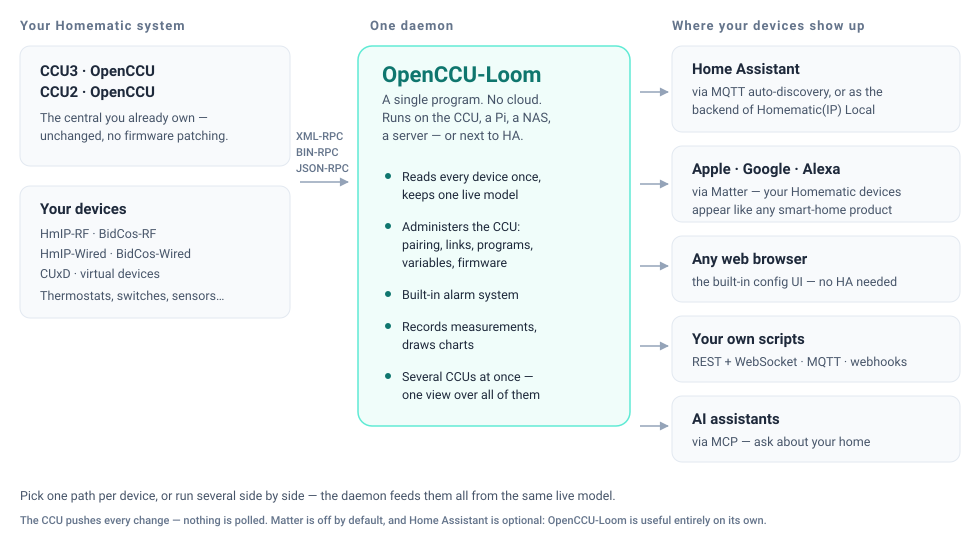

<p align="center">
  
</p>

<p align="center">
  <em>One daemon between your Homematic CCUs and the rest of your smart home.</em>
</p>

# OpenCCU-Loom

**OpenCCU-Loom** is a standalone Go daemon that talks to Homematic and
HomematicIP CCUs (CCU2, CCU3, OpenCCU, OpenCCU) over XML-RPC,
BIN-RPC and JSON-RPC — and exposes them through MQTT, a REST +
WebSocket API, a web Config UI, a native Matter bridge and an MCP
server. It runs several CCUs at once, administers them (pairing,
firmware, links, programs, system variables, groups), records
measurement history, and ships a complete local alarm system.

Single static binary, no CGo, no cloud, no Home Assistant required —
though it integrates with Home Assistant through MQTT Discovery,
Matter, and two ready-made add-ons.

<p align="center">
  
</p>

---

## Features

### North-bound bridges

- **MQTT** — Home Assistant Discovery **and** a raw topic plane in
  parallel, bidirectional control via `/set` topics, localized entity
  names. Pure-Go MQTT 5.0 client (3.1.1 selectable).
  → [`docs/mqtt-topic-schema.md`](./docs/mqtt-topic-schema.md)
- **REST + WebSocket** — OpenAPI 3.1 contract, RFC 9457 `problem+json`,
  Idempotency-Key middleware, resumable WebSocket subscriptions with
  typed broadcasts. → [`assets/openapi.yaml`](./assets/openapi.yaml),
  [`assets/wsapi.json`](./assets/wsapi.json)
- **Config UI** — Svelte 5 SPA (Tailwind 4, embedded via `go:embed`) as
  the primary surface: login, OIDC and first-run onboarding all live in
  the SPA. Fully localized (en + de), light/dark, and a Home-Assistant-
  native visual skin. → [`docs/user/web-ui.md`](./docs/user/web-ui.md)
- **Matter** — native-Go bridge (no CHIP SDK): PASE/CASE, full
  Read/Write/Invoke/Subscribe/TimedRequest, generic measurement and
  bridge-core cluster servers, and projections for switch / light /
  cover / climate / lock / siren / valve / button / text-display. One
  Matter endpoint per physical device. Default off.
  → [`docs/user/matter.md`](./docs/user/matter.md)
- **MCP** — Model Context Protocol server so AI clients can read (and,
  optionally, write) the device model.
  → [ADR 0025](./docs/adr/0025-mcp-northbound-adapter.md)
- **Webhooks** — outbound HTTP fan-out for device, hub and alarm events.

### CCU connectivity

- **Multi-CCU from day one** — one daemon, many CCUs, every store,
  coordinator and topic scoped by central. No "the one CCU" anywhere.
  → [`docs/user/multi-ccu.md`](./docs/user/multi-ccu.md)
- **Push everywhere, no polling** — XML-RPC + JSON-RPC for HmIP-RF,
  BidCos-RF, BidCos-Wired, HmIP-Wired and VirtualDevices; **native
  BIN-RPC** for CUxD, including our own BIN-RPC callback server.
- **Hot-plug** — newly paired devices appear without a restart;
  readiness-gated bring-up waits for a co-booting CCU instead of
  serving half a device tree.
- **Reliability layer** — circuit breaker, retry, throttle, request
  coalescer and ping/pong per interface, with recorded default values
  pinned by contract tests.
- **Device model** — generated device profiles plus custom data points
  (light, cover, climate, lock, siren, …), calculated and combined data
  points, week profiles / schedules, and hub entities (system
  variables, programs, service messages).

### CCU administration

Everything below is driven from the Config UI *and* the REST/WS API —
no detour through the CCU WebUI:

- **Devices** — pairing inbox with first-time configuration, install
  mode, HmIP teach-in via SGTIN + key (no internet needed), wired-bus
  search, guided device replace, delete with factory-reset and
  dependency check, per-device communication test, rename device and
  channel, restore stored configuration.
- **Channels** — MASTER paramset editor with session-based editing,
  undo/redo and presets, "determine" for determinable values, AES
  secured transmission, team assignment, and per-channel visibility /
  operation lock.
- **Links** — global direct-links overview, create / rename / delete /
  test, plus central links (press-event forwarding) with live active
  state.
- **Groups** — Homematic heating groups: list, create, edit, delete,
  member picker at scale.
- **Programs & system variables** — run (optionally only when the
  condition holds), delete, rename, create alarm and logic variables,
  edit value lists, assign channels, and see where a variable is used
  before deleting it.
- **Rooms, functions & areas** — assign per channel, and group CCU
  rooms into operator-defined areas (floors, outbuildings) that filter
  every device list and picker.
- **Fleet health** — firmware updates with duty-cycle warning, signal
  quality, per-radio-interface duty cycle and carrier sense,
  diagnostics artefacts, service-message acknowledge/suppress, backups,
  CCU reboot, and a cache clear + re-pull.

### Alarm system

A complete, local-first alarm system in the daemon — no cloud, no CCU
program spaghetti: zones with arm/disarm and delays, sensors with hold
time and cross-zoning, capability-derived outputs (sirens with tone /
pattern / sound file, sysvar mirrors, notifications), guided keyfob
bindings (e.g. HmIP-KRCA), PIN codes, journal, walk test and a
re-runnable setup wizard. Surfaces as a Home Assistant
`alarm_control_panel` over MQTT.
→ [`docs/alarm-user-guide.md`](./docs/alarm-user-guide.md)

### Data & insight

- **Measurement history** — opt-in recorder with per-datapoint toggle,
  persisted to SQLite, rendered as in-SPA charts.
- **Diagrams & energy** — named multi-series diagrams with a guided
  series editor, plus a dedicated energy view.
- **Audit log** — every configuration change appended and queryable.
- **Metrics & tracing** — Prometheus collectors and an OTLP span
  exporter.

### Operations & security

- **Authentication** — HTTP Basic, Bearer tokens, session cookies with
  CSRF, OpenID Connect (PKCE, JWKS-verified RS256, role mapping),
  CCU-delegated login ([ADR 0043](./docs/adr/0043-ccu-authentication-provider.md))
  and Home Assistant Ingress passthrough
  ([ADR 0044](./docs/adr/0044-single-port-onboarding-and-ha-ingress-auth.md)).
  Role-based authorization across every north-bound surface
  ([ADR 0051](./docs/adr/0051-northbound-authorization-model.md)).
- **Runtime configuration** — almost every knob is editable in the SPA
  and takes effect without hand-editing YAML (see below).
- **Discovery** — the daemon announces itself via mDNS and finds CCUs
  on the network via SSDP.
- **Packaging** — single static binary (`CGO_ENABLED=0`) for Linux
  amd64 / arm64 / armv7, a multi-arch Docker image, two Home Assistant
  add-ons (daemon + remote ingress proxy), and a CCU/OpenCCU
  add-on that **updates itself**
  ([ADR 0057](./docs/adr/0057-addon-self-update.md)).

## Status

All north-bound bridges work end-to-end against a real CCU and against
the `godevccu` simulator. [`CHANGELOG.md`](./CHANGELOG.md) is the
authoritative release history — it carries the current version rather
than this page, which would re-drift every release; the shipped build
reports its own version and REST `APIVersion` on `/about` and
`GET /api/v1/info`. [`notes/plans/roadmap.md`](./notes/plans/roadmap.md)
covers what is next.

**Maturity: beta** — the feature set is complete and in daily productive
use, but it has not been hardened across a wide range of installations
yet. Expect bugs, keep a CCU backup, and note that the daemon can not
only read your CCU but also change it (pairing, deleting, writing
paramsets).

**The Matter bridge is alpha** — considerably younger than the rest and
the least proven part. It is off by default; switching it on is an
explicit test decision, not something to build load-bearing automations
on. Production-grade Matter attestation additionally requires
vendor-supplied DAC/PAI/CD bundles configured by the operator; the
bundled CSA Test PAA chain is fine for development and for
Apple- / Google- / chip-tool-driven testing.

## Quickstart

### Docker

```sh
docker run -d --restart unless-stopped \
  -p 8119:8119 -p 8120:8120 -p 8129:8129 \
  -v $(pwd)/config.yaml:/app/config.yaml:ro \
  -v openccu-loom-data:/app/var \
  ghcr.io/sukramj/openccu-loom:latest run --config /app/config.yaml
```

> `--restart unless-stopped` (already set in `docker-compose.yaml`) is
> what makes the Config UI's **Restart** action work: the daemon exits,
> Docker brings the container back.

### Binary

```sh
make build
./bin/openccu-loom run --config config.yaml
```

### Home Assistant add-ons

Add `https://github.com/SukramJ/openccu-loom` as a repository under
*Settings → Add-ons → Add-on Store → ⋮ → Repositories*, then install
**OpenCCU-Loom**. The Config UI appears as a sidebar panel (Ingress)
and on `:8119`; state persists in the add-on's `/data`. A second add-on,
**OpenCCU-Loom Remote** ([ADR 0054](./docs/adr/0054-remote-ingress-proxy-addon.md)),
proxies a daemon running elsewhere into the same sidebar.
→ [`packaging/ha-addon/README.md`](packaging/ha-addon/README.md)

### CCU / OpenCCU add-on

Runs the daemon directly on the CCU, defaults to CCU-delegated login,
and can update itself from the project's GitHub releases.
→ [`packaging/ccu-addon/README.md`](packaging/ccu-addon/README.md)

### First run

1. Start the daemon with no user configured.
2. Open `http://localhost:8119/` — the SPA renders the onboarding
   wizard and creates the first admin.
3. Add your CCUs, then enable the bridges you want.

The full walkthrough is [`docs/getting-started.md`](./docs/getting-started.md)
and [`docs/user-guide.md`](./docs/user-guide.md).

## Configuration model

Configuration lives in three tiers so the SPA can drive almost
everything at runtime:

| Tier | Lives in | What goes there | Edit via |
|------|----------|-----------------|----------|
| **Bootstrap** | `config.yaml` | `data_dir`, `north.rest.listen`, `logging.{level,format}`, `bootstrap.allow_first_run_setup`, `env_file` | Edit the YAML + restart |
| **Live** | SQLite (`<data_dir>/openccu-loom.db`) | Everything else — CCUs, MQTT, Matter, mDNS, CORS, OIDC, rate limits, reliability tunables, users, API tokens | SPA settings, or `PUT /api/v1/config/sections/{section}` |
| **Secrets** | Environment (process or `.env` file) | CCU passwords, MQTT password, OIDC client secret | Operator-owned; the daemon never writes them back |

The daemon overlays the live tier on top of the YAML: an empty database
starts from the YAML (that's the seed), SPA edits win from then on, and
`DELETE /api/v1/config/sections/{section}` reverts a section to its YAML
fallback — so GitOps + restart stays a valid workflow.
[`example.config.yaml`](./example.config.yaml) is intentionally short;
`GET /api/v1/config/schema` returns the complete field schema with each
field's classification (basic / expert / secret) — the same endpoint the
SPA builds its editors from.

Passwords never have to touch `config.yaml`. Type them into the SPA
(stored encrypted at rest, redacted from backups unless
`--include-secrets` is passed), or keep them in your own secret store
and reference the variable name — `centrals[].password_env` per CCU,
`OPENCCU_LOOM_MQTT_PASSWORD`, `OPENCCU_LOOM_OIDC_CLIENT_SECRET`.
Docker `env_file:` and Kubernetes `envFrom:` work the same way; details
and the plaintext escape hatch for test rigs are in
[`docs/user-guide.md`](./docs/user-guide.md) and
[`docs/SECURITY.md`](./docs/SECURITY.md).

## Why "OpenCCU-Loom"?

**OpenCCU** ([openccu.de](https://openccu.de)) is the cloud-free,
Buildroot-based smart-home OS for the HomematicIP CCU that this project
extends — and, via [openccu-data](https://github.com/SukramJ/openccu-data),
the upstream the daemon's embedded metadata is derived from.

A **loom** is the bundled cable harness running through a car or an
aircraft: many conductors, one routed path. That is the daemon's job —
many CCU wire protocols come in on one side, the standard north-bound
protocols come out on the other. The mark shows that cross-section.

## Relationship to Home Assistant

OpenCCU-Loom does not need Home Assistant, and Home Assistant does not
need OpenCCU-Loom — they overlap, so the useful question is which one
owns the CCU connection and how devices travel from there.

- **HA only, one CCU, everything fine?** Keep *Homematic(IP) Local*
  talking to the CCU directly; the daemon adds nothing.
- **Want one CCU connection, several CCUs as one fleet, CCU
  administration outside the CCU WebUI, a local alarm system or
  measurement history?** Let the daemon own the CCU and feed HA over
  **MQTT Discovery**.
- **Only a third system (Node-RED, InfluxDB, evcc, …) needs the data?**
  Run the daemon with the **raw topic plane** and Discovery **off** —
  no HA entities, no duplicates.
- **Matter** mainly pays off *without* HA; with HA you would usually
  publish to Apple/Google/Alexa from HA itself.
- The *Homematic(IP) Local* **loom backend** (integration talks REST/WS
  to the daemon) is wired but not yet user-selectable — a preview.

MQTT Discovery, the loom backend and the Matter bridge each create their
own HA entities, so exactly **one** of them per device. Wherever that
lands, the recommended place to *run* the daemon is **on the CCU**
(CCU / OpenCCU add-on): the chatty XML-RPC/BIN-RPC hop stays on
loopback, callback addressing resolves itself, and HA restarts stop
touching the Homematic side. The full scenario catalogue, combination
matrix, anti-patterns and migration paths are in
[`docs/user/home-assistant.md`](./docs/user/home-assistant.md).

## Relationship to `aiohomematic`

OpenCCU-Loom began as a Go port of
[`aiohomematic`](https://github.com/SukramJ/aiohomematic) and now
develops independently. `aiohomematic` remains the Python library
powering the Home Assistant integration *Homematic(IP) Local* — and the
reference implementation for CCU-side semantics, cross-checked by a
scoped model-snapshot regression gate. It is a reference, not a
dependency, and no longer a parity target.

| Area | aiohomematic | OpenCCU-Loom |
|---|---|---|
| Language | Python 3.14 (asyncio) | Go 1.26+ |
| Primary consumer | Home Assistant integration | Standalone daemon (MQTT / REST / UI / Matter / MCP) |
| CUxD transport | JSON-RPC via CCU facade + MQTT workaround | **Native BIN-RPC** + BIN-RPC callback server |
| Multi-CCU | one `CentralUnit` per process | **many** `CentralUnit`s per process |
| Configuration | programmatic (Pydantic) | YAML seed + live SQLite tier, edited in the SPA |
| Persistence | JSON files | SQLite (WAL) + filesystem under `data_dir/` |
| UI / CCU administration | none (HA provides the UI) | built-in Svelte 5 SPA, administration first-class |

On the Matter side the gold standard is
[matter.js](https://github.com/matter-js/matter.js) HEAD: cluster
IDs, revisions, constraints and wire shape are mirrored from it and
locked by parity tests.

## Building

```sh
make build        # ./bin/openccu-loom
make test         # unit + contract tests
make integration  # godevccu + Mosquitto (Mosquitto needs Docker)
make lint         # golangci-lint (zero findings required)
make docker       # multi-arch image via buildx
```

Prerequisites: Go 1.26+, `golangci-lint` v2, `gofumpt`, `goreleaser`,
Docker (+ buildx) for the Mosquitto-backed integration tests.
Integration runs use [`godevccu`](https://github.com/SukramJ/godevccu),
a pure-Go CCU simulator consumed as a regular module dependency — no
Python toolchain required. Four structural pillars guard against
architecture drift — reachability (`make reachability`), wiring pin
tests, wire snapshots (`make wire-snapshots`) and E2E smoke
(`make e2e`).

## Documentation

- [`docs/getting-started.md`](./docs/getting-started.md) — install and
  first CCU in a few minutes.
- [`docs/user-guide.md`](./docs/user-guide.md) — the operator manual;
  [`docs/user/`](./docs/user/) covers concepts, the web UI, multi-CCU
  and Matter.
- [`docs/user/home-assistant.md`](./docs/user/home-assistant.md) — which
  integration path to run when Home Assistant is in the picture, and
  which combinations are mutually exclusive.
- [`SPECIFICATION.md`](./SPECIFICATION.md) — design intent, hard
  constraints, resolved decisions; [`docs/adr/`](./docs/adr/) — the
  architecture decisions behind them, e.g. Matter
  ([0012](./docs/adr/0012-matter-pure-go-implementation.md)), MQTT topics
  ([0011](./docs/adr/0011-mqtt-topic-and-payload-architecture.md)) and
  multi-CCU ([0002](./docs/adr/0002-multi-ccu-first-class.md)).
- [`docs/SECURITY.md`](./docs/SECURITY.md) — threat model and audit
  checklist; [`docs/caching.md`](./docs/caching.md) — every cache layer
  and its boot-time radio cost.
- [`docs/external-clients/`](./docs/external-clients/) — the wire
  contract for Python / TypeScript / Rust clients; start at the
  [topic hierarchy](./docs/external-clients/topic-hierarchy.md).
- [`CLAUDE.md`](./CLAUDE.md) — entry point for fresh contributors and
  AI assistants.

## Contributing

[`CONTRIBUTING.md`](./CONTRIBUTING.md) covers local setup, PR
expectations and the release workflow. Please open an issue first so we
agree on scope — especially for changes to the wire layer or the device
profile catalogue. [`AI_POLICY.md`](./AI_POLICY.md) sets the rules for
AI-assisted contributions: AI as a tool is welcome, autonomous agent
submissions are not. Parts of OpenCCU-Loom are developed with agentic AI
assistance, primarily [Claude Code](https://www.anthropic.com/claude-code)
— but every change is reviewed by a human maintainer and has to pass the
full test, contract and parity suites before it lands.

## License

The **source code** is [MIT](./LICENSE), aligned with the rest of the
aiohomematic ecosystem.

The **binary distribution** additionally ships CCU metadata archives
sourced from [openccu-data](https://github.com/SukramJ/openccu-data) via
the versioned [go-openccu-data](https://github.com/SukramJ/go-openccu-data)
module ([ADR 0053](./docs/adr/0053-go-openccu-data-module.md)). Those
archives are governed by the **eQ-3 HomeMatic Software License** — free
for private and non-commercial use; commercial redistribution requires
written permission from eQ-3 AG. See
[the module's `NOTICE.md`](https://github.com/SukramJ/go-openccu-data/blob/main/NOTICE.md)
and [ADR 0003](./docs/adr/0003-embed-occu-extracts.md). Operators with
commercial use-cases can point `cfg.CCUData.{translations_path,easymode_path}`
at self-licensed equivalents — the daemon degrades gracefully.

Third-party prior art and module dependencies with their licenses and
verbatim copyright notices are recorded in
[`THIRD-PARTY-NOTICES.md`](./THIRD-PARTY-NOTICES.md); full license texts
live under [`licenses/`](./licenses/).

## Acknowledgements

Narrative credits are in [`docs/attribution.md`](./docs/attribution.md).
With particular thanks:

- [aiohomematic](https://github.com/SukramJ/aiohomematic) (MIT) — the
  reference implementation for wire behaviour and the device profile
  catalogue, by **SukramJ** and **Daniel Perna**; plus
  [aiohomematic-config](https://github.com/SukramJ/aiohomematic-config)
  (MIT) for the form-schema, grouping and label logic in the Config UI.
- [pydevccu](https://github.com/danielperna84/pydevccu) (MIT, Daniel
  Perna & SukramJ) — the CCU simulator that
  [godevccu](https://github.com/SukramJ/godevccu) is a Go port of.
- [matter.js](https://github.com/matter-js/matter.js) (Apache-2.0) —
  the gold standard for the entire Matter bridge.
- [homematicip-local-frontend](https://github.com/SukramJ/homematicip-local-frontend)
  (MIT) and the [Home Assistant frontend](https://github.com/home-assistant/frontend)
  (Apache-2.0) — UI interaction and control-primitive references.
- The Homematic / HomematicIP community and eQ-3, for the devices and
  the protocol knowledge that make any of this possible.
