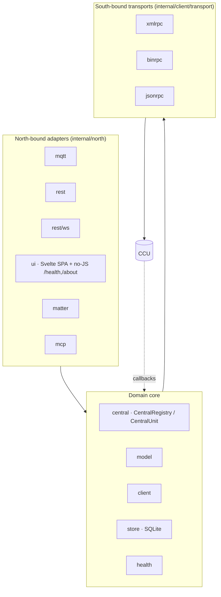

# Architecture

A map of how OpenCCU-Loom is put together: the hexagonal layering, the key packages, the multi-CCU model, the south-bound transports, and where to read deeper.

!!! info "Who this page is for"
    Contributors and developers who need a mental model of the daemon before changing it. For the authoritative design intent, read [`SPECIFICATION.md`](https://github.com/SukramJ/openccu-loom/blob/main/SPECIFICATION.md); for implementation detail, read the code.

## Hexagonal layering

OpenCCU-Loom follows a ports-and-adapters (hexagonal) design. North-bound adapters expose the domain to the outside world; the domain core holds all the logic; a south-bound adapter speaks the Homematic wire protocols to the CCU.



The dependency rule points inward: adapters depend on the core, never the reverse. Cross-cutting protocol interfaces (the DI contracts shared by `central`, `client`, and north-bound adapters) live in `pkg/interfaces`.

## Key packages

The public, thin library surface lives under `pkg/`; everything daemon-internal lives under `internal/`.

| Package | Role |
| --- | --- |
| `pkg/hmtypes`, `pkg/hmenum`, `pkg/hmerr` | Primitive types, enums, error sentinels. |
| `pkg/hmevent` | Domain event types carried on the bus. |
| `pkg/hmapi`, `pkg/hmproto`, `pkg/interfaces` | External DTOs, Homematic wire shapes, DI contracts. |
| `internal/central` | `CentralUnit`, coordinators, registries, the callback servers, scheduler. |
| `internal/client` | `InterfaceClient`, transports, reliability (circuit breaker, retry, throttle), ReGa runner. |
| `internal/model` | Domain model: devices, channels, data points, custom/calculated/combined profiles, schedules, hub. |
| `internal/north` | REST, WS, UI, MQTT, Matter, and MCP adapters. |
| `internal/store` | SQLite persistence (migrations, sessions, paramsets, devices, audit) plus in-memory caches. |
| `internal/auth`, `internal/config`, `internal/health` | Auth backends, config loading, the unified health tracker. |
| `internal/secret`, `internal/configstore` | Secret handling and config-at-rest. |
| `internal/audit`, `internal/diagnostics`, `internal/metrics`, `internal/observability` | Change-log, diagnostics, Prometheus collectors, tracing helpers. |

The full tree is described in [`CLAUDE.md`](https://github.com/SukramJ/openccu-loom/blob/main/CLAUDE.md).

## Multi-CCU model

Multi-CCU is a first-class feature. One daemon serves many CCUs:

- One `CentralUnit` is created per configured CCU.
- A `CentralRegistry` holds them all and is shared with the north-bound adapters.
- `central_name` is the scoping dimension threaded through every cross-cutting call.

No code path assumes a single central. The rationale is in [ADR 0002](https://github.com/SukramJ/openccu-loom/blob/main/docs/adr/0002-multi-ccu-first-class.md); the user-facing view is [Multi-CCU](../user/multi-ccu.md).

## South-bound transports and callback servers

Three transports cover every interface in the MVP, and every interface supports push callbacks — there is no polling-only path.

| Transport | Interfaces | Callback server |
| --- | --- | --- |
| XML-RPC + JSON-RPC | HmIP-RF, BidCos-RF, BidCos-Wired, VirtualDevices | XML-RPC over HTTP on `:8120` |
| BIN-RPC | CUxD | BIN-RPC over raw TCP on `:8129` |

HmIP-Wired is not a separate south-bound interface — [ADR 0023](https://github.com/SukramJ/openccu-loom/blob/main/docs/adr/0023-hmipwired-is-product-group.md) models it as a `ProductGroup` carried on the HmIP-RF interface.

Two listeners run, one per protocol, shared across all centrals:

- **XML-RPC over HTTP** on `rpc_callback.port` (default `:8120`), routed by URL path `/RPC2/<central_name>`.
- **BIN-RPC over raw TCP** on `rpc_callback.bin_port` (default `:8129`), routed by `interface_id` in the envelope.

Both support fixed, dynamic (`0`, OS-assigned), and range port modes. The **effective** port is re-advertised to the CCU on every `init()` and every reconnect. CUxD always speaks BIN-RPC — never treat it as JSON-RPC.

## Event bus

Cross-domain communication inside the core runs over an internal, generic, typed, priority-aware event bus (`internal/central/events`). It has no re-entrancy: handlers subscribe with a priority and an unsubscribe handle.

```go
unsubscribe := events.Subscribe(bus, func(e hmevent.DataPointValueChanged) {
    // handle
}, events.WithPriority(events.PriorityHigh))
defer unsubscribe()
```

## Persistence

Persistence is SQLite via `modernc.org/sqlite` — pure Go, no CGo. The default build runs `CGO_ENABLED=0` and ships as a single static binary. Schema migrations live under `internal/store/sqlite/migrations/` and are applied with goose. Cache layers and boot-time CCU radio cost are documented in [Caching](../caching.md).

## Matter bridge

The Matter side under `internal/north/matter/` is a semantic port of matter.js HEAD. Its binding contract and standing parity guards are described in the [Matter parity contract](../matter-parity-contract.md); the user-facing view is [Matter](../user/matter.md).

## Where to read deeper

- [`SPECIFICATION.md`](https://github.com/SukramJ/openccu-loom/blob/main/SPECIFICATION.md) — goals, non-goals, constraints, resolved decisions.
- [ADR index](adr-index.md) — every architectural decision, with rationale.
- [Security guide](../SECURITY.md) — trust boundaries and the threat model.
- [Source interface](../contributor/source-interface.md) — the strong-model read/write contract.
