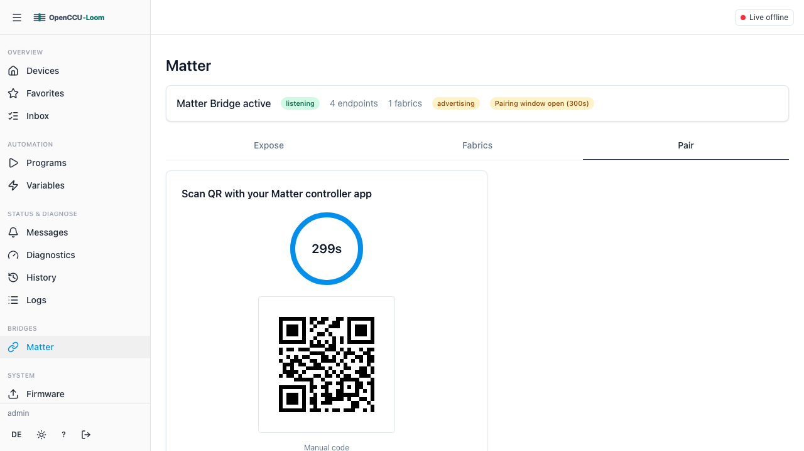

# Matter Bridge

OpenCCU-Loom can expose your Homematic devices to Matter ecosystems — Apple Home, Google Home, and Amazon Alexa — so you can control them from those apps. This page explains how to turn the bridge on and pair it.

!!! info "Who this page is for"
    End users who want their Homematic devices to appear in Apple Home, Google Home, or Alexa. No Go knowledge required; some familiarity with your smart-home app helps.

## What the Matter bridge does

When enabled, OpenCCU-Loom advertises itself on your network as a single Matter **bridge**. Each selected Homematic device shows up inside that bridge as a Matter accessory of the appropriate type (a light, a lock, a sensor, and so on). You then pair the bridge once with your ecosystem, and all its accessories appear together.

The bridge is **off by default**. You must explicitly enable it.

## Enabling the bridge

Set `north.matter.enabled` to `true` in your daemon configuration:

```yaml
north:
  matter:
    enabled: true
    # Optional. The bridge name your ecosystem will show. Defaults to "openccu-loom".
    node_label: "Home Bridge"
    # Optional. UDP listen address. Defaults to ":5540".
    listen: ":5540"
    commissioning:
      # Required for pairing — the Matter setup passcode (00000001..99999998).
      # Leave 0 (the default) and pairing is disabled.
      passcode: 20202021
```

The bridge listens on UDP port **5540** by default. The pairing **passcode** under `north.matter.commissioning.passcode` is required: if it is left at `0`, the bridge will not accept commissioners and the pairing codes are unavailable.

For the full set of keys (vendor/product IDs, discriminator, attestation, CASE), see [Configuration](../admin/configuration.md). Restart the daemon after changing the config — see [Getting started](../getting-started.md).

!!! warning "Test vendor identity — your ecosystem may flag it as uncertified"
    By default the bridge advertises the **test** vendor ID `0xFFF1` and product ID `0x8000`. These are development identifiers, not a certified production identity. Apple Home, Google Home, and Alexa may warn that the bridge is an **uncertified / test accessory** during pairing. This is expected for a self-hosted bridge; you can usually accept and continue. Setting real, vendor-assigned IDs and attestation material is an expert/production step covered in [Configuration](../admin/configuration.md).

## Finding your pairing codes

To pair, your phone app needs either the **setup QR code** or the **11-digit manual pairing code**. OpenCCU-Loom generates both from your configured passcode and discriminator.

- **In the web UI:** open the **Matter** view, which shows the QR code and the manual code ready to scan or type.
- **Via the API:** `GET /api/v1/matter/setup-payload` returns the QR payload and the manual code. (It returns "not configured" if no passcode is set.)



!!! tip
    Keep the passcode private — anyone with the code can add your bridge to their own home.

## Pairing step by step

The flow is the same idea everywhere: add an accessory, then scan the QR or enter the manual code.

=== "Apple Home"

    1. Open the **Home** app and tap **+** → **Add Accessory**.
    2. Scan the **QR code** from the OpenCCU-Loom Matter view (or tap "More options" to enter the manual code).
    3. If prompted that the accessory is uncertified, choose **Add Anyway**.
    4. Wait for the bridge and its devices to be set up, then assign rooms and names.

=== "Google Home"

    1. Open the **Google Home** app and tap **+** → **Set up device** → **New device**.
    2. Choose **Matter-enabled device** and scan the **QR code**, or enter the manual code.
    3. Acknowledge any uncertified-device prompt to continue.
    4. Finish setup and assign rooms.

=== "Amazon Alexa"

    1. Open the **Alexa** app → **Devices** → **+** → **Add Device**.
    2. Pick **Other** / **Matter** and choose to scan the **QR code** or enter the manual code.
    3. Acknowledge any uncertified-device prompt.
    4. Let Alexa discover the bridged accessories.

After pairing the bridge once, the individual Homematic devices appear in the app automatically. Adding the bridge to additional ecosystems uses a fresh commissioning window — open one from the Matter view (the **commissioning window** action) and pair again with the new code.

## Supported device types

OpenCCU-Loom maps Homematic devices to these Matter device types. Anything it cannot map is simply not exposed.

| Matter device type | Typical Homematic source |
|--------------------|--------------------------|
| On/Off Light | Switch-actuator used as a light |
| Dimmable Light | Dimmer |
| Color Temperature Light | Tunable-white light |
| Extended Color Light | Color (RGB) light |
| On/Off Plug-in Unit | Switch / plug actuator |
| Window Covering | Blind / shutter / cover |
| Thermostat | Heating thermostat |
| Door Lock | Door lock / keymatic |
| Contact Sensor | Door/window contact |
| Occupancy Sensor | Motion / presence sensor |
| Temperature Sensor | Temperature measurement |
| Humidity Sensor | Humidity measurement |
| Light Sensor | Illuminance measurement |
| Pressure Sensor | Air-pressure measurement |
| Generic Switch | Button / momentary switch |
| Smoke / CO Alarm | Smoke detector |
| Water Leak Detector | Water/leak sensor |
| Air Quality Sensor | CO₂ / particulate sensor |

## Choosing which devices are exposed

You do not have to expose everything. The **Matter** view lets you pick which devices the bridge advertises, so your Home app stays uncluttered. Changes take effect on the bridge without re-pairing it.

## Limitations

- Only the device types in the table above are exposed; unmapped devices stay Homematic-only.
- Some Homematic features have no direct Matter equivalent and are not carried over.
- A device must be mappable to a supported Matter type before it can be exposed.
- The default test vendor identity means ecosystems may treat the bridge as uncertified (see the warning above).

For the technical contract behind the Matter mapping, see [`docs/matter-parity-contract.md`](../matter-parity-contract.md).

## Where to go next

- [Getting started](../getting-started.md) — install and first run.
- [Core concepts](concepts.md) — devices, channels, and data points.
- [Configuration](../admin/configuration.md) — full Matter and daemon settings.
