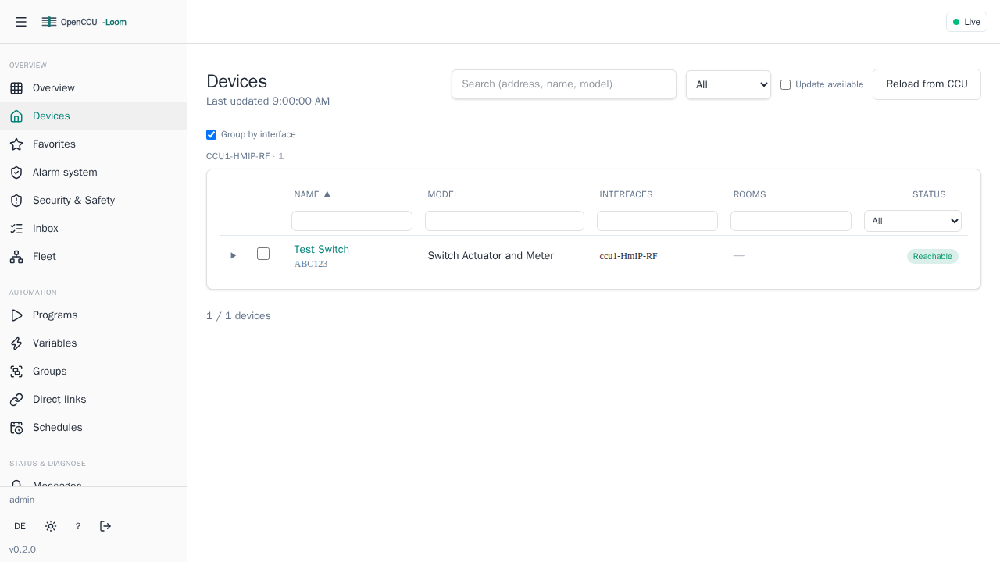
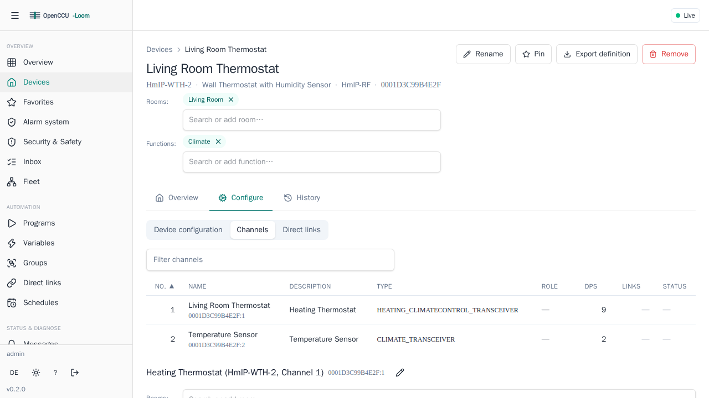
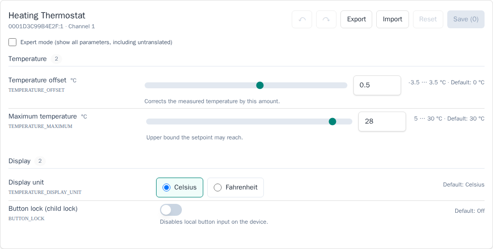
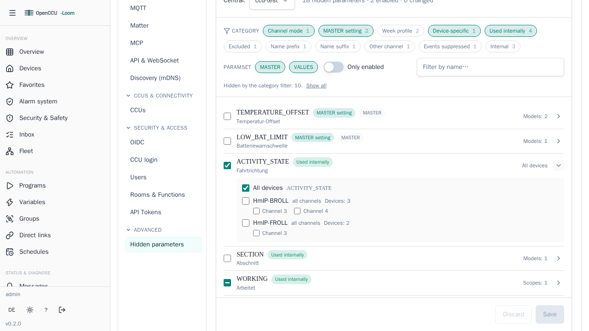

# Using the Web UI

OpenCCU-Loom ships a browser-based Config UI for inspecting your CCUs, browsing devices, changing values, and configuring devices — no command line needed. This page is a tour of what you can do there.

!!! info "Who this page is for"
    End users who want to manage their Homematic devices from a browser. No Go knowledge or API experience required.

## Opening the UI

By default the web UI listens on port **8119**. In a browser on the same network, open:

```text
http://<host-running-openccu-loom>:8119/
```

### First run

The very first time you open the UI, there is no account yet. You are sent to the **first-run setup** page at `/setup`, where you create the initial administrator account.

```text
http://<host>:8119/setup
```

After that, future visits go through the **login** page at `/login`.

### Logging in

OpenCCU-Loom supports several sign-in methods (local accounts, sessions, and optionally OIDC single sign-on). Which ones are available depends on how the daemon was configured. For the details of accounts, roles, and OIDC, see [Authentication](../admin/auth.md).

!!! tip
    If the page does not load at all, the rich Svelte app may not be built into your binary. A minimal fallback page is served instead and points you back to the same address. In that case check your install per [Getting started](../getting-started.md).

## What the UI lets you do

The app is organised into views. The main ones, and the everyday tasks they cover:

| View | What you do there |
|------|-------------------|
| **Overview** | Landing dashboard: at-a-glance daemon and CCU status. |
| **Favorites** | Quick access to the devices you pin as favorites. |
| **Devices** | Browse all devices across your CCUs, drill into channels and parameters. |
| **Device detail** | Inspect one device, read and change its data points, and configure it. |
| **Fleet** | Fleet-wide view across every configured CCU. |
| **Energy** | Monitor power and energy readings from measuring devices. |
| **Radio & battery** | Review per-device radio signal strength (RSSI), battery level and reachability. |
| **Matter** | Enable exposure of devices to Apple Home / Google Home / Alexa and pair. |
| **Diagnostics** | Check health and troubleshooting information. |
| **Backups** | Manage configuration backups. |
| **Firmware** | View device firmware status. |
| **Inbox / Messages** | See pending notices from your CCUs. |
| **Programs / System variables** | Browse CCU programs and system variables. |
| **Audit log** | Review what changes were made and by whom. |
| **Log viewer** | Follow the daemon's live log stream (see [Installation & First Steps](../user-guide.md#log-viewer-logs)). |
| **Settings** | Adjust daemon and UI settings, including the interface theme (light / dark / system — the same preference the sidebar toggle cycles), users and API tokens, and the hidden parameters to reveal. |



The sections below cover the tasks most users do.

## Browsing devices, channels, and parameters

Open the **Devices** view to see every device OpenCCU-Loom has discovered across all configured CCUs. If you run more than one CCU, devices are grouped by their CCU name (the `central_name`).

Selecting a device opens its detail view, where you can:

1. See the device's channels.
2. Open a channel to list its **data points** (parameters such as `STATE`, `LEVEL`, `TEMPERATURE`).
3. Read the current value of each data point.

If you are unsure what "device", "channel", and "data point" mean, read [Core concepts](concepts.md) first.



## Changing a value

For writable parameters, the UI gives you a control (a toggle, a slider, an input field) to set a new value. When you confirm, OpenCCU-Loom sends the change to the CCU and the device reacts.

Behind the scenes this is a single write to the parameter
(`PUT /api/v1/devices/{address}/channels/{channel}/data-points/{parameter}/value`); you do not need to call it yourself — the control does it for you.

!!! warning
    Writing a value actuates a **real device**. Make sure you are changing the device you intend to before you confirm.

## Configuring a device (paramsets)

Beyond live values, many devices have **configuration parameters** (the device's settings, as opposed to its current state). The UI presents these as editable forms per channel, with sensible grouping and labels.

You can also **export** a channel's configuration and **import** it again, which is handy for copying settings between similar devices. These map to the channel config export/import endpoints
(`GET .../config/export` and `POST .../config/import`).



## Showing hidden parameters (un-ignore)

Some parameters are hidden by default to keep views clean — see [parameter visibility](concepts.md#parameter-visibility-ignore-un-ignore). **Settings → Advanced → Hidden parameters** lists what is currently hidden and lets you switch individual parameters back on.

The list shows **one row per parameter**, not one row per device. A large installation hides only a few dozen distinct parameters, but each of them occurs on many device models and channels — so the row is the parameter, and you open it to choose where it applies.

1. Open **Settings** and pick the **Hidden parameters** tab.
2. Find the parameter you need — type part of its name, its translated label, or a device model into the search box.
3. Switch it on with the checkbox at the start of the row. That enables it **for every device**.
4. To be more selective, expand the row with the chevron on the right and tick a single device model, or a single channel of that model.
5. Click **Save**.



### If you cannot find a parameter

Most hidden parameters are internal plumbing — diagnostic bits, service values the CCU marks as internal, and the individual cells of week profiles. Those categories **start collapsed**, so the list opens on the parameters that are usually worth a decision.

A line under the filter tells you how many rows are currently hidden and offers **Show all**. You can also click the category chips to filter to exactly the categories you want; each chip shows how many parameters it holds.

The category on each row names the rule that hid the parameter:

| Category | Meaning |
| --- | --- |
| **Channel mode** | The channel's operation mode excludes it. Changing the mode reveals it without an un-ignore entry — usually the better fix. |
| **MASTER setting** | A configuration value outside the list of MASTER parameters shown by default. |
| **Week profile** | One cell of a week profile (`P1_ENDTIME_MONDAY_1`, `01_WP_LEVEL`). A single thermostat has hundreds; edit the profile in the schedule editor instead. |
| **Used internally** | The value exists and is used elsewhere — a maintenance channel or a combined data point — but is not shown on its own. |
| **Device-specific** | Suppressed for this device model in particular. |
| **Excluded**, **Name prefix**, **Name suffix** | On the built-in exclusion list, or matching a suppressed name pattern such as `*_STATUS`, `*_RESULT`, `ERR_TTM_*`. |
| **Internal**, **Diagnostic bit** | The CCU marks it as an internal service value, or it is a read-only bit the CCU never reports on its own. |

### Three-state checkboxes

A row's checkbox has three states: empty (off), checked (on for every device), and a dash (on for some device models or channels only). The right-hand column tells you which — *All devices*, or how many scopes are active.

### Patterns without a matching parameter

If you previously enabled a parameter that no device in your installation carries any more — a device you removed, or a hand-typed entry with a typo — it appears in a separate **Patterns without a matching parameter** list at the bottom instead of disappearing. Saving never drops those silently; remove them yourself with the ✕ button.

Once un-ignored, the parameter shows up in the device's data-point list and is published to MQTT, REST, and the other north-bound bridges like any other data point.

## Charts and measurement history

The device detail view has a **History** tab that charts a data point's
recorded values over time — handy for seeing how a temperature,
humidity, or power reading moved across a day or week.

Measurement history is **opt-in**: nothing is recorded until you enable
it (`persistence.history` in the configuration). Once on, the daemon
stores samples in a separate `history.db` and the History tab plots
them; before that the tab has nothing to show.

## Health and diagnostics

The **Diagnostics** view shows the daemon's overall health and connection status to each CCU and interface — useful when a device seems unresponsive or a CCU dropped offline. There is also a server-rendered `/health` page if you only need a quick up/down check.

For deeper operational topics (log levels, captures, metrics), see [Observability](../admin/observability.md).

## Where to go next

- [Getting started](../getting-started.md) — install and first run.
- [Authentication](../admin/auth.md) — accounts, roles, and OIDC.
- [Core concepts](concepts.md) — the device model in plain language.
- [Multi-CCU](multi-ccu.md) — running several CCUs at once.
