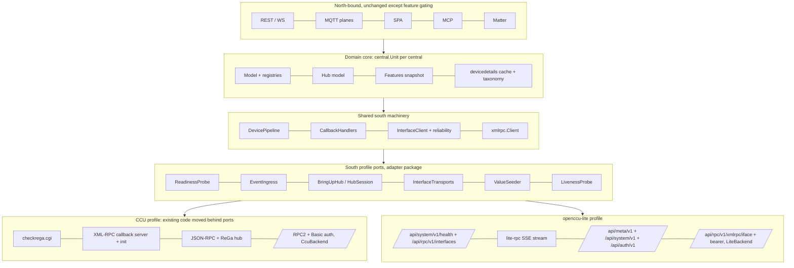

# openccu-lite as a first-class south-bound system — implementation plan

- **Status**: ready for execution
- **Written**: 2026-09-27, against `main` @ `9a78c308` (version 0.78.1, REST `APIVersion` 11.2.0, wsapi 1.9)
- **Audience**: the coding agent that executes this plan end-to-end, without access to the conversation
  that produced it. Everything you need is in this file; the scratchpad reports it was built from will
  not exist when you read it.
- **Binding user decisions** (do not re-open them): see [§1.4](#14-decisions-already-made-binding).

How to read this document:

- Every code anchor is `path:line` at `9a78c308`. Lines drift as you edit — re-locate by the named
  symbol, never by the number alone.
- **UNVERIFIED** marks a claim nobody read in code. Each one carries a resolution step; do it before
  the plan step that depends on the claim. Never treat an UNVERIFIED claim as a fact.
- "occulited" is the daemon that fronts openccu-lite; its source is GPL-3.0-only. Its wire contract is
  condensed in [Appendix A](#appendix-a--the-occulited-wire-contract-condensed). That appendix is the
  only occulited material you may use: you may not read, copy or port occulited source (see §1.5).
- The rules in [`CLAUDE.md`](../../CLAUDE.md) apply in full. §12 distils the ones this work trips over.
- **Moved 2026-09-29**: the test double this plan builds under `tests/harness/litefake` now lives in
  godevccu as `pkg/litefake` (standalone fake box via godevccu CLI `-mode lite`); Appendix A is kept
  verbatim there as `pkg/litefake/CONTRACT.md`. Path mentions of `tests/harness/litefake` below are
  historical.

---

## Contents

1. [Goal, non-goals, success criteria, licence](#1-goal-non-goals-success-criteria-licence)
2. [Target architecture](#2-target-architecture)
3. [Per-central features: a capability model that gates](#3-per-central-features-a-capability-model-that-gates)
4. [The lite event source](#4-the-lite-event-source)
5. [Metadata: the backend-neutral taxonomy](#5-metadata-the-backend-neutral-taxonomy)
6. [System management on openccu-lite](#6-system-management-on-openccu-lite)
7. [Onboarding](#7-onboarding)
8. [Test double, contract tests and guards](#8-test-double-contract-tests-and-guards)
9. [Execution plan — the slices](#9-execution-plan--the-slices)
10. [ADRs, specification, docs, changelogs, API versions](#10-adrs-specification-docs-changelogs-api-versions)
11. [Risks and open questions](#11-risks-and-open-questions)
12. [Implementer's operating rules](#12-implementers-operating-rules)
- [Appendix A — the occulited wire contract (condensed)](#appendix-a--the-occulited-wire-contract-condensed)
- [Appendix B — report claims found wrong during verification](#appendix-b--report-claims-found-wrong-during-verification)
- [Appendix C — new identifiers at a glance](#appendix-c--new-identifiers-at-a-glance)

---

## 1. Goal, non-goals, success criteria, licence

### 1.1 Goal

After this plan is executed, OpenCCU-Loom runs against **openccu-lite** — a CCU firmware without
ReGaHSS and without the WebUI JSON-RPC, managed by the daemon occulited — as fully as the system
allows:

- devices, channels, paramsets, values, links, MASTER configuration, install mode, device firmware,
  team / replace / config-restore / delete, all through occulited's XML-RPC proxy;
- live events through occulited's lite-rpc event stream (SSE) instead of `init` callbacks, with
  liveness, resume, resync and interface up/down handled so that every existing north-bound surface
  (MQTT, REST, WS, SPA, Matter, MCP, alarm, history) behaves as it does on a CCU;
- names, rooms, functions (and any other enum, e.g. `floor`) read and written through occulited's
  metadata API, modelled as a backend-neutral **tree taxonomy**;
- system management (backup/restore, system update, reboot/halt/recovery, service messages, heating
  groups, radio / duty-cycle / interface status, HmIP key-mode info) — each feature live only when the
  API token carries the scope, cleanly absent with a reason otherwise;
- onboarding: detection, token pairing and manual token entry, TLS pinning, in the SPA wizard and the
  CCU admin.

**CCU behaviour does not change.** Every CCU code path is extracted behind ports first
(behaviour-preserving, proved by the existing suites), and lite is added as a second implementation of
the same ports. There is no `if lite` anywhere outside the one selection function
(`southProfileFor`, §2.4).

### 1.2 Non-goals

| Non-goal | Why | What the operator sees on lite |
|---|---|---|
| System variables, programs, HM-Script, ReGa alarm messages, CCU inbox, ReGa ISE-IDs | openccu-lite has no ReGa and no script interpreter (Appendix A §A.9) | Features `hub.sysvars`, `hub.programs`, `hub.alarm_messages`, `hub.inbox` absent with reason `not_supported_by_system`: views hidden, MQTT entities not declared, REST/WS answer `422 feature_unavailable` (§3.4). Never a silent empty success. |
| CUxD on lite | occulited's lite-rpc excludes BIN-RPC interfaces | Config validation rejects `CUxD` in a lite central's `interfaces` with a clear message. |
| Classic RPC (lighttpd sockets 2001/2010/9292, `init` with a Loom callback) | Binding user decision: "Weg B" only. Classic RPC is off by default on the box and has no per-method rights | Not offered, not detected. |
| occulited's JSON variant `POST /api/rpc/v1/json/{interface}` | Binding: use the XML path so Loom's XML-RPC codec and the whole description/paramset pipeline stay unchanged | — |
| Communication test, CCU astro position, safe mode, service-message acknowledge | No endpoint on lite (Appendix A §A.9) | Absent with reason. |
| eQ-3 UDP-43439 discovery | Loom has never implemented it (`grep 43439` finds nothing); SSDP already finds lite boxes (§7.7) | SSDP lists the box and labels it `openccu-lite`. |
| Running the real occulited in CI | GPL-3.0 binary; dev mode has no working lite-rpc (Appendix A §A.10). Needs a separate user decision (CLAUDE.md: copyleft → stop and discuss) | Our own MIT fake gates PRs (§8). |
| Device pictures from the box | occulited serves no `/config/img/...` pictures (a `.png` path that does not exist is a 404, Appendix A §A.1) | Superseded: the pictures now come from the embedded openccu-data snapshot (`ccudata.DeviceImage`), and the CCU is only asked for a filename the snapshot lacks, so lite shows them too. The earlier claim that "the SPA shows its fallback" was wrong — the SPA did not request the icon route at all until the device detail view started rendering it with a glyph fallback. |
| Area (ADR 0056) keys by tree path | Areas stay keyed by `(central, room name)`; on lite the tree itself is the grouping | Documented limitation (§5.6). |

### 1.3 Success criteria (each one is a test or a named check)

1. **CCU unchanged**: `make test`, `make contract`, `make integration`, `make e2e`, the wire-snapshot
   pins (`tests/contract/wire_snapshots/`) and the model-snapshot parity diff (tests/CLAUDE.md
   pipeline, steps 2+4) are green and **unchanged** after each Phase A slice. Phase A adds no file to
   `tests/contract/wire_snapshots/` and moves no golden.
2. **Lite boots in production order**: `tests/e2e/boot_order_test.go` runs a table entry per backend;
   the lite run starts the fake **not ready**, asserts 0 devices, flips ready, asserts every subsystem
   reports non-empty state (slice C4b).
3. **Lite end-to-end** (`tests/e2e/lite_backend_test.go`, built binary, fake openccu-lite): devices
   appear with names and rooms from the metadata API; a simulated device event reaches REST, WS and
   MQTT; a value write reaches the fake's godevccu; an `interface down` makes that interface's devices
   unavailable and `up` recovers them; a forced `resync gap` re-seeds values; a dropped stream resumes
   with `Last-Event-ID` without duplicate or lost events; a rename via REST lands in the fake's meta
   store and comes back on the metadata stream.
4. **Absent is explicit**: `TestLiteFeatureContract` (table over every `hmenum.Feature`) asserts, for a
   lite central with a scope-limited token: the REST route answers `422` with problem type
   `feature_unavailable` and the right `reason`/`scope`; the WS command answers error code
   `feature_unavailable`; `/system/ccu` reports the feature absent; the MQTT hub plane declares no
   entity for it (`TestHubPlaneTopicsRoundTripLite`).
5. **Every new seam has a production caller and a composition-root pin** (§8.5), and every new event
   type has a subscriber (`TestEveryEventTypeHasASubscriber`).
6. **Live verification** on a real openccu-lite box passes the read-only checklist in slice F2; writes
   happen only with explicit user approval and a user-named device (CLAUDE.md "Live-CCU writes").

### 1.4 Decisions already made (binding)

1. **Transport "Weg B"**: XML-RPC via `POST /api/rpc/v1/xmlrpc/{interface}` (token as bearer); events via
   `GET /api/rpc/v1/events` (SSE); names/rooms/functions via `/api/meta/v1` (snapshot + change stream);
   system management via `/api/system/v1`. Classic RPC is not the path.
2. **Room/function model**: a tree taxonomy becomes Loom's core model — backend-neutral enums with node
   trees and path ids. CCU rooms/functions map to depth-1 trees. Public DTOs keep room/function
   **names** (backwards compatible) and gain path/parent information additively. Enum ids are data
   (`room`, `function`, `floor`, `favorite`, …).
3. **Token acquisition**: both occulited client pairing in the SPA wizard (cannot grant `backup`,
   `power`, `radio:keys`, `addons:write`, `led`, `auth:admin`) **and** pasting a manually created token
   (which may carry `backup`/`power`). The token is a `cfg:"secret"`.
4. **System management**: full and scope-driven — every feature active only if the token has the scope
   (read `GET /api/auth/v1/state`), otherwise hidden with a reason; never silent success.

### 1.5 Licence

- occulited is **GPL-3.0-only**; openccu-lite's own work is Apache-2.0. OpenCCU-Loom stays **MIT**
  ([ADR 0001](../../docs/adr/0001-license-mit.md); [ADR 0066](../../docs/adr/0066-relicense-agpl-commercial-exception.md)
  was rejected).
- Loom is a **network client** of occulited's HTTP API. Implementing a client against a documented wire
  contract is not a derivative of the server's code. Therefore: **re-derive** every wire detail from
  Appendix A; **never** copy, port or translate occulited source (its tier table, its `anyValue`
  converter, its pairing code, its SSE writer) and never commit occulited's `fixtures/` corpus (also
  GPL-3.0). Where Loom needs the same arithmetic (the pairing code, §7.5) it is written from the
  formula in Appendix A, not from occulited's function.
- The test double (`tests/harness/litefake`) is our own MIT code, written from Appendix A.
- Comments may cite the occulited *documentation* by name ("occulited system API, lite-rpc section")
  but never an occulited source path (`internal/literpc/…`): `TestDocPurity_MarkdownRefsExist`
  resolves cited paths against this repository, and a GPL source path is not a durable reference here.
- ADR 0071 (§10) records this licence reasoning.

---

## 2. Target architecture

### 2.1 What is hard-wired to "CCU with ReGa + JSON-RPC + init callback" today

Verified in code at `9a78c308`:

| # | Hard-wired behaviour | Anchor | Lite breaks because |
|---|---|---|---|
| H1 | Readiness gate = `GET <base>/ise/checkrega.cgi` body `OK`, unbounded wait at boot | `internal/central/adapter/ccu_readiness.go:64-186`; callers `ccu_wiring.go:259` (boot, `Timeout:-1`), `ccu_wiring.go:1276` (pre-init, 5 s), `ccu_wiring.go:1038` (recovery, 120 s), `ccu_wiring.go:813` via `newReconnectReadinessGate` (`ccu_readiness.go:179-186`, 30 s), `cuxd_wiring.go:480` | occulited serves its SPA shell (HTTP 200, HTML) for any path without a static-file extension, `.cgi` included (Appendix A §A.1) → body ≠ `OK` forever → the central waits forever |
| H2 | Hub bring-up = JSON-RPC `Session.login` + ReGa runner; serial via ReGa `get_serial` (hard prerequisite); names/rooms/functions via `Device.listAllDetail` / `Room.getAll` / `Subsection.getAll` (hard prerequisites) | `hub_wiring.go:122-481` (`WireHub`), login `:147`, runner `:151`, serial `:235-241`, names `:309-317`, rooms `:328-336`, functions `:338-346`; called first in `bringUpCentral` `ccu_wiring.go:440-446` | no JSON-RPC → `WireHub` fails → re-gate loop forever |
| H3 | The ReGa runner threads through the device pipeline for value seeding (`fetch_all_device_data`) | `device_pipeline.go:628-694` (`IngestFromBackend(…, runner, …)`), `:775-839` (`IngestNewDevices`), `:943-962` (seed), `:1315-1387` (`seedValues`); `load_refresh.go:20-37`; `hotplug_wiring.go:32-88` | no runner; must become a port |
| H4 | Per-interface transport = `http(s)://host:<detection port>/RPC2` with Basic auth; announcer = XML-RPC `init`; backend kind from the interface name only | `ccu_wiring.go:727-761` (URL, client, announcer, `backends.KindFor`), `:1609-1662` (`interfaceURL`/`interfacePort`), `internal/client/transport/xmlrpc/client.go:151-153` (Basic only when `Username != ""`), `internal/client/backends/capabilities.go:259-266` (`KindFor`) | lite URL is `…/api/rpc/v1/xmlrpc/{iface}`, auth is a bearer token, `init` is refused (fault), kind must come from the central |
| H5 | CCU backend extras bound per interface: ReGa runner, CCU time zone, `cp_security.cgi` HTTP transport + session renewer, rename hooks via ISE-ID lookup | `ccu_wiring.go:856-939` | none of this exists on lite |
| H6 | Inbound events only via the shared XML-RPC callback server route `/RPC2/<central>`; `CallbackHandlers` created only when a callback server + host exist | `ccu_wiring.go:635-671` (`registerCentralCallbacks`); `internal/central/rpcserver/handlers.go:20-51` | events arrive over SSE; handlers must exist without a callback server |
| H7 | Liveness stamp only on an inbound event (`NotifyCallback`), 180 s freshness | `callback_handlers.go:234-258` (`noteCallbackAndRoutePong`), `internal/client/interface_client.go:785-836` | a quiet interface would trip `ConnectionLostEvent` after 180 s; the SSE heartbeat must stamp |
| H8 | Recovery re-registers with `init` via `ReinitProxy` | `ccu_wiring.go:1028-1050`; `internal/client/interface_client.go:935-972` | must become "wait until the stream reports the interface up" |
| H9 | Late-binding hub wiring resolves the **KindCCU** primary backend | `ccu_wiring.go:563-571` (`WireSysvarCreator`, `WireBackupAndDownload`, `WireServiceMessageSuppressor`, `WireInstallModeDPs`); `hub_wiring.go:2631-2680` (`primaryBackendOf` accepts only `backends.KindCCU`, `:2660`) | a lite backend is (correctly) skipped; the features need other sources |
| H10 | Maintenance (reboot/poweroff/safe/recovery/position/firmware download) by type assertion on the primary backend | `internal/central/adapter/ccu_maintenance.go:15-35, 56-199` | needs per-central ports |
| H11 | Heating groups by type assertion (`heatingGroupLister`, jpages writer) on the primary backend | `groups.go` (`groupsOf`), `groups_write.go:23-31` | lite has its own groups API |
| H12 | Backup create = `cp_security.cgi` download; restore = `HTTPBackupRestorer` with the JSON-RPC session | `ccu_wiring.go:458-470`; `internal/central/central.go:991-1006` (`CreateBackup`/`SetCreateBackupFn`); `stubs.go:287-307`; `backup_restorer.go` | lite: `GET /api/system/v1/backup`, `POST /restore/check` + `/restore/apply` |
| H13 | MQTT hub-plane liveness = ReGa `checkrega.cgi` poll | `rega_liveness.go:215-289`; `cmd/openccu-loom/daemon.go:370, 638`; `hub_mqtt_publisher.go:132-200` | on lite the probe gets the SPA shell (200 + HTML) → classified `regaProbeNotServing` → the whole hub plane goes `offline` |
| H14 | MQTT hub discovery declared unconditionally (alarm messages, service messages, inbox, system update, install mode) | `hub_mqtt_publisher.go:639-825, 888-905`; retraction list `:418-425` | declared ≠ published on lite |
| H15 | CCU-delegated login = JSON-RPC `Session.login`; user level via ReGa | `internal/central/adapter/ccu_auth.go:72-116` | lite has `/api/auth/v1/login` with a level |
| H16 | `/system/ccu` product heuristics: `RecoveryModeSupported = Model != "" && Model != "CCU"` | `cmd/openccu-loom/system_ccu_adapter.go:68-72` | would claim recovery for any lite box without checking the `power` scope |
| H17 | Config has no system type, no token, no pin; the setup wizard and CCU admin know only host/username/password/interfaces | `internal/config/config.go:1757-1801`; `internal/store/sqlite/centrals_store.go:95-117`; `internal/north/rest/handlers/setup.go:82-88`; `assets/ui/src/routes/Setup.svelte`; `assets/ui/src/lib/components/settings/CentralsAdmin.svelte` | lite needs `system_type`, token, TLS pin |
| H18 | Room/function write paths and room admin are ReGa scripts; room ids are ReGa ISE-IDs (`int`) | `hub_wiring.go:2368-2452`; `internal/model/hub/hub.go:19-46` (`RoomAdmin.CreateRoom` returns `int`) | lite writes through the meta API; node ids are strings |
| H19 | Metadata refresh = 5-minute poll of JSON-RPC | `hub_wiring.go:372-396`; `internal/store/devicedetails/loader.go:106-221` | lite pushes changes on its metadata stream |

The first-order branch today exists only **per interface** (CUxD, `ccu_wiring.go:718-725`); there is
no per-central branch before `WireHub`. `backends.KindHomegear` is never selected in production
(`KindFor` returns only CCU/CUxD; the `DetermineBackendKind` named in `factory.go:30` and
`capabilities.go:257` does not exist).

### 2.2 The model: one south profile per central

A **south profile** is the per-central strategy, chosen once from `cc.SystemType`, that supplies
everything in the table above. The XML-RPC client, the reliability stack (`InterfaceClient`), the
backend `Operations` contract, the device-description and paramset pipeline, the callback handlers,
the domain model and every north-bound adapter stay shared.



ASCII fallback (same content):

```
north (REST/WS/MQTT/SPA/MCP/Matter) ── reads ──> central.Unit (model, hub, Features, taxonomy)
                                                   ^
shared south: DevicePipeline, CallbackHandlers, InterfaceClient, xmlrpc.Client
                                                   ^
SouthProfile ports: ReadinessProbe | EventIngress | BringUpHub→HubSession(InterfaceTransports, ValueSeeder, …) | LivenessProbe
          ├── ccuProfile   (checkrega · callback server + init · JSON-RPC/ReGa · /RPC2 + Basic · CcuBackend)
          └── liteProfile  (health+interfaces · SSE stream · meta/system/auth APIs · /api/rpc/v1/xmlrpc + bearer · LiteBackend)
```

### 2.3 The ports (Go sketches that pin the decisions)

All ports are declared in the **consumer** package `internal/central/adapter` (CLAUDE.md: interfaces live
in the consumer package), in a new file `internal/central/adapter/south_profile.go`. Per-central
domain ports that north-bound code also consumes (features, backup archive, system management) are
declared in `internal/central` because `central.Unit` holds them and several consumers read them.

```go
// internal/central/adapter/south_profile.go

// SouthProfile is the per-central south-bound strategy, selected once per
// central by southProfileFor from the configured system type.
type SouthProfile interface {
	SystemType() hmenum.SystemType
	// Readiness decides when the system serves names and devices; it gates the
	// boot bring-up, the pre-announce re-check, the recovery reconnect and the
	// InterfaceClient reconnect.
	Readiness() ReadinessProbe
	// Liveness is the hub-plane liveness probe the MQTT hub publisher polls
	// (the CCU's ReGa probe today). Nil means "no probe": the plane folds to reachable.
	Liveness() LivenessProbe
	// Events wires inbound events for the central. Called once per central, at
	// buildAndStart (permanent for the central's life).
	Events() EventIngress
	// BringUpHub is the first step of every bring-up generation: identity, hub
	// model, metadata, features. An error returns the central to the readiness gate.
	BringUpHub(ctx context.Context, in HubBringUpInput) (HubSession, error)
}

// ReadinessProbe performs ONE readiness check. reason names why the system is
// not ready ("checkrega.cgi answered 503", "token rejected (401)") and is
// recorded on the central's startup health component.
type ReadinessProbe interface {
	Probe(ctx context.Context) (ready bool, reason string)
}

// LivenessProbe classifies one hub-plane liveness poll. Replaces the
// ReGa-specific probe function inside regaLivenessTarget.
type LivenessProbe interface {
	Probe(ctx context.Context) regaProbeResult // rename the type to systemProbeResult in slice A1
}

// EventIngress constructs the central's CallbackHandlers and starts feeding them.
// callbackURL is what the per-interface announcers advertise ("" = read-through
// mode, the existing ccu_wiring.go:1354-1371 branch). binRPCAddr is the CUxD
// callback address (CCU only). detach is a permanent closer.
type EventIngress interface {
	Attach(unit *central.Unit, deps WireDeps, logger *slog.Logger) (
		h *CallbackHandlers, callbackURL, binRPCAddr string, detach func())
}

type HubBringUpInput struct {
	Cfg    *config.Config
	CC     *config.CentralConfig
	Unit   *central.Unit
	Deps   WireDeps
	Logger *slog.Logger
}

// HubSession is one bring-up generation's south-side state.
type HubSession interface {
	// Data is the metadata snapshot the pipeline stamps at ingest (names,
	// rooms, functions by name). Taxonomy refs travel through unit.DeviceDetails.
	Data() HubData
	Transports() InterfaceTransports
	// ValueSeeder returns nil when the system offers no bulk value source.
	ValueSeeder() ValueSeeder
	// RefreshMetadata runs before a hot-plug ingest so a new device carries its
	// name; a push-fed profile returns nil immediately.
	RefreshMetadata(ctx context.Context) error
	// Restorer returns nil when the system cannot restore a backup.
	Restorer() BackupRestorer
	// WireLate installs the per-central services that need every interface
	// backend (today's WireSysvarCreator/WireBackupAndDownload/
	// WireServiceMessageSuppressor/WireInstallModeDPs block).
	WireLate(unit *central.Unit, writer *client.ValueWriter)
	Close()
}

// InterfaceTransports is the per-interface transport strategy of a session.
type InterfaceTransports interface {
	Endpoint(iface hmenum.Interface) (InterfaceEndpoint, error)
	Announcer(c *xmlrpc.Client, iface hmenum.Interface) backends.Announcer
	BackendKind(iface hmenum.Interface) backends.Kind
	// JSONCaller is the JSON-RPC caller CcuBackend dispatches JSON-only ops on; nil for lite.
	JSONCaller() backends.Caller
	// ReconnectGate is client.Config.WaitCCUReady.
	ReconnectGate() func(context.Context) bool
	// ConfigureBackend applies profile extras to a freshly built backend
	// (CCU: the ccu_wiring.go:856-939 block).
	ConfigureBackend(unit *central.Unit, iface hmenum.Interface, b backends.Operations)
}

type InterfaceEndpoint struct {
	URL        string
	Username   string       // XML-RPC Basic auth (CCU); empty for lite
	Password   string
	HTTPClient *http.Client // nil = xmlrpc.NewClient's default (CCU today)
}

// ValueSeeder returns the current wire values of one interface, keyed by
// channel address then parameter. The pipeline applies them (edge-trigger
// exclusion and OnWireValue stay in the pipeline). depth lets a profile keep
// the periodic sweep cheap; the CCU ignores it (fetch_all_device_data is one call).
type ValueSeeder interface {
	SeedValues(ctx context.Context, iface hmenum.Interface, depth SeedDepth) (map[string]map[string]any, error)
}

type SeedDepth int

const (
	SeedCheap SeedDepth = iota // periodic central.refresh_client_data sweep
	SeedFull                   // boot ingest, hot-plug, after a resync
)

// generationAware is implemented by an EventIngress that needs the current
// bring-up generation's pipeline. bringUpCentral type-asserts it after the
// pipeline exists and registers the returned unbind as a generation closer
// (the pattern of backends.MaybeInitialize).
type generationAware interface {
	BindGeneration(reseed func(ctx context.Context, iface hmenum.Interface) error) (unbind func())
}
```

`HubData` (`hub_wiring.go:54-58`) and `BackupRestorer` (`backup_storage.go:76-81`) are existing
types; keep them.

Domain-side additions in `internal/central` (the Unit holds them, north reads them):

```go
// internal/central/features.go — see §3.
type FeatureState struct {
	Available bool
	Reason    hmenum.FeatureReason // empty when Available
	Scope     string               // the missing token scope when Reason == missing_scope
}
type Features struct { /* immutable: system hmenum.SystemType; states map[hmenum.Feature]FeatureState */ }
func (f Features) SystemType() hmenum.SystemType
func (f Features) State(k hmenum.Feature) FeatureState      // zero Features or unknown key: {false, not_ready}
func (f Features) Require(central string, k hmenum.Feature, legacy error) error // nil or *hmerr.FeatureUnavailableError
func (u *Unit) Features() Features
func (u *Unit) SetFeatures(f Features) // publishes hmevent.CentralFeaturesChangedEvent iff changed

// internal/central/system_services.go — per-central management ports (§6).
type PowerControl interface {
	Reboot(ctx context.Context) error
	PowerOff(ctx context.Context) error
	EnterSafeMode(ctx context.Context) error
	EnterRecoveryMode(ctx context.Context) error
}
type PositionWriter interface{ SetPosition(ctx context.Context, lon, lat float64) error }
type SystemFirmwareDownloader interface{ DownloadSystemFirmware(ctx context.Context) error }
type HeatingGroups interface { /* §6.6 */ }
type SystemServices struct {
	Power    PowerControl
	Position PositionWriter
	Firmware SystemFirmwareDownloader
	Groups   HeatingGroups
}
func (u *Unit) SetSystemServices(s SystemServices)
func (u *Unit) SystemServices() SystemServices

// internal/central/central.go — CreateBackup gains a file name (§6.2).
type BackupArchive struct {
	Data     []byte
	FileName string // "" = derive (ccuArchiveName)
}
func (u *Unit) SetCreateBackupFn(fn func(ctx context.Context) (BackupArchive, error))
```

### 2.4 Selection — the only place a system type is compared

```go
// internal/central/adapter/south_profile.go
func southProfileFor(cc *config.CentralConfig, deps WireDeps, logger *slog.Logger) (SouthProfile, error) {
	switch cc.SystemType.Normalize() { // "" normalises to ccu
	case hmenum.SystemTypeCCU:
		return newCCUProfile(cc, deps, logger), nil
	case hmenum.SystemTypeOpenCCULite:
		return newLiteProfile(cc, deps, logger)
	case hmenum.SystemTypeAuto:
		return nil, errAutoUnresolved // resolved by resolveAutoSystemType, §7.1
	}
	return nil, fmt.Errorf("central %s: unknown system_type %q", cc.Name, cc.SystemType)
}
```

Call sites:

- `BringUpManager.buildAndStart` (`central_bringup.go:429-463`): replaces the direct
  `registerCentralCallbacks` call with `profile.Events().Attach(...)` and stores the profile on the
  `centralBringUp` handle; `start()` passes it to `gatedCentralBringUp`.
- For `auto`, `buildAndStart` defers `Attach` into the bring-up goroutine: the goroutine first runs
  `resolveAutoSystemType` (§7.1), persists the result via a new `WireDeps.PersistSystemType`
  (mirrors `WireDeps.PersistSerial`, `ccu_wiring.go:156-162`), then builds the concrete profile and
  attaches. An explicit type keeps today's synchronous attach (behaviour-preserving for CCU).
- The MQTT hub publisher's liveness target (`rega_liveness.go:220-236`, `newRegaLivenessTarget`) asks
  `southLivenessFor(cc)`, which calls `southProfileFor` and returns `profile.Liveness()`; for `auto`
  it returns nil (no probe; the plane folds to reachable, `rega_liveness.go:101-104`) until the
  persisted type makes it explicit.

A contract test (`TestSystemTypeIsComparedOnlyInSouthProfileFor`, slice C2) walks the production AST
of `internal/` and `cmd/` and fails on any comparison against `hmenum.SystemTypeOpenCCULite` /
`SystemTypeCCU` outside `south_profile.go`, the config validator and the SPA-facing DTO mapper. This is
the mechanical form of "no if-lite sprinkled through the code".

### 2.5 What stays shared (and why the boundary sits there)

| Shared | Why it is not part of the profile |
|---|---|
| `xmlrpc.Client` and codec (`internal/client/transport/xmlrpc`) | occulited proxies XML-RPC verbatim, re-encoding the answer to UTF-8 (Appendix A §A.3); Loom's decoder already honours any declared charset (`message.go:256-259`, `charset.NewReaderLabel`). Only URL, auth header and error classification differ — all injectable via `xmlrpc.Config.URL` + `Config.HTTPClient` (`client.go:26-45`). |
| `InterfaceClient` + reliability (`internal/client`) | Circuit breaker, retry, throttles, coalescer and ping/pong are transport-agnostic. The profile only sets `Capabilities`/`BackendKind` explicitly (slice A2) and supplies the reconnect gate. |
| `backends.Operations` | The contract is already the right seam; lite adds a `LiteBackend` beside `CcuBackend`/`HomegearBackend`. |
| `DevicePipeline`, description/paramset registries, model | Descriptions and paramsets are identical XML-RPC data on both systems. The pipeline loses its `*rega.Runner` parameter in favour of `ValueSeeder` (H3). |
| `CallbackHandlers` (`rpcserver.Handlers`) | Every inbound message kind the stream carries has a handler already (`handlers.go:20-51`). The lite stream calls the same methods, so hot-plug, delete, PONG correlation, command tracking and bus events are shared. Two additions: `NoteAlive` (heartbeat stamp) and `IngestDescriptions` (typed descriptions), both extracted from existing bodies (slice A3). |
| North-bound adapters | They read the model and the new `Features` snapshot; they never learn the system type except for display (`/system/ccu.system_type`). |

The boundary sits at **"where does this fact come from"**, not at "which protocol": readiness, events,
identity, metadata, management and per-interface transport are sources; everything downstream of a
source is shared.

### 2.6 Package and file layout

Per [ADR 0034](../../docs/adr/0034-adapter-package-taxonomy.md) the adapter package stays one package;
new files join a new cluster "south profiles" in the taxonomy map in `internal/central/adapter/doc.go`
(update the map in every slice that adds a file). Wire-level code with no Loom domain knowledge goes to
a transport package, exactly like `jsonrpc`/`xmlrpc`/`binrpc`.

| New / changed | Contents | Slice |
|---|---|---|
| `pkg/hmenum/system_type.go` | `SystemType` (`auto`, `ccu`, `openccu-lite`), `Normalize()` | A1 |
| `pkg/hmenum/feature.go` | `Feature` keys, `FeatureReason` | A4 |
| `pkg/hmerr/feature.go` | `FeatureUnavailableError`, `ErrFeatureUnavailable`, `ErrScopeMissing` | A4 |
| `internal/central/features.go`, `system_services.go` | §2.3 domain ports | A4, C6a |
| `internal/model/taxonomy/` | tree model (§5.1) | A5 |
| `internal/central/adapter/south_profile.go` | ports + `southProfileFor` | A1–A3 |
| `internal/central/adapter/south_ccu.go` (+ `south_ccu_hub.go`) | CCU profile wrapping today's code | A1–A3 |
| `internal/central/adapter/south_lite.go`, `lite_events.go`, `lite_values.go`, `lite_hub.go`, `lite_metadata.go`, `lite_system.go`, `lite_groups.go`, `lite_features.go`, `lite_onboarding.go` | lite profile | C3–C7, D3 |
| `internal/client/transport/occulited/` | `client.go` (base URL, `Transport` with bearer + error classification + TLS pin), `version.go`, `auth.go` (state, scope expansion, login), `pairing.go`, `sse.go` (frame parser; fuzz target), `events.go` (lite-rpc stream reader), `meta.go`, `metastream.go`, `system.go`, `upnp.go` | C1 (+ growth in C5/C6) |
| `internal/client/backends/lite.go` | `LiteBackend`, `KindOpenCCULite` | C3 |
| `tests/harness/litefake/` | MIT fake openccu-lite on godevccu | B1, B2 |

### 2.7 Why each boundary sits where it sits

- **Readiness is a port, not a flag**, because four call sites with different timeouts (boot unbounded,
  pre-announce 5 s, recovery 120 s, reconnect 30 s) must keep their timeouts while the *meaning* of
  "ready" changes. The shared loop (`waitReady`, moved out of `WaitForCCUReady`) keeps the timeouts; the
  probe supplies the meaning.
- **Events are attached per central, permanently**, because that is the lifecycle the callback route
  has today (registered once in `buildAndStart`, survives re-init — `central_bringup.go:64-70`). The
  lite stream supervisor has the same lifecycle: it reconnects on its own and feeds the same handlers
  across bring-up generations.
- **The hub bring-up returns a session**, because the per-interface transports of the CCU depend on
  the hub's JSON-RPC session (the JSON caller, the ReGa runner, the time zone). Making the transports a
  product of the session keeps that dependency explicit instead of threading `runner` through
  `wireInterface`'s 16 parameters.
- **Late wiring moves into the session** (H9), because `WireBackupAndDownload` would otherwise
  overwrite a lite backup function with one that resolves a KindCCU backend and finds none.
- **Management ports live on the Unit**, because they are per-central and consumed by several domains
  (maintenance, backup, groups, hub update) that today each rediscover the primary backend by type
  assertion.

---

## 3. Per-central features: a capability model that gates

### 3.1 Why a new model

`backends.Capabilities` (`internal/client/backends/capabilities.go:35-174`) is per **interface
backend** and mostly decorative: 13 flags are never read, the hub bypasses it entirely
(`hub_wiring.go:158-205` installs writers without consulting it), and the SPA has no per-central
signal except `recovery_mode_supported`. Lite features depend on **the system and the token's
scopes**, which are per central and can change at runtime (token narrowed, re-paired). So:

- `backends.Capabilities` keeps its job (per-interface wire abilities, read by `InterfaceClient`).
- New `central.Features` answers "can this central do X right now, and if not, why", and is the single
  source for north-bound declaration (MQTT, SPA, MCP, `/system/ccu`).

### 3.2 Feature keys and the two profiles

Keys are public wire strings (`hmenum.Feature`), listed in `assets/openapi.yaml` as an enum. Reasons:
`not_supported_by_system`, `missing_scope`, `not_ready`.

| Key | Gates | CCU | Lite: needs scope | Lite source |
|---|---|---|---|---|
| `hub.sysvars` | sysvar list/set/create/update/delete/usage/fetch | yes | — (never) | — |
| `hub.programs` | program list/execute/enable/delete, webhook trigger | yes | — (never) | — |
| `hub.alarm_messages` | alarm messages list/ack | yes | — (never) | — |
| `hub.inbox` | CCU inbox list/accept (the daemon's deferred queue is NOT gated) | yes | — (never) | — |
| `hub.service_messages` | service message list | yes | `system:read` | `GET /api/system/v1/service-messages` |
| `hub.service_messages.ack` | acknowledge / ack-all | yes | — (never; no acknowledge on lite) | — |
| `hub.service_messages.suppress` | disable / unsuppress / suppressed list | yes | `rpc:admin` | XML-RPC `suppressServiceMessages`/`getSuppressedServiceMessages` on HmIP-RF |
| `hub.system_update` | system firmware info | yes | `system:read` | `GET /api/system/v1/system-update` |
| `hub.system_update.install` | install / download system firmware | yes | `power` | `POST /system-update/download` then `/install` |
| `system.backup.create` | create + download a backup archive | yes | `backup` | `GET /api/system/v1/backup` |
| `system.backup.restore` | restore an archive onto the system | yes | `power` | `POST /restore/check` + `/restore/apply` |
| `system.reboot` | reboot | yes | `power` | `POST /reboot {"confirm":true}` |
| `system.poweroff` | power off | yes | `power` | `POST /halt {"confirm":true}` |
| `system.recovery_mode` | reboot into recovery | CCU: `Model != "CCU"` (today's rule, kept) | `power` | `POST /reboot/recovery {"confirm":true}` |
| `system.safe_mode` | safe mode | yes | — (never) | — |
| `system.position` | astro position write | yes | — (never) | — |
| `system.auth_delegation` | CCU-account login (ADR 0043) | yes | — (always; uses the user's credentials) | `POST /api/auth/v1/login` |
| `device.control` | setValue / VALUES writes | yes | `rpc:operate` | lite-rpc tier |
| `device.configure` | MASTER/LINK writes, links, team, metadata, report value usage | yes | `rpc:configure` | lite-rpc tier |
| `device.admin` | delete, replace, restore config, reset | yes | `rpc:admin` | lite-rpc tier |
| `device.firmware_update` | device firmware install | yes | `rpc:admin` | lite-rpc tier |
| `device.communication_test` | comm test | yes | — (never) | — |
| `device.rename` | device/channel rename | yes | `meta:write` | meta API |
| `taxonomy.read` | names/rooms/functions/tree read | yes | `meta:read` | meta API |
| `taxonomy.assign` | set rooms/functions/enum membership | yes | `meta:write` | meta API |
| `taxonomy.edit` | create/rename/delete rooms/functions (nodes) | yes | `meta:write` | meta API |
| `taxonomy.tree` | nested nodes: create under a parent, move | **no** (`not_supported_by_system`; CCU rooms are flat) | `meta:write` | meta API |
| `heating_groups.read` | groups list/types | yes | `system:read` | `GET /api/system/v1/groups*` |
| `heating_groups.write` | groups create/update/delete | yes | `system:write` | `POST/PUT/DELETE /api/system/v1/groups*` |
| `install_mode` | install mode on/off/state | yes | `rpc:configure` | XML-RPC `setInstallMode`/`getInstallMode` |
| `install_mode.local` | HmIP LOCAL key teach-in | yes | `rpc:admin` | XML-RPC `setInstallModeWithWhitelist` |
| `radio.duty_cycle` | duty cycle / gateway list | yes | `rpc:read` | XML-RPC `listBidcosInterfaces` |
| `connectivity` | per-interface connectivity sensors | yes | `rpc:read` | `GET /api/rpc/v1/interfaces` + stream |

CCU column: every value is what the daemon does today. The only CCU value that is *new* is
`taxonomy.tree = absent` — a new capability, not a changed one. Defining the CCU set as "everything
available" keeps CCU behaviour identical: no CCU code path consults a feature it would find absent.

Every profile's table lists **every** key (`TestFeatureTablesCoverEveryKey`, slice A4, iterates the
`hmenum.Feature` constants). A central whose profile has not published its set yet (before the first
hub bring-up) reports every key `{available: false, reason: not_ready}` — for the CCU this matches
today's `recovery_mode_supported: false` while the model is unknown (`system_ccu_adapter.go:68-72`).

The lite scope mapping is **data re-derived from occulited's documented scope and tier tables**
(Appendix A §A.2, §A.4), not a port of its code. It lives in one table in
`internal/central/adapter/lite_features.go` (`liteFeatureTable`), and a table test pins every row.

### 3.3 Scope expansion (Appendix A §A.2)

`GET /api/auth/v1/state` returns the token's stored scope list **without** implied scopes. Loom expands
before evaluating (`occulited.ExpandScopes` in `internal/client/transport/occulited/auth.go`):

- `*` → every scope.
- `meta:write` ⊃ `meta:read`; `system:write` ⊃ `system:read`, `led`; `addons:write` ⊃ `system:read`;
  `auth:admin` ⊃ `self`.
- `rpc:admin` ⊃ `rpc:configure` ⊃ `rpc:operate` ⊃ `rpc:read`.

When scopes are read: at every hub bring-up (§4.2 step 3), every 10 minutes (scheduler job
`lite.scopes.<central>`), and immediately after any occulited `403 forbidden` answer carrying a `scope`
member or any XML-RPC fault `not permitted: … needs rpc:<tier>` (Appendix A §A.3). A changed set
recomputes `Features` and publishes `CentralFeaturesChangedEvent`. A `401` marks the central not
ready with reason `token rejected (401)` (the readiness probe reports it; §4.2).

### 3.4 The "absent" contract, per surface

| Surface | Contract |
|---|---|
| REST | `422 Unprocessable Entity`, `Content-Type: application/problem+json`, problem type `feature_unavailable` (new `problem.TypeFeatureUnavailable` in `internal/north/rest/problem/problem.go:29-44`), `X-Problem-Code: feature_unavailable`, and an additive extension member `feature: {central, key, reason, scope?}` on `problem.Details` (`problem.go:57-65`). 422 because the existing convention maps `backends.ErrUnsupported` to 422 (`handlers/ccu_maintenance.go:127-129` and the other sites listed in §9 slice D1), so existing clients already read 422 as "not supported". |
| WS | command error code `feature_unavailable` (new constant beside `CommandErrorNotImplemented`, `internal/north/rest/ws/commands.go:264`) with `details: {central, key, reason, scope?}`. |
| `/system/ccu` | `SystemCCUEntry` (`handlers/system_ccu.go:25-82`) gains `system_type` and `features: {<key>: {available, reason?, scope?}}` (additive). `recovery_mode_supported` stays and is derived from `features["system.recovery_mode"]`. |
| MQTT | A hub-plane entity whose feature is absent is **not declared**; when the feature becomes absent at runtime its retained discovery config is retracted (the retraction path `hub_mqtt_publisher.go:303-425` already exists). Round-trip test per profile (§8.4). Device-plane entities are not feature-gated (they follow the model). |
| SPA | Nav items gated by a new surface gate kind `feature:<key>` meaning "at least one central offers it"; inside a view, per-central rows/actions for an absent feature render the shared `EmptyState` with the localized reason ("not available on openccu-lite" / "the API token lacks the scope `power`"). Buttons are hidden, never shown-and-failing. |
| MCP | Hub tools (`list_sysvars`, `list_programs`, `list_service_messages`, `list_alarm_messages`, `list_inbox`, `trigger_program`, …) keep their names; per central they return `{central, unavailable: {key, reason, scope?}}` instead of an empty list. |

### 3.5 Enforcement: refusing ports that wrap the legacy sentinel

Absent features are enforced by **what the lite profile installs**, not by checks sprinkled through
shared code:

- Every port the lite profile cannot serve gets an implementation that returns
  `*hmerr.FeatureUnavailableError`. The error **wraps the sentinel today's code already branches on**,
  so every existing `errors.Is` keeps working:

```go
// pkg/hmerr/feature.go
var ErrFeatureUnavailable = errors.New("feature unavailable")

type FeatureUnavailableError struct {
	Central string
	Feature hmenum.Feature
	Reason  hmenum.FeatureReason
	Scope   string // set when Reason == FeatureReasonMissingScope
	Legacy  error  // e.g. hub.ErrNoInboxAccepter, hub.ErrNoSysvarMutator, backends.ErrUnsupported
}
func (e *FeatureUnavailableError) Error() string
func (e *FeatureUnavailableError) Is(target error) bool { return target == ErrFeatureUnavailable }
func (e *FeatureUnavailableError) Unwrap() error        { return e.Legacy }
```

  Load-bearing example: `DeviceAdminDomain.AcceptInboxDevice` (`device_admin.go:189-252`) finishes a
  *deferred* accept locally only when the hub answers `errors.Is(err, hub.ErrNoInboxAccepter)`
  (`:215-220`). The lite inbox accepter returns `FeatureUnavailableError{Feature: hub.inbox, Legacy:
  hub.ErrNoInboxAccepter}`, so the deferred path keeps working.
- North-bound handlers add **one** first case to their error switch: `var fe
  *hmerr.FeatureUnavailableError; if errors.As(err, &fe) { writeFeatureUnavailable(w, r, fe); return }`
  (helper in new `internal/north/rest/handlers/feature_gate.go`). The CCU never produces the error, so
  CCU responses are unchanged.
- The lite `Features` snapshot and the lite port implementations are built from the same
  `liteFeatureTable`. `TestLiteFeatureTableMatchesRefusingPorts` (slice C6c) calls every port behind
  every absent key and asserts it returns `FeatureUnavailableError` with that key — the two cannot drift.

### 3.6 Latent silent-success defects fixed on the way (reachable only when a capability is false)

Verified: none of these is reachable on a CCU today (the capability is true there), so fixing them does
not change CCU behaviour.

1. Backup with `Backup=false`: `InterfaceClient.CreateBackupAndDownload` returns `(nil, nil)`
   (`internal/client/interface_client_orchestration.go:585-588`) and `createAndSave`
   (`stubs.go:287-307`) stores a zero-byte archive and reports success. Fix: `createAndSave` rejects an
   empty archive with an error (slice A4).
2. Suppress with `SuppressServiceMessage=false`: the IC returns `(false, nil)`
   (`interface_client_orchestration.go:510-515`) and `clientServiceMessageSuppressor` drops the bool
   (`hub_wiring.go:2809-2820`) → 2xx for a no-op. Fix: the suppressor maps `false` to
   `FeatureUnavailableError{hub.service_messages.suppress, not_supported_by_system, Legacy:
   backends.ErrUnsupported}` (slice A4).
3. `GetSuppressedServiceMessages` with the capability false returns an empty list instead of "unknown"
   (`hub_wiring.go:2822-2842`). Same fix.

---

## 4. The lite event source

### 4.1 One stream per central, all interfaces, no `state` messages

Decision: **one** lite-rpc SSE stream per central, filtered `interface=<configured, comma-joined>` and
`type=event,interface,newDevices,deleteDevices,updateDevice,replaceDevice,readdedDevice`.

- occulited allows **2 streams per token** (and 16 in total, SSE and WebSocket counted together;
  Appendix A §A.5). One stream per interface would exceed the limit with three interfaces. One stream
  leaves one slot for a reconnect overlap (the server may not have reaped the old stream yet).
- One stream gives one sequence, one `hello`, one resume position.
- `state` messages (occulited's own sweep of a chosen datapoint set, `source: sweep`) are excluded:
  they re-publish values Loom already reconciles (value seeder, on-demand `LoadValue`), would double
  the event rate and would appear on the bus as value changes without a device event.
- `hello` and `resync` are sent regardless of filters (Appendix A §A.5).
- The metadata stream (`/api/meta/v1/events/sse`) is a separate handler and is **not** counted
  against the lite-rpc stream limit (Appendix A §A.6).
- SSE, not WebSocket: plain HTTP GET through lighttpd, simpler client, identical message content.

### 4.2 Stream supervisor lifecycle

`liteEventIngress.Attach` (in `lite_events.go`) builds the `CallbackHandlers` (like
`registerCentralCallbacks` does, `ccu_wiring.go:643-647`: `NewCallbackHandlers`, `SetWriter`,
`SetDelayNewDeviceCreation`), then starts one supervisor goroutine (`SafeGo`, stopped by `detach`,
which also calls `handlers.Stop()`), and returns `callbackURL = "lite-stream://" + cc.Name`. The
pseudo URL is never sent anywhere: the lite announcer ignores it; it exists so `activate`
(`ccu_wiring.go:1264`) and `ReinitProxy` take their announce branch.

Supervisor states: `connecting → open(hello pending) → live → (dropped) → backoff → connecting`.

1. **Connect**: `GET <base>/api/rpc/v1/events?interface=…&type=…` with `Authorization: Bearer
   <token>`, `Accept: text/event-stream`, and `Last-Event-ID: <boot>-<seq>` when a position is held.
   HTTP client: own transport (`httpx.NewTransport()`, TLS per §7.2), **no client timeout** (the body is
   unbounded); connect/TLS/header timeouts via `Transport.ResponseHeaderTimeout = 15s`.
2. **Answer handling**: `200` → open. `401` → token invalid: publish readiness reason, backoff 60 s.
   `403` → token lacks `rpc:read`: same. `429 too-many-streams` → honour `Retry-After` else 30 s, log
   warn once per episode ("another client uses this token's two stream slots"). `503 starting` →
   backoff per `Retry-After` (5 s). Other → exponential backoff 1 s → 60 s cap, jitter ±20 %.
3. **Hello**: records `boot_id` and `seq`, the per-interface status list; for each configured
   interface marks it `up` when `state` is `up` or `silent` (occulited counts `silent` as running,
   Appendix A §A.5), else `down`. Notifies waiting announcers (§4.8).
4. **Live**: parse frames (§4.3), dispatch, advance position to each message's `id` (messages without an
   id — `resync` — do not move it).
5. **Heartbeat**: every `: ping` comment and every message stamps liveness (§4.5). 45 s without any
   byte = dead: close and reconnect.
6. **Dropped**: on EOF/error mark the stream `disconnected` (announcers block), keep the position,
   backoff, reconnect. After a reconnect the supervisor runs the **reconciliation** of §4.7 for every
   interface (the CCU equivalent is the full `newDevices` push that follows each `init`).

### 4.3 Message → handler mapping

`id(iface)` is `InitInterfaceID(unit.InstanceName(), cc.Name, iface)` (`interface_id.go:27`, the
function that builds the id the CCU echoes). Handlers canonicalise every id they receive
(`callback_handlers.go:150-155` → `CanonicalInterfaceID`, `interface_id.go:95-109`); passing the
`InitInterfaceID` form is the exact inverse. Passing the bare name (`HmIP-RF`) would miss the Clients
registry (`<central>-HmIP-RF`), and passing `<central>-HmIP-RF` is stripped wrongly when the instance
name equals the central name (`interface_id.go:105-107`). Messages for an interface Loom does not
manage are dropped (the `interface=` filter makes this rare).

| Message (`event:` type) | Data (Appendix A §A.5) | Call |
|---|---|---|
| `hello` | `boot_id`, `seq`, `interfaces[]`, `buffer` | supervisor state only (§4.2 step 3) |
| `event` | `interface`, `address`, `key`, `value`, `ts`, `batch?` | `h.Event(ctx, id(iface), address, key, typedValue(...))` — value typing §4.4; `batch` is ignored (each event is dispatched on its own, as a CCU multicall is) |
| `interface` | `interface`, `state` ∈ `up`/`down`/`restarted`/`added`/`removed` | §4.6 |
| `newDevices` (live form, `addresses`) | `interface`, `addresses[]` | fetch full descriptions for addresses unknown to `unit.DeviceRegistry` via the interface backend (`GetDeviceDescription` for the device and each `CHILDREN`, the pattern of `device_reloader.go:175-212`), then `h.IngestDescriptions(ctx, id(iface), descs)` |
| `newDevices` (snapshot form, `devices`) | only with `?devices=1` | **not used** — Loom never sends `devices=1` (§4.7 uses XML-RPC `listDevices` so there is one description codec) |
| `deleteDevices` | `addresses[]` | `h.DeleteDevices(ctx, id(iface), addresses)` |
| `updateDevice` | `addresses[]` (one address; the daemon's hint is **dropped** by occulited) | `h.UpdateDevice(ctx, id(iface), addr, 0)` per address — hint 0 is the only hint with an effect (`callback_handlers.go:666-699`); a link-hint update then costs one description refresh, which is harmless |
| `replaceDevice` | `addresses: [old, new]` (positional order of the daemon's call) | `h.ReplaceDevice(ctx, id(iface), old, new)` |
| `readdedDevice` | `addresses[]` | `h.ReaddedDevice(ctx, id(iface), addresses)` |
| `resync` | `reason` ∈ `boot`/`gap`/`overflow` | §4.7 |
| unknown type | — | debug log, ignore (forward compatibility) |

SSE framing rules the parser must implement (Appendix A §A.5): lines `id:`, `event:`, `data:`
(single-line JSON), blank line terminates a frame, lines starting with `:` are comments
(`: connected`, `: ping`); `id:` may be absent. The parser lives in `occulited/sse.go`, is shared with
the metadata stream (whose frames carry only `data:`), and gets a fuzz test
(`FuzzSSEFrameParser`, tests/CLAUDE.md fuzz pillar).

### 4.4 Value re-typing from the paramset description

The stream's `value` loses XML-RPC types (Appendix A §A.5): a `double` of `1.0` arrives as JSON `1`, a
`dateTime` as the raw string `20260926T12:00:00`, a `base64` as the raw base64 string, and a
non-numeric `i4` arrives as `0` (lossy, undetectable). The bus cache compares `ParamValue` by kind
(`pkg/hmtypes/value.go:186-213`); a FLOAT delivered as an `IntValue` would publish a spurious change
and flip the north-bound value type. So the lite ingress rebuilds the XML-RPC type before calling
`h.Event`:

```go
// lite_values.go
// typedValue decodes raw (json.Decoder with UseNumber) and types it by the
// VALUES paramset description of (channel, key). Unknown parameters (PONG,
// parameters not yet hydrated) fall back to JSON-native typing.
func typedValue(pd hmproto.ParameterData, known bool, raw json.RawMessage) xmlrpc.Value
```

| Description `TYPE` (`pkg/hmenum/paramset.go:30-37`) | JSON value | XML-RPC value |
|---|---|---|
| `FLOAT` | number | `xmlrpc.DoubleValue` |
| `INTEGER`, `ENUM` | number (integral) | `xmlrpc.IntValue` (int32); a fractional number is rounded half-away-from-zero and logged at debug |
| `BOOL`, `ACTION` | bool, or number 0/1 | `xmlrpc.BoolValue` |
| `STRING` | string; number formatted with `strconv.FormatFloat(f,'f',-1,64)` | `xmlrpc.StringValue` |
| unknown / no description | bool → Bool; integral number within int32 → Int; other number → Double; string → String; array → `ArrayValue` (recursive); object → `StructValue`; `null` → `NilValue` | |

The description comes from `unit.ParamsetReg.GetParameterData(wireID, channel, hmenum.ParamsetKeyValues,
key)` (`internal/central/registry/paramset.go:149-156`). Do **not** use `goToXMLRPCValue`
(`xmlrpc_caller.go:66-112`): it maps every `float64` to `DoubleValue`, and `encoding/json` into `any`
turns every number into `float64` — the opposite flip. `dateTime`/`base64` raw strings become
`StringValue`; `xmlRPCValueToGo` (`xmlrpc_caller.go:114-144`) renders the CCU's typed forms to the same
strings, so the data point sees the same value; only the bus cache differs (CCU: `NoneValue`, lite:
`StringValue`) for these two XML-RPC types, which no Homematic VALUES parameter uses (the VALUES types
are the seven above). Record this in `notes/parity/by_design.md`.

### 4.5 Liveness

- New `CallbackHandlers.NoteAlive(interfaceID string)`: canonicalises the id and calls
  `entry.Client.NotifyCallback()` when the Clients registry has it — the stamping half of
  `noteCallbackAndRoutePong` (`callback_handlers.go:234-245`), extracted so both share it (slice A3).
- The supervisor calls `NoteAlive(id(iface))` on every heartbeat and every message, **only for
  interfaces currently `up`**. A `down` interface therefore stops being stamped; `IsCallbackAlive`
  (`interface_client.go:819-836`) turns false after 180 s, as it would on a CCU whose interface process
  died — and §4.6 reacts sooner.
- `PingPong` stays **true** for the lite backend kind: Loom's `ping(<initID>#<n>)` goes through the
  proxy (`ping` is `rpc:read`), the daemon emits `CENTRAL`/`PONG` to its registered subscriber
  (occulited), and occulited publishes it as an ordinary `event` on the stream; `noteCallbackAndRoutePong`
  correlates it. **UNVERIFIED** that the daemons broadcast PONG for a caller id that is not
  registered with them (occulited's code comment says so; Loom's own code already assumes it,
  `pingpong_wiring.go:71-80`; godevccu broadcasts, `rpcfunctions.go:585-607` in godevccu v0.2.2).
  Resolution: slice F2 live check L-4 (read-only: `ping` is a read). If PONGs do not arrive, set
  `PingPong: false` in `CapabilityFor(KindOpenCCULite)`; liveness then rests on the heartbeat alone
  (`IsCallbackAlive` short-circuits true, `interface_client.go:820-822`) and the stream's own
  dead-after-45 s rule. occulited's own PONGs (`occulited_<iface>`) and other clients' PONGs are
  ignored by the correlator (`pingpong_wiring.go:83-98` requires our wire-boundary prefix).

### 4.6 Interface state → client transitions

| `interface` state | Action |
|---|---|
| `down`, `removed` | Mark down (stop stamping). Publish `hmevent.ConnectionLostEvent{CentralName, InterfaceID: wireID, Reason: hmenum.FailureReasonNetwork}` — the same event the probe loop publishes (`ccu_wiring.go:1081-1090`) — so the recovery coordinator, forced device unavailability (`device_availability.go:32-86`) and health react exactly as for a CCU outage. Recovery then runs its stages: TCP probe (lighttpd port — up), RPC probe = `backend.Ping` through the proxy → `503 down` → fails → the pipeline backs off and retries, as it does today. |
| `up` | Mark up, stamp, notify announcers. Recovery's next attempt succeeds (`Reconnect` → `ReinitProxy` → lite announcer `Init` returns once up). |
| `restarted` | The daemon restarted (it lost volatile state). Mark up, then run the §4.7 reconciliation for that interface. |
| `added` | Info log; if configured, mark up (recovery arms it). |

### 4.7 Reconciliation after resync or reconnect

Run per interface, serialized per central (a `sync.Mutex` on the ingress), never concurrently with
the bring-up's own activation for the same interface (skip when the interface's backend is not yet
registered in `deps.Writer` — the bring-up's `IngestFromBackend` covers it):

1. **Inventory**: `backend.ListDevices(ctx)` (XML-RPC, typed) → `backends.ParseDeviceDescriptions` →
   `h.IngestDescriptions(ctx, id, descs)` (the dedup layers make known devices a no-op, exactly like the
   CCU's post-`init` full `newDevices`, `callback_handlers.go:533-542`). Then addresses present in
   `unit.DeviceRegistry.Addresses(wireID)` but absent from the listing → `h.DeleteDevices`. Only on a
   successful listing. (A CCU re-init does not detect deletions; lite needs it because a gap can drop a
   `deleteDevices`.)
2. **Values**: the `reseed` function bound by `BindGeneration` (§2.3) for that interface, which runs
   `DevicePipeline.Reseed(ctx, iface, SeedFull)` — the lite `ValueSeeder` (§4.9) in full mode through
   the pipeline's apply loop. Before the first generation is bound (bring-up not finished) the step is
   skipped: the bring-up's own ingest seeds.

Triggers: every successful reconnect after the first hello of the supervisor's life; `resync{gap}`,
`resync{overflow}`, `resync{boot}`; `interface{restarted}` (that interface only). On `resync` without an
id the position is reset to the next message's id.

`Last-Event-ID` semantics (Appendix A §A.5): same boot id and still in the ring → replay, no resync;
different boot id or unparsable → `resync{boot}`; ring no longer covers → `resync{gap}`; position
ahead of the ring → nothing replayed, no resync.

### 4.8 The lite announcer (replaces `init`/`deinit`)

```go
// lite_events.go
type liteAnnouncer struct { stream *liteStream; iface hmenum.Interface }
// Init blocks until the stream is live (hello seen on the current
// connection) and iface is up, or ctx ends. Returns an error naming the
// interface state otherwise — activate's and ReinitProxy's existing
// failure paths (ensureDisconnectedClientState, recovery retry) take over.
func (a *liteAnnouncer) Init(ctx context.Context, interfaceID, callbackURL string) error
// Deinit is a no-op: occulited owns the daemon-side subscription.
func (a *liteAnnouncer) Deinit(ctx context.Context, callbackURL string) error { return nil }
```

`activate`'s pre-announce readiness re-check (`ccu_wiring.go:1276`) uses the profile probe
(slice A1); the pre-init `Deinit` (`:1292`) and the shutdown deinit (`shutdown_deinit.go:35-47`) become
no-ops for lite by construction. The `LastEventMonotonicForInterface` fallback (`:1308-1341`) stays and
is harmless.

### 4.9 Value seeding on lite

`liteValueSeeder.SeedValues(ctx, iface)`:

1. `GET /api/rpc/v1/state?interface=<iface>&limit=5000` (paged via `after`), keep entries with
   `confirmed: true` and `source` ≠ `restored` (Appendix A §A.5.6). This covers occulited's "chosen
   set" (STATE, LEVEL, temperatures, UNREACH, LOWBAT, …) in one or two calls.
2. For every channel of the interface whose VALUES description has a readable (`OPERATIONS & READ`)
   non-edge-trigger parameter that step 1 did not deliver: XML-RPC `getParamset(channel, "VALUES")`,
   sequential per interface (through the IC read throttle).
3. Return `channel → parameter → value` with values typed by §4.4 (step 1) or already typed by XML-RPC
   (step 2).

**UNVERIFIED**: whether `getParamset(VALUES)` costs radio airtime for any device class. On a CCU the
daemons answer VALUES from their caches; Loom already does per-parameter `getValue` reads at boot
(`seedReadableEvents`, `relevant_init.go:97-141`), which is strictly more calls. Resolution: slice F2
live check L-6 compares `DUTY_CYCLE` before and after a cold lite boot (reads only).

`SeedCheap` runs step 1 only; `SeedFull` runs steps 1 and 2. `wireLoadAndRefresh`
(`load_refresh.go:20-37`) keeps its role (the periodic `central.refresh_client_data` job) and passes
`SeedCheap`, because the periodic sweep must stay cheap; the boot ingest, hot-plug and the §4.7
reconciliation pass `SeedFull`.

---

## 5. Metadata: the backend-neutral taxonomy

### 5.1 The model

New package `internal/model/taxonomy` (pure data, no I/O):

```go
package taxonomy

type EnumID string // "room", "function", "floor", "favorite", … — data, not an enum in code
const (
	EnumRoom     EnumID = "room"
	EnumFunction EnumID = "function"
)

// Path is the slash-joined node-id path inside one enum ("eg/wohnzimmer").
// Node ids match ^[a-z0-9][a-z0-9-]*$ on lite (≤ 32 chars, depth ≤ 8); on a
// CCU a node id is the decimal ReGa id of the room/function ("1234").
type Path string

// Ref names one node: the full reference is "<enum>/<path>".
type Ref struct {
	Enum EnumID
	Path Path
}
func ParseRef(s string) (Ref, error)
func (r Ref) String() string

type Node struct {
	ID       string
	Name     string
	Icon     string
	Children []*Node
}

type Enum struct {
	ID    EnumID
	Names map[string]string // locale → display name ("en": "Rooms", "de": "Räume")
	Roots []*Node
}

// Taxonomy is an immutable snapshot; mutations build a new one.
type Taxonomy struct {
	Revision uint64 // 0 = unversioned (CCU)
	Enums    map[EnumID]*Enum
}
func (t *Taxonomy) Node(r Ref) (*Node, bool)
func (t *Taxonomy) Ancestors(r Ref) []*Node          // root first, excluding r
func (t *Taxonomy) ParentRef(r Ref) (Ref, bool)
func (t *Taxonomy) FindByName(enum EnumID, name string) []Ref // every node with that display name
func (t *Taxonomy) Walk(enum EnumID, fn func(Ref, *Node, int /*depth*/))
```

Persistence: **none**. Both sources are authoritative and cheap to re-read at bring-up (CCU: the same
JSON-RPC calls as today; lite: one snapshot GET), and `internal/store/devicedetails` is memory-only
today. A persisted copy would add a second truth to invalidate.

### 5.2 The per-central mirror: `devicedetails.Cache` generalised

`internal/store/devicedetails/cache.go:44-55` already is the per-central metadata mirror (names,
channel rooms, device rooms, functions, ISE-IDs, interfaces) and feeds the pipeline and
`restampDeviceDetails` (`hub_wiring.go:593-642`). Generalise it instead of adding a parallel store:

- Add `refs map[string][]taxonomy.Ref` (address → direct refs, all enums) and `tax *taxonomy.Taxonomy`.
- Add writers `AddRef(address string, r taxonomy.Ref)`, `SetTaxonomy(*taxonomy.Taxonomy)`, and readers
  `Refs(address) []taxonomy.Ref`, `Taxonomy() *taxonomy.Taxonomy`. `ReplaceWith` (`cache.go:241-257`)
  and `Clear` (`:261-271`) carry the new fields.
- Keep every existing reader with **identical output** for CCU data: `GetChannelRooms`,
  `GetDeviceRooms` (device = union of its channels plus direct device refs, as today's
  `AddChannelRoom` aggregation, `cache.go:93-118`), `GetFunctions` (no device aggregation, as today —
  do not "fix" the documented device-function divergence here; it is out of scope), `GetName`,
  `GetAddressID`.
- Room/function **names** are derived from refs through the taxonomy for lite (display name of the
  directly assigned node), and remain the ReGa names for CCU (the CCU writers keep calling
  `AddChannelRoom`/`AddFunction` and additionally `AddRef`).

The pipeline (`device_pipeline.go:474-489, 499-562`) additionally stamps `SetTaxonomyRefs(refs)` on
channels and devices; `restampDeviceDetails` compares and restamps refs too. New model accessors:
`device.Device.TaxonomyRefs()`, `device.Channel.TaxonomyRefs()` (`internal/model/device/device.go`,
`channel.go`). `Rooms()`, `Room()` (single-or-empty, `device.go:198-211`), `Functions()` are unchanged.

### 5.3 CCU adapter (depth-1 trees; ISE-ID joins stay inside)

- `loadRoomAssignments`/`loadFunctionAssignments` (`hub_wiring.go:726-760`) and the loader's steps 2/3
  (`loader.go:181-215`) already hold each room/function's ReGa `id` and `name`. Build, in the same
  pass, a `taxonomy.Taxonomy` with enums `room` and `function`, one root node per entry
  (`ID = decimal ReGa id`, `Name = ReGa name`, no children), and `AddRef(address, {room, "<id>"})` next
  to every `AddChannelRoom`. Enum display names: `room` → en "Rooms" / de "Räume"; `function` → en
  "Functions" / de "Gewerke".
- The ISE→address join (`hub_wiring.go:679-703`, `loader.go:137-175`) stays exactly where it is — it
  is a CCU concern and never leaves the CCU code.
- `TestCCUTaxonomyIsFlatAndNamesAreUnchanged` (slice A5): for the existing hub-wiring fixtures, every
  name reader returns the same output as before, and every CCU node has depth 0.

### 5.4 Lite adapter (snapshot + change stream)

`liteMetadata` (in `lite_metadata.go`, owned by the lite `HubSession`, closed by `Close`):

1. **Snapshot** at hub bring-up: `GET /api/meta/v1/snapshot` (`meta:read`) → Document (Appendix A §A.6).
   Map `objects["<iface>.<address>"]` to Loom addresses **only for configured interfaces** (split the
   ref at the first `.`, case-sensitive; `<iface>` is the InterfacesList name, which equals the
   `hmenum.Interface` string for `HmIP-RF`, `BidCos-RF`, `BidCos-Wired`, `VirtualDevices`). Build a
   fresh `devicedetails.Cache` staging copy: `AddName`, `AddInterface`, `AddRef` for every object path
   in `enums` (each entry is `"<enum>/<path>"`), `AddChannelRoom` with the **direct** node's display
   name for `room/…` refs, `AddFunction` likewise for `function/…`; `SetTaxonomy` from `enums`; then
   `ReplaceWith`. Objects with `orphaned: true` are kept (occulited marks a ref orphaned when the
   interface no longer lists the address; Loom's registry is the authority on existence).
2. **Change stream**: `GET /api/meta/v1/events/sse?since=<revision>` (frames are `data:` only, no `id:`
   and no `event:`). Apply events to the mirror:
   - `object.updated` (`ref`, `value` = full object) / `object.deleted` (`ref`): update names/refs.
   - `enum.*`, `node.*` (`enum`, `path`, `from`, `to`, `value`): update the taxonomy.
   - `import`, `resync`: re-snapshot.
   - After applying a batch, call the restamp callback (below) once.
3. **Gap detection**: events carry `revision`; one mutation may emit several events with the **same**
   revision. Track `last`. An event with `revision > last + 1` means events were dropped (occulited
   drops silently when a subscriber's 64-slot queue overflows, Appendix A §A.6) → re-snapshot. An event
   with `revision ≤ last` from a previous mutation is ignored.
4. **Liveness**: heartbeat `: ping` every 30 s → dead after 90 s → reconnect with `since=last`.
   Reconnect backoff as §4.2. There is no stream limit on this endpoint.
5. **Restamp**: the lite session is built inside the adapter package, so it calls the existing
   `restampDeviceDetails(unit, logger)` (`hub_wiring.go:593-642`) directly after each applied batch;
   that function already diffs cache vs model and publishes `DeviceMetadataChanged` per changed device,
   which fans out to MQTT/WS/Matter (`eventbridge.go:473-525`; `cmd/openccu-loom/daemon_matter.go:3318-3332`).
6. **Missing `meta:read`**: bring-up continues with an empty mirror; features `taxonomy.*` and
   `device.rename` absent with `missing_scope: meta:read`. This is deliberate: a scope is an operator
   decision, and re-gating forever would never succeed. Transient failures (5xx, timeout) fail the hub
   bring-up and re-gate, exactly as the CCU's name load does (`hub_wiring.go:299-313`).

### 5.5 Writes (lite)

All writes go through `occulited.MetaClient` with `If-Match: <revision>`; on `409 revision-conflict`
re-read the object and retry **once**; a second conflict surfaces as `hmerr.ErrConflict`-wrapped error
(REST 409). A `304` (unchanged) is success; its body is empty and the revision is only in `ETag`
(Appendix A §A.6). Every request with a method other than GET sends a body (`{}` when empty) because
lighttpd answers `411` without `Content-Length` (Appendix A §A.1).

| Loom port (unchanged signature unless noted) | Lite implementation |
|---|---|
| `unit.SetRenameDeviceFn` / `SetRenameDeviceBatchFn` (`central.go:1070-1105`) | `PATCH /objects/<iface>.<address> {"name": …}`; the batch variant uses `POST /objects:bulk {"set": {ref: {"name": …}}}` (one revision) |
| `hub.RoomMutator.SetDeviceRooms(ctx, address, names)` (`model/hub/hub.go:19-22`) | resolve each name to a node of enum `room` via `Taxonomy.FindByName`; **zero** matches → `hub.ErrRoomNotFound`; **more than one** → `*taxonomy.AmbiguousNameError{Name, Candidates []Ref}` (REST 409, lists the paths; the client retries with paths, §5.6). Then read the object's current `enums`, replace the `room/…` subset, keep all other enums (`function`, `favorite`, `floor`, …), `PATCH {"enums": [...]}`. If the object does not exist (the store never invents objects), send `PATCH {"name": <current display name>, "enums": [...]}` — PATCH creates an object when it carries a name (Appendix A §A.6). |
| `hub.FunctionMutator.SetDeviceFunctions` | same for `function/…` |
| `hub.RoomAdmin` / `hub.FunctionAdmin` (`hub.go:31-46`) | **signature change** (both profiles): `CreateRoom(ctx, name) (CreatedNode, error)` where `type CreatedNode struct{ LegacyID int; Ref taxonomy.Ref }`. CCU: `LegacyID` = the ReGa id it returns today, `Ref = room/<id>`. Lite: `POST /enums/room/nodes {"parent": null, "id": slug(name), "name": name}` (a non-root `parent` is the **full** path including the enum id, `"room/eg"`) (slug: lower-case, `ä→ae ö→oe ü→ue ß→ss`, other non-`[a-z0-9]` runs → `-`, trim to 32, collision → `-2`, `-3`…), `LegacyID = 0`. Rename: `PATCH /enums/room/nodes/<path> {"name"}`. Delete: `DELETE /enums/room/nodes/<path>?members=detach` — without `members=detach` occulited refuses to delete a node that has members (`has-members`, Appendix A §A.6); detaching matches the CCU's "delete the room, keep the devices". |
| new `hub.TaxonomyAdmin` (both profiles) | `CreateNode(ctx, parent taxonomy.Ref, name) (taxonomy.Ref, error)`, `RenameNode`, `MoveNode(ctx, r, newParent taxonomy.Ref, position int)`, `DeleteNode`. CCU implements create/rename/delete for depth 0 via the ReGa scripts and refuses move and non-root parents with `FeatureUnavailableError{taxonomy.tree}`. |
| `meta` namespace | Loom writes **no** `meta` namespace in this plan. (A `meta.openccu-loom` namespace for Loom-local per-object state is a possible follow-up; the 16 KiB per-object cap and the key pattern are in Appendix A §A.6.) |

Loom-initiated writes keep today's eager model stamp + `PublishDeviceMetadataChanged`
(`device_admin.go:467-517`); the meta stream then echoes the change, and `restampDeviceDetails` finds
nothing to change (idempotent).

### 5.6 North-bound projection rules

- **Names stay names.** `DeviceSummary.rooms/functions`, channel `room/rooms/functions`
  (`handlers/devices.go:755-771, 971-1000`), WS device maps (`cmd/openccu-loom/ws_adapters.go:987-1040`),
  MCP `list_rooms`/`list_channels`, alarm candidates, the MQTT `device/info` payload: the **display names
  of the directly assigned nodes**. Ancestors are **not** flattened into `rooms` — that would give
  every device in `room/eg/wohnzimmer` two rooms and kill `Room()`.
- **Additive path information**: a `taxonomy` array on `DeviceSummary`, the channel summary, WS device
  maps and `payload.DeviceInfo`: `[{enum, path, name, parent_path?}]` (all enums, direct refs only).
  `ise_id` stays as it is.
- **MQTT `suggested_area`**: unchanged rule — `Room()` when exactly one room is directly assigned
  (`discovery.go:1369-1377`). For `room/eg/wohnzimmer` that is "Wohnzimmer". Floors are not mapped
  (MQTT discovery has no floor field).
- **`GET /rooms`, `GET /functions`** (`handlers/devices.go:459-498`): still derived from device
  assignments and merged by name across centrals (unchanged), each entry gains `refs: [{central,
  path, parent_path?}]` so a client can see that two "Küche" are different nodes.
- **New `GET /api/v1/taxonomy[?central=]`**: `{centrals: [{central, revision, writable (taxonomy.edit),
  tree (taxonomy.tree), enums: [{id, names, nodes: [{id, path, name, icon?, children: [...]}]}]}]}`.
  This is the only surface that shows empty nodes; the SPA tree pickers read it.
- **Writes by path** (additive): `DevicePatchRequest`/`ChannelPatchRequest` (`handlers/device_admin.go:62-81`)
  gain `room_paths`/`function_paths` (full refs, `room/eg/kueche`); when given they win over
  `rooms`/`functions`. Node CRUD: `POST /api/v1/taxonomy/{central}/{enum}/nodes`
  `{parent_path?, name}`, `PATCH /api/v1/taxonomy/{central}/{enum}/nodes/{path…} {name?, parent_path?,
  position?}`, `DELETE /api/v1/taxonomy/{central}/{enum}/nodes/{path…}`. WS: `taxonomy.list`,
  `taxonomy.node_create`, `taxonomy.node_update`, `taxonomy.node_delete`.
- **`CreatedNamedResource`** (`assets/openapi.yaml:7793-7806`): the handler emits an **integer** `id`
  (`handlers/rooms_admin.go:93, 159`) while the spec says `string`. Keep the CCU wire unchanged: correct
  the spec to `integer`, make `id` optional (omitted for lite, where there is no integer id), and add
  `path` (string, both profiles). Record the spec correction in `valueSemanticsChanges`
  (`tests/contract/api_surface_bump_test.go:31`) as "documented type corrected to the emitted type".
- **Areas (ADR 0056)** stay keyed by `(central, room name)` (`migrations/032_room_areas.sql`). On lite a
  room name can occur twice in one central; an area assignment then covers every node with that name.
  Documented limitation; the tree itself is the lite grouping.

### 5.7 ISE-ID fields on the public contract

| Field | CCU | Lite |
|---|---|---|
| `DeviceSummary.ise_id` (`handlers/devices.go:50`, `openapi.yaml:8785-8790`, `omitempty`) | unchanged | omitted (0) |
| `payload.DeviceInfo.ise_id` → raw MQTT `device/info` (`internal/payload/info.go:304`) | unchanged | omitted (`omitempty`) |
| sysvar `vid` (`openapi.yaml:9630-9636`) | unchanged | n/a (no sysvars) |
| `CreatedNamedResource.id` | unchanged (integer) | omitted; `path` present |

Document the table in `docs/integrations/rest-ws.md` (slice F1).

---

## 6. System management on openccu-lite

Every lite feature below is served by an implementation in `lite_system.go` / `lite_groups.go` /
`lite_hub.go` that checks the central's `Features` first and returns `FeatureUnavailableError` (with the
legacy sentinel of today's code path) when absent. Endpoint shapes: Appendix A §A.7.

### 6.1 Identity (`SystemInfo`, serial) — hub bring-up step, hard prerequisite as on a CCU

| `central.SystemInfo` field (`central.go:236-269`) | Lite source | Scope |
|---|---|---|
| `Serial` (**required**, else the hub bring-up fails and re-gates, as `hub_wiring.go:225-241`) | `GET /upnp/basic_dev.cgi` → `serialNumber`, reduced with `routingkey.CanonicalSerial` (the same reduction SSDP applies, `internal/north/discovery/ssdp/device.go:88-93`), so a discovered box and a configured central match | open |
| `Model` | constant `"openccu-lite"` | — |
| `Version` | `GET /api/system/v1/health` → `release` (openccu-lite version); fall back to `version` | open |
| `Hostname` | `GET /api/system/v1/status` → `hostname`; without `system:read`: `basic_dev.cgi` → `friendlyName` | `system:read` |
| `Timezone` | `GET /api/system/v1/status` → `timezone` | `system:read` |
| `URL` | `ccuBaseURLFor(cc)` (the box's web UI) | — |
| `Longitude`/`Latitude` | none (0 → `null` on `/system/ccu`, `system_ccu_adapter.go:73-80`) | — |
| `AuthEnabled`, `HTTPSRedirectEnabled` | `false` (status-page facts; left unknown on lite) | — |
| new `HmIPKeyMode *HmIPKeyMode{KeyserverMode string, DeviceKeys int, OfflinePairing bool}` | `GET /api/meta/v1/version` → `hmip` (never carries a key) | open |

`unit.SetCCUInterfaces` (`central.go:811`) from `GET /api/rpc/v1/interfaces`
(`CCUInterface{Type: name, URL: url_path}`, `Port` 0). `SystemCCUEntry` gains `hmip_key_mode` (additive,
omitted for CCU).

### 6.2 Backup create and restore

- **Create** (`system.backup.create`, scope `backup`): `unit.SetCreateBackupFn` (signature change,
  §2.3 `BackupArchive`) → `GET /api/system/v1/backup` with the bearer. Store the bytes as served; the
  archive name comes from `Content-Disposition` (`.sbk` or `.sbk.age` when the box has backup
  encryption on). Do **not** request `?encrypted=false`: an encrypted archive is the box owner's
  choice. CCU: the existing function returns `BackupArchive{Data, FileName: ""}` and `createAndSave`
  (`stubs.go:287-307`) keeps `ccuArchiveName` for an empty name — CCU names unchanged.
- **Restore** (`system.backup.restore`, scope `power`): `BackupAdapter.SetRestorerForCentral`
  (`backup_storage.go:406`) with `liteBackupRestorer.Restore(ctx, id, payload)`:
  1. `POST /api/system/v1/restore/check` multipart field `file` → `{file, check: {ok, output,
     backup_version, running_version, needs_key, has_rega}, encryption: {needs_recovery_key, …}}`.
  2. `encryption.needs_recovery_key == true` → error `restore: the archive needs the box's recovery
     key; restore it on the box` (REST 422 problem `validation`); `check.ok == false` → error with
     `check.output` (REST 422).
  3. `POST /api/system/v1/restore/apply {"file": <file>}` → `{ok, output, rebooting}`. Return the id.
  The box reboots; the stream and readiness gate take the central through `waiting_for_ccu` →
  `ready` like a CCU reboot.
- The on-box trigger `hub.BackupTrigger` (`model/hub/hub.go:211-214`, used by WS `backup.trigger` /
  `backup.status`): `TriggerBackup` → `POST /api/system/v1/backup/run {}` (`202` → nil, `409 busy` →
  error `busy`); `BackupStatus` → `GET /api/system/v1/backup/targets` (`system:read`): `"running"`
  when any target's `state.state == "running"`; otherwise the newest `last_backup` across targets →
  `"ok"` (`ok: true`), `"failed"` (`ok: false`, with its `error`), or `"idle"` when no target has
  run (shape in Appendix A §A.7). Without `system:read` it returns
  `FeatureUnavailableError{system.backup.create, missing_scope, scope: system:read}`.

### 6.3 System update (`hub.system_update`, `hub.system_update.install`)

- Refresh hook `SystemUpdate` (`hub_wiring.go:445-447` today) → `GET /api/system/v1/system-update`
  (`system:read`) → `hub.UpdateInfo{CurrentFirmware: running.lite (fallback running.version),
  AvailableFirmware: feed.available.version, UpdateAvailable: feed.available.newer,
  CheckScriptAvailable: feed != null}` (`model/hub/update.go:16-21`).
- `hub.FirmwareUpdater.TriggerFirmwareUpdate` (scope `power`): when `staged == null`,
  `POST /system-update/download` (long-running; context timeout 30 min), then
  `POST /system-update/install` (the box reboots into recovery and installs). `409` (nothing staged) →
  error.
- `CCUMaintenanceDomain.DownloadFirmware` (`ccu_maintenance.go:180-192`) → `SystemServices.Firmware`
  → `POST /system-update/download` (scope `power`).
- The update-progress monitor (`hub_wiring.go:171-175`, ReGa) has no lite counterpart; the stream's
  `resync{boot}` + a changed `running.lite` after the reboot clears `InProgress` (the refresh hook
  compares versions).

### 6.4 Power (`system.reboot`, `system.poweroff`, `system.recovery_mode`) and position

Refactor first (slice C6a): `CCUMaintenanceDomain` stops type-asserting the primary backend and reads
`unit.SystemServices()`. The CCU profile installs `ccuSystemServices` whose methods are today's bodies
(`ccu_maintenance.go:56-199`, still resolving the primary `CcuBackend` via `primaryBackendOf` at call
time, so the lookup timing is unchanged). The lite profile installs:

| Port method | Lite call | Scope |
|---|---|---|
| `Reboot` | `POST /api/system/v1/reboot {"confirm":true}` | `power` |
| `PowerOff` | `POST /api/system/v1/halt {"confirm":true}` | `power` |
| `EnterRecoveryMode` | `POST /api/system/v1/reboot/recovery {"confirm":true}` | `power` |
| `EnterSafeMode` | `FeatureUnavailableError{system.safe_mode, not_supported_by_system, Legacy: backends.ErrUnsupported}` | — |
| `PositionWriter.SetPosition` | same, feature `system.position` | — |

`/system/ccu.recovery_mode_supported` := `features["system.recovery_mode"].available` (for the CCU this
equals today's `Model != "" && Model != "CCU"`, because the CCU feature table computes it with that
rule).

### 6.5 Service messages, install mode, duty cycle, connectivity

| Hub refresh hook / port (`hub_wiring.go:418-456`) | Lite implementation |
|---|---|
| `ServiceMessages` refresh | `GET /api/system/v1/service-messages` (`system:read`) → `hub.ServiceMessage` (`model/hub/messages.go:282-311`): `ID = "<interface>.<address>:<channel>.<key>"`, `Address = "<address>:<channel>"`, `Parameter = key`, `InterfaceID = interface`, `Timestamp = since`, `Quittable = false`, `Type`: `STICKY_*` → `ServiceMessageTypeSticky`, `CONFIG_PENDING` → `ConfigPending`, `UPDATE_PENDING` → `UpdatePending`, else `Generic`; `DisplayName = messageDisplayName(catalogs, locale, ID)` (`hub_wiring.go:1577`), `Rooms`/`Functions` from the channel's taxonomy names. Replace via `ServiceMessages.Replace` (`messages.go:431`). |
| Acknowledgers (`SetAcknowledgers`) | refusing: `hub.service_messages.ack`. Today the unwired path returns an inline `errors.New("service messages: no acknowledger configured")` (`model/hub/messages.go:483`; alarm twin `:200`). Promote both to exported sentinels (`hub.ErrNoServiceMessageAcknowledger`, `hub.ErrNoAlarmMessageAcknowledger`, same text — no behaviour change) and use them as `Legacy`. |
| Suppressor | `LiteBackend.SuppressServiceMessage` / `GetSuppressedServiceMessages` → XML-RPC `suppressServiceMessages(channel, param, bool)` / `getSuppressedServiceMessages(channel)` on HmIP-RF (not in occulited's tier table → needs `rpc:admin`). The `WireServiceMessageSuppressor` machinery (`hub_wiring.go:2770-2855`) is reused unchanged; it resolves the per-interface backend, which is now a `LiteBackend`. |
| `InstallMode` refresh + setter | `LiteBackend.GetInstallMode` → XML-RPC `getInstallMode()` (rpc:read); `SetInstallMode` → HmIP-RF `setInstallMode(bool on, int seconds)` (2 args; off: `setInstallMode(false)`), BidCos-RF `setInstallMode(on, time, mode)` (as `ccu_extended.go:111-114`); `SetInstallModeLocal` → HmIP-RF `setInstallModeWithWhitelist(bool on, int time, [{ADDRESS: sgtin, KEY: keyHex, KEY_MODE: "LOCAL"}])` (not in the tier table → `rpc:admin`). BidCos-Wired has no install mode (hs485d) — unchanged interface gate `Interface.SupportsInstallMode()` (`pkg/hmenum/interface.go:63`). `WireInstallModeDPs` (`install_mode.go:102-117`) is reused. |
| `BidcosInterfaces` refresh (duty cycle) | XML-RPC `listBidcosInterfaces()` on BidCos-RF (rpc:read) → the existing `bidcosInterfaceLister` consumer interface (`hub_wiring.go:1816-1829`) via an adapter that converts the XML-RPC structs (`ADDRESS`, `DESCRIPTION`, `DUTY_CYCLE`, `CONNECTED`, `DEFAULT`, `FIRMWARE_VERSION`, `TYPE`) to `jsonrpc.BidcosInterface`; `loadBidcosInterfaces` is reused. |
| `Connectivity` (`Reconciler.SetConnect`, `hub_wiring.go:204-206`) | probe = `GET /api/rpc/v1/interfaces` → `InterfaceReachability{InterfaceID: name, Reachable: running}` wrapped by the existing `stampWireInterfaceIDs` (`hub_wiring.go:502-515`). |
| `Programs`, `Sysvars`, `Inbox`, `AlarmMessages` refresh hooks | left **nil** (the jobs no-op, `coordinators/hub_refresh.go:43-50`); the models stay un-`Observed`; the features are absent. |
| `hub.Mutator` (`model/hub/hub.go:671-678`) | one `liteHubWriter`: `SysvarMutator` → refusing (`hub.sysvars`, legacy `hub.ErrNoSysvarMutator`); `RoomMutator`/`FunctionMutator` → §5.5; `BackupTrigger` → §6.2; `FirmwareUpdater` → §6.3; `InboxAccepter` → refusing (`hub.inbox`, legacy `hub.ErrNoInboxAccepter`); `SysvarUsageReader` → refusing (legacy `hub.ErrNoSysvarUsageReader`). `Hub.SetProgramExecutor` / `SetSysvarValueWriter` → refusing implementations (legacy: the coordinator's `ErrNoProgramExecutor` / `ErrNoSysvarWriter`). `Hub.SetSysvarCreator` (the setter `WireSysvarCreator` uses, `hub_wiring.go:2715-2723`) → a refusing creator (`hub.sysvars`). Note the regression detector `wire.hub.sysvar_writer.missing` (`ccu_wiring.go:283-293`): gate it on `features["hub.sysvars"]` so it does not fire on lite. |
| `UserLevelReader` (auth delegation) | §7.8 |
| Alarm engine sysvar mirror (`internal/alarm/sysvar.go:237-280`) | the mirror's writes hit the refusing sysvar writer; the alarm config validator refuses a `sysvar_mirror` output on a central whose `hub.sysvars` is absent (slice C6b), instead of warn-logging forever. |

### 6.6 Heating groups (`heating_groups.read`, `heating_groups.write`)

Refactor first (slice C6c): `GroupsDomain` (`groups.go`, `groups_write.go`) reads
`unit.SystemServices().Groups` instead of type-asserting the primary backend. Backend-neutral port:

```go
// internal/central/system_services.go
type HeatingGroups interface {
	List(ctx context.Context) ([]group.Group, error)
	Types(ctx context.Context) ([]group.Type, error)             // existing shapes in internal/model/group
	SuitableMembers(ctx context.Context, typeID string) ([]group.Member, error)
	Create(ctx context.Context, in group.SaveInput) (group.Group, error)
	Update(ctx context.Context, id string, in group.SaveInput) (group.Group, error)
	Delete(ctx context.Context, id string) error
}
```

The CCU implementation is today's jpages flow (draft id, `SaveHeatingGroup`, metadata, ReGa id,
operate-group-only) moved behind the port, byte-for-byte on the wire (ADR 0055 unchanged). Before
writing the port, read `internal/model/group` and `groups_write.go` and shape `SaveInput`/`Type`/`Member`
from the fields today's REST DTOs carry, so the REST layer does not change. The lite implementation
maps to `GET /groups`, `GET /groups/types`, `GET /groups/{id}`, `POST /groups {name, type, members,
forbid_single_operation?}`, `PUT /groups/{id} {name?, members?, forbid_single_operation?}` (members as a
whole list), `DELETE /groups/{id}` (Appendix A §A.7). Group ids are strings on lite; the CCU keeps its
integer ids formatted as strings inside the port and parsed back in the CCU implementation. The
operate-group-only flag maps to `forbid_single_operation`.

---

## 7. Onboarding

### 7.1 Detection

`occulited.Detect(ctx, baseURL, httpClient) (Detection, error)`:

1. `GET <base>/api/meta/v1/version` (open). `200` + JSON with `"api":"meta"` → **lite**: parse
   `implementation`, `format`, `revision`, `capabilities.apis` (`{meta,rpc,system,auth}` majors),
   `capabilities.pairing`, `capabilities.limits`, `hmip`. Refuse when any major Loom uses is **greater**
   than the major Loom speaks (`meta:1, rpc:1, system:1, auth:1`) — error `unsupported occulited API
   major`. An answer without `capabilities` is an older box: treat as `pairing:false` and majors 1.
2. `503` + JSON `{"error":"starting"}` → **lite, not ready** (lighttpd's answer while occulited is down).
3. Anything else (404, HTML, non-JSON) → **not lite**. Then `GET <base>/ise/checkrega.cgi`: body `OK` →
   **ccu**; otherwise **unknown** (keep probing).

`resolveAutoSystemType` (for `system_type: auto`) loops Detect every 3 s until it gets lite or ccu,
records the waiting reason like the readiness gate, then `deps.PersistSystemType(ctx, central, type)`
writes the resolved type into the centrals row (a new `CentralsStore.SetSystemType`, same shape as the
serial backfill, `cmd/openccu-loom/daemon_southbound.go:99`). The TLS fingerprint of the answering
server is captured for the wizard (§7.5).

### 7.2 Config fields

`config.CentralConfig` (`internal/config/config.go:1757-1801`) gains:

| Field | yaml / json | cfg class | Meaning |
|---|---|---|---|
| `SystemType hmenum.SystemType` | `system_type` | basic | `ccu` (default when empty), `openccu-lite`, `auto` |
| `APIToken string` | `api_token` | **secret** | occulited API token (`olt_` + 32 hex). Required for `openccu-lite` |
| `TLSFingerprint string` | `tls_fingerprint` | expert | lower-case hex SHA-256 of the server certificate's DER; when set (lite only), TLS verification is **pinning**: the handshake succeeds iff the leaf certificate's SHA-256 equals it (CA chain not checked) |

`JSONRPCPort` (`json_rpc_port`) keeps its name and is re-described as "HTTP(S) port of the system's web
server (JSON-RPC on a CCU, the occulited API on openccu-lite); 0 = 80/443". `TLS`,
`TLSInsecureSkipVerify` apply to lite too.

Validation (new `config.ValidateLiteCentral`, called from `Config.Validate` for lite centrals **and**
from the centrals write path and the setup path for lite rows only — CCU write-time behaviour is
unchanged):

- `api_token` non-empty and matches `^olt_[0-9a-f]{32}$` (or is the mask during an update).
- `interfaces` ⊆ {`HmIP-RF`, `BidCos-RF`, `BidCos-Wired`, `VirtualDevices`}; `CUxD` → error "CUxD is
  not available on openccu-lite".
- `port`, `ports`, per-interface `port`/`remote_path`/`rpc_type` must be empty (they have no meaning
  on the lite path) → error naming the field.
- `username`/`password` must be empty → error "openccu-lite authenticates with api_token".
- `tls_fingerprint` requires `tls: true`; `tls_fingerprint` and `tls_insecure_skip_verify` are
  mutually exclusive.
- For `ccu`: `tls_fingerprint` and `api_token` must be empty (they would silently do nothing).

`TestConfigFieldsHaveLabelsAndHelp` (`tests/contract/config_field_labels_test.go:29`) forces
`config.field.centrals.{system_type,api_token,tls_fingerprint}` and `config.help.…` in **EN and DE** in
`assets/ui/src/lib/i18n.ts` (existing central keys live near `:1446` EN and `:5440` DE). Update
`config.field.centrals.json_rpc_port` / `config.help.centrals.json_rpc_port` wording in both locales.

### 7.3 Persistence and migration

- Migration `internal/store/sqlite/migrations/043_centrals_system_type.sql`:
  `ALTER TABLE centrals ADD COLUMN system_type TEXT NOT NULL DEFAULT '';`
  `… ADD COLUMN api_token_env TEXT NOT NULL DEFAULT '';`
  `… ADD COLUMN api_token_plain TEXT NOT NULL DEFAULT '';`
  `… ADD COLUMN tls_fingerprint TEXT NOT NULL DEFAULT '';`
  Down block drops the four columns with the loss note ADR 0061 requires
  (`TestMigrationDownDropsHaveLossNotes`). `''` normalises to `ccu`, so every existing row keeps CCU
  behaviour without a data migration.
- `sqlite.CentralRow` (`centrals_store.go:95-117`) gains `SystemType`, `APITokenEnv`, `APITokenPlain`
  (sealed at rest with the same cipher as `password_plain`, `centrals_store.go:26-90`), `TLSFingerprint`.
- `configstore.RowToCentralConfig` (`internal/configstore/store.go:813-842`) maps them; `APITokenEnv`
  resolves through `envLookup` exactly like `PasswordEnv`.
- YAML seed (`cmd/openccu-loom/daemon_rest.go:186-208`) copies the three fields (`APITokenPlain:
  cc.APIToken`).
- `centralConfigNeedsRestart` (`cmd/openccu-loom/central_adopt.go:1000-1011`) adds `SystemType`,
  `APITokenPlain`, `APITokenEnv`, `TLSFingerprint`.
- REST masking: `maskCentralRow` (`internal/north/rest/handlers/admin_centrals.go:63-80`) masks
  `api_token_plain` with `maskSentinel` unconditionally and clears `api_token_env`/`tls_fingerprint`
  for non-admins; create drops a sentinel token (`:217` pattern); update restores it (`:334` pattern).
  Extend the masked-secret tests in `admin_centrals_test.go` (the `password_plain` cases at
  `:380-638`) with the same four cases for `api_token_plain`: GET masks, PUT with mask keeps, explicit
  empty clears, create with mask stores empty. `APIToken` is `cfg:"secret"`, so the config-section
  path (`admin_config.go:239, 383`, `maskSecrets`/`restoreMaskedSecrets`) covers it automatically;
  add one case to `admin_config_masked_secret_test.go` naming it.
- `slog`: the token must never reach a log attribute; extend `tests/contract/slog_any_secret_guard_test.go`
  if it enumerates secret field names (implementer: read it first).

### 7.4 REST onboarding API (additive; `assets/openapi.yaml` first)

| Route | Auth | Body → answer |
|---|---|---|
| `POST /api/v1/centrals/probe` | admin | `{host, port?, tls?, tls_insecure_skip_verify?}` → `{system_type: ccu\|openccu-lite\|unknown, ready, tls_fingerprint?, lite?: {implementation, api_majors, pairing_available, hmip_key_mode?, interfaces?}}` |
| `POST /api/v1/setup/probe` | none; self-gated on first run like `POST /setup` (`handlers/setup.go:183`), rate-limited with the login limiter (`router.go:730-736`) | same |
| `POST /api/v1/centrals/pairing` | admin | `{host, port?, tls?, tls_fingerprint?, access?: "full"\|"control"\|"read"}` → `{pairing_id, code, fingerprint, expires_in}` |
| `GET /api/v1/centrals/pairing/{id}` | admin | → `{state: pending\|approved\|rejected\|expired\|error, scopes?, error?}` (long-poll ≤ 25 s) |
| `DELETE /api/v1/centrals/pairing/{id}` | admin | withdraw → 204 |
| `POST/GET/DELETE /api/v1/setup/pairing[/{id}]` | self-gated like `/setup/probe` | same |
| `POST /api/v1/centrals`, `PUT /api/v1/centrals/{name}` | admin | the row gains `system_type`, `api_token_plain`, `api_token_env`, `tls_fingerprint`, and write-only `pairing_id`: when present the server takes the approved token from the pairing session (one-shot) and fills `api_token_plain` + `tls_fingerprint` |
| `POST /api/v1/setup` | self-gated | `setupCCU` (`handlers/setup.go:82-88`) gains `system_type`, `api_token`, `pairing_id`, `tls`, `port`, `tls_fingerprint` |

The approved token **never reaches the browser**: the daemon holds it in the pairing session (memory
only, 10-minute TTL, deleted on take). Domain: `LiteOnboardingDomain` in
`internal/central/adapter/lite_onboarding.go` (probe, pairing sessions); the handler port lives in
`internal/north/rest/handlers` (consumer). The composition root (`cmd/openccu-loom/daemon_rest_mount.go`)
constructs the domain and hands it to the router deps and the setup service — **composition-root work:
do it yourself, do not delegate** (CLAUDE.md), and pin it (§8.5).

### 7.5 The pairing flow (client side, re-derived from Appendix A §A.8)

1. `client_nonce` = 32 random bytes (`crypto/rand`); `commit = hex(sha256(client_nonce))`.
2. `POST <base>/api/auth/v1/pairing/request` with `{"app":"openccu-loom", "app_version":
   <build.Version>, "instance": <daemon instance name>, "name": "OpenCCU-Loom (<instance>)",
   "access": <levels>, "purpose": {"devices": …, "names": …, "system": …}, "commit": commit}` — the
   body is decoded strictly (unknown fields → 422). Levels: `full` = `{"devices":"administer",
   "names":"configure","system":"configure"}` (default), `control` = `{"devices":"operate",
   "names":"read","system":"read"}`, `read` = `{"devices":"read","names":"read","system":"read"}`.
   Purposes are localized strings from the Go i18n catalogs (`internal/i18n/catalogs/{en,de}.json`,
   locale = the daemon locale).
3. `202 {id, poll, nonce, expires_in, interval, fingerprint}`. Over TLS, compare `fingerprint` with the
   SHA-256 of the leaf certificate the client saw (captured with `tls.Config.VerifyConnection`); a
   mismatch aborts (`error: fingerprint mismatch — possible interception`). Over plain HTTP the
   fingerprint is `""`.
4. Code = `fmt.Sprintf("%06d", binary.BigEndian.Uint32(sha256(nonceBytes‖clientNonce‖fingerprintBytes)[0:4]) % 1000000)`
   where `nonceBytes = hex.Decode(nonce)` and `fingerprintBytes = hex.Decode(fingerprint)` (empty over
   HTTP). Show the code; the box admin enters it on the box to approve.
5. Poll `GET …/pairing/request/{id}?client_nonce=<hex>&wait=25` with header `Authorization: Pairing
   <poll>`; the first poll reveals the nonce (the request becomes visible to the admin only then).
   `pending` → poll again; `approved` → `{token, name, scopes, access}` exactly once (a second poll is
   404); `rejected`/`expired` → end. `429 slow_down` → wait `Retry-After`. `403 not-local` at step 2
   means Loom is outside the box's local networks → surface "pair from the local network or paste a
   token".
6. `DELETE …/pairing/request/{id}` with the `Pairing` header on cancel.

Pairing can never grant `backup`, `power`, `radio:keys`, `addons:write`, `led`, `auth:admin`. The
wizard says so and shows the console alternative for a manual token with the extra scopes:
`occulited token openccu-loom --scope rpc:admin --scope meta:write --scope system:write --scope logs:read --scope backup --scope power`.

### 7.6 SPA

- `Setup.svelte` step "CCU" and `CentralsAdmin.svelte` "Add/Edit CCU" gain a **system type** step:
  enter host (or pick a discovered one) → the SPA calls probe → shows "OpenCCU / CCU" or "openccu-lite
  (occulited …)". For lite: TLS on by default with the probed fingerprint pre-filled (show it, the
  operator confirms), then two tabs — **Pair** (access level select, code display, live state,
  cancel) and **Paste token** (masked input). Interfaces pre-select from the probe's `interfaces`
  (CUxD not offered for lite). Username/password fields hidden for lite.
- After adoption, `CentralsAdmin` shows the token's effective scopes (from `/system/ccu.features`)
  and which features each missing scope would unlock.
- Operating concept (`assets/ui/CLAUDE.md`): `Tabs`, `Select`, `Input`, `Card`, `Badge`,
  `LoadingState`/`EmptyState`/`ErrorState`, `toastStore`, `confirmStore`; every string through `t(...)`
  in EN **and** DE; all four skin × mode combinations; Playwright baselines for the new wizard steps in
  light and dark; vitest for the pairing state machine.

### 7.7 Discovery

SSDP already lists lite boxes: `isCentralManufacturer` accepts any description containing `openccu`
(`internal/north/discovery/ssdp/device.go:118-126`) and occulited answers `manufacturer = modelName =
openccu-lite`. Add `SystemType` to `DiscoveredCCU` (`device.go:26-43`): `openccu-lite` when
`modelName`/`manufacturer` equals `openccu-lite` (case-insensitive), else `ccu`; expose it on
`GET /centrals/discovered` (additive) so the wizard pre-selects the type. The serial derivation is
unchanged (UDN tail `uuid:upnp-BasicDevice-1_0-<serial>`, `device.go:155-177`), and matches the lite
`SystemInfo.Serial` (§6.1) because both go through `routingkey.CanonicalSerial`.

### 7.8 CCU-account login delegation on lite (`system.auth_delegation`)

`CCUAuthDomain` (`internal/central/adapter/ccu_auth.go:72-116`) dispatches through a per-profile
`AccountVerifier` port (declared in `ccu_auth.go`, installed by the profile on the unit's services):

- CCU: today's code (JSON-RPC `Session.login`/`logout`; user level via `HubModel.UserLevelRemote`).
- Lite: `POST /api/auth/v1/login {username, password}` → `{sid, level, …}`; map `level` →
  CCU UserLevel: `administer` → 8, `configure` → 2, `operate` → 2, `read` → 1; then
  `POST /api/auth/v1/logout` with `Authorization: Bearer <sid>` (body `{}`). `UserLevel(username)` on
  lite needs a session of that user, so the verifier returns the level with the credential check
  (extend the port: `Verify(ctx, user, pass) (level int, err error)`), and `ccuauth` uses it instead of
  a second call. `401` → `hmerr.ErrAuthFailure`.

---

## 8. Test double, contract tests and guards

### 8.1 `tests/harness/litefake` — an MIT fake openccu-lite

Untagged helper package (sibling of `tests/harness/mcasttest`), so unit, integration (`-tags=integration`)
and e2e (`-tags=e2e`) tests share it. `TestFilenamePurity` applies to its file names;
`TestDocPurity` does not scan `tests/harness` but write clean comments anyway.

Composition:

- **godevccu** (`github.com/SukramJ/godevccu v0.2.2`, MIT, already in `go.mod:6`) started with
  `InterfacePorts` (one listener, callback registry and device partition per interface — the lite
  topology), ReGa/JSON-RPC unused. Note: `VirtualCCU.SetReady` flips only the main XML-RPC and
  JSON-RPC servers, **not** the per-interface listeners (godevccu `virtualccu.go:449-460`,
  `interfaces.go:99`), so the fake owns readiness itself.
- **Subscriber role** (what occulited's rpcsub does): the fake serves an XML-RPC callback endpoint
  `/cb/<iface>` using Loom's own `internal/client/transport/xmlrpc` mux (`mux.go:101-170`, which already
  handles `system.multicall`), answers `listDevices` with `[]`, `system.listMethods` with the
  subscriber method list, and publishes `event`, `newDevices` (addresses only), `deleteDevices`,
  `updateDevice` (address only), `replaceDevice` (`[old,new]`), `readdedDevice` onto an in-memory ring
  (`boot_id` 16 hex random per fake start, `seq` uint64). It registers with each godevccu interface via
  `init("http://127.0.0.1:<cb>/cb/<iface>", "occulited_<iface>")`.
- **HTTP server** (`httptest.NewServer`, loopback) implementing the Appendix A surfaces:
  - `/api/rpc/v1/interfaces`, `/api/rpc/v1/xmlrpc/{iface}` (bearer/basic-password check; route scope
    `rpc:read`; **exact** `init` refusal fault text, including inside `system.multicall`; a per-method
    tier table for the methods Loom calls — setValue/putParamset VALUES → operate, putParamset MASTER,
    setInstallMode, addLink, … → configure, unknown → admin — written from Appendix A §A.4; reverse
    proxy to the godevccu interface listener; dial error / interface marked down → `503 {"error":"down"}`),
    `/api/rpc/v1/events` (SSE exactly as §A.5: `: connected`, `id`/`event`/`data`, `hello` first,
    `: ping` every `HeartbeatInterval` (default 15 s, tests set 200 ms), `Last-Event-ID` resume from the
    ring, `resync{boot|gap|overflow}` without id, filters `interface`/`type`/`address`/`key`,
    2-per-token / 16-total limit with `429 too-many-streams`), `/api/rpc/v1/state`.
  - `/api/meta/v1/version`, `/snapshot`, `/objects[/{ref}]` (GET/PUT/PATCH/DELETE, `If-Match`, `304`
    on unchanged with `ETag` and empty body), `/objects:bulk`, `/enums[…]`, `/enums/{enum}/nodes[/{path…}]`
    (with `?members=detach`), `/events/sse` (`data:`-only frames, `?since=`, `resync`, revision per
    mutation, several events with one revision for bulk).
  - `/api/auth/v1/state`, `/login`, `/logout`, `/pairing/request` (+ `/{id}` poll and delete) with the
    Appendix A §A.8 code formula, and a test hook `ApprovePairing(id, code)` / `RejectPairing(id)`.
  - `/api/system/v1/health`, `/status`, `/time`, `/system-update` (GET, `download`, `install`),
    `/backup` (streams a fixed byte blob with `Content-Disposition`), `/backup/run`, `/restore/check`,
    `/restore/apply`, `/reboot`, `/halt`, `/reboot/recovery`, `/service-messages`, `/groups[…]`,
    `/radio/health`; each records the calls it received.
  - `/upnp/basic_dev.cgi` (UPnP description with `serialNumber`, `modelName openccu-lite`) and a
    catch-all that answers `200 text/html` for any other non-`/api/` path (so a stray `checkrega.cgi`
    probe reproduces the real box).
- **Knobs** (all concurrency-safe): `SetReady(bool)` (not ready: every `/api/*` → `503
  {"error":"starting","message":…}` + `Retry-After: 5`, everything else 503 too), `SetInterfaceDown(iface,
  bool)` (proxy 503 + `interface` message), `RestartInterface(iface)` (emits `interface{restarted}`),
  `RestartBoot()` (new boot id, empty ring), `DropStreams()`, `ForceOverflow()`, `ForceGap()` (advance
  the ring start past held positions), `Tokens(map[token]scopes)`, `V()` (the godevccu instance, for
  `SimulateDeviceEvent`), `Meta()` (seed/inspect the meta store), `Calls()` (recorded system/meta calls).
- **Fixtures**: our own small JSON meta documents under `tests/harness/litefake/testdata/` (a room tree
  `eg/wohnzimmer`, `eg/kueche`, `og/kueche`, a function enum, named devices matching godevccu's default
  fleet). Never occulited's `fixtures/`.

### 8.2 Contract tests that pin the wire format

`tests/contract/occulited_wire_contract_test.go` — each test states the contract fact from Appendix A,
drives the **production client** (`internal/client/transport/occulited`) against the fake, and has a
negative control: the fake has a `Deviate(field)` knob per pinned fact, and every test also runs once
with the deviation on and asserts the production client **notices** (errors, resyncs or re-snapshots).
Without the deviation run the test would only prove the fake agrees with itself.

| Test | Pins |
|---|---|
| `TestLiteRPCInitIsRefusedAsFaultOver200` | `init` alone and inside `system.multicall` → HTTP 200 fault `-1` with the exact text; Loom's lite announcer never sends `init` (assert the fake saw none) |
| `TestLiteRPCDownIs503JSONAndClassifiedAsNoConnection` | `503 {"error":"down"}` → `errors.Is(err, hmerr.ErrNoConnection)` |
| `TestLiteRPCTierFaultBecomesScopeMissing` | fault `not permitted: setValue needs rpc:operate` → `hmerr.ErrScopeMissing` carrying `rpc:operate` |
| `TestLiteStreamFramingAndHello` | `: connected`, `hello` first with id, `id:`/`event:`/`data:` order |
| `TestLiteStreamResumeReplaysExactlyOnce` | reconnect with `Last-Event-ID` → no duplicate, no loss |
| `TestLiteStreamResyncBootGapOverflow` | the three reasons, no id on `resync` |
| `TestLiteStreamHeartbeatDeadAfterSilence` | dead-after rule reconnects |
| `TestLiteStreamLimitIs429` | third stream → 429 handled with backoff |
| `TestMetaStreamGapTriggersResnapshot` | revision jump → re-snapshot; same-revision multi-event accepted |
| `TestMetaUnchangedMutationIs304WithETag` | 304 empty body, revision from `ETag` |
| `TestMetaWritesSendBodyOnEveryNonGET` | `{}` bodies (lighttpd 411 rule) |
| `TestPairingCodeFormula` | a fixed nonce/client-nonce/fingerprint triple → a fixed 6-digit code, computed independently in the test from the formula text |
| `TestDetectionClassifies` | meta JSON → lite; 503 starting → lite not ready; HTML → not lite; higher major → refused |

### 8.3 Harness integration

- `tests/e2e/harness/daemon.go:55-94` `Options` gains `Backend Backend` (`BackendCCU` default,
  `BackendOpenCCULite`). `Start` (`:135-244`) starts `litefake` instead of `startMockCCU` for lite;
  `configInputs`/`buildConfigYAML` (`tests/e2e/harness/config.go:18-49, 141-163`) emit `system_type:
  openccu-lite`, `api_token`, `json_rpc_port: <fake port>`, no `username`/`port`. `StartCCUNotReady`
  maps to `fake.SetReady(false)`. Add `h.Lite() *litefake.Fake` and `h.SetCCUReady(bool)` that works for
  both backends.
- `tests/e2e/boot_order_test.go:54` becomes table-driven over `{BackendCCU, BackendOpenCCULite}`; the
  lite row asserts the same subsystems. Bite proof: remove the heartbeat `NoteAlive` call (or the lite
  ingress `Attach` from `buildAndStart`) and observe the lite row go red.
- New `tests/e2e/lite_backend_test.go` (success criterion 3) and `tests/integration/lite_backend_test.go`
  (in-process, through `adapter.WireCentrals` — the real constructor — not by assembling collaborators).

### 8.4 Guards to extend (all verified to exist)

| Guard | Location | Extension |
|---|---|---|
| `TestCUxDUsesBINRPCBackend`, `TestXMLRPCInterfacesUseCCUBackend`, `TestJSONRPCOnlyInterfacesEmpty`, `TestHomegearBackendCapabilities` | `tests/contract/backend_capabilities_test.go:16, 31, 44, 54` | add `TestOpenCCULiteBackendCapabilities` (template `:54`) and `TestLiteCentralsSelectLiteBackendForEveryInterface` (through the profile, not `KindFor`) |
| capability matrix | `internal/client/backends/capabilities_test.go` (`TestKindStringNonEmpty`, `TestKindStringCoversAllKnownKinds`, `TestCapabilityFirmwareUpdateConsistency`, per-kind matrices, `TestEveryMVPBackendKindStringIsNonEmpty`) | add `KindOpenCCULite` to every kind list; full matrix test; consistency: every advertised capability must not return `ErrUnsupported` |
| operations segmentation | `internal/client/backends/operations_segmentation_test.go:14-49` | `_ Operations = (*LiteBackend)(nil)` + the six sub-interfaces |
| absent JSON-RPC names | `internal/client/backends/absent_jsonrpc_methods_test.go:76` | `lite.go` must name none of them (it names no JSON-RPC method at all) |
| `TestEveryWiringSetterHasAProductionCaller` | `tests/contract/wiring_setter_callers_test.go:95` | every new `Set*`/`Attach*`/`Register*` (`SetFeatures`, `SetSystemServices`, `SetCreateBackupFn` new signature, `SetAccountVerifier`, …) needs a production caller; do not add ratchet entries |
| `TestEveryRegistryWalkerHasAnAdoptSeam` | `tests/contract/registry_walker_adopt_seam_test.go:80` | no new registry walks: the lite ingress is per-central via `buildAndStart`; the MQTT feature re-declaration subscribes inside `wireOneCentral` (already per central) |
| wiring manifest (ADR 0065) | `tests/contract/wiring_manifest_test.go:44, 118, 200` | only if a new `OnRegisterDeclared` observer appears (none planned) |
| `TestEveryEventTypeHasASubscriber` / `…HasAPublisher` | `tests/contract/event_subscriber_coverage_test.go:89`, `event_publisher_coverage_test.go:39` | `CentralFeaturesChangedEvent`: publisher `Unit.SetFeatures`; subscribers MQTT hub publisher (re-declare) and the WS broadcaster (push `central.features_changed`) |
| `Test*SinkFansOutEveryEventType` | e.g. `internal/alarm/sink_fanout_test.go:50` | if the WS broadcaster type-switches, add the new event to its fan-out test |
| `TestConfigFieldsHaveLabelsAndHelp` | `tests/contract/config_field_labels_test.go:29` | §7.2 |
| masked-secret tests | `internal/north/rest/handlers/admin_config_masked_secret_test.go`, `admin_centrals_test.go:380-638`, `tests/contract/spa_secret_payload_contract_test.go:39` | §7.3 |
| `TestEveryHTTPClientOwnsItsTransport` | `tests/contract/http_transport_ownership_test.go:71` | every occulited `http.Client` built from `httpx.NewTransport()` |
| `TestEveryCapabilityTokenIsEmittedAndDocumented` | `tests/contract/capability_surface_test.go:34` | new `/info` tokens `south.openccu_lite.v1`, `central.features.v1`, `taxonomy.v1` emitted + documented |
| `TestAPISurfaceChangesCarryTheRightBump`, `TestAPIVersionMatchesTheSpecDocument`, `TestWSSurfaceChangesCarryTheRightBump` | `tests/contract/api_surface_bump_test.go:93, 226`, `ws_surface_bump_test.go:47` | regenerate `tests/contract/testdata/api_surface.json` with `-update-api-surface`, bump per §10.4 |
| `TestCompositionRootHandsOverEveryDeclaredField` | `tests/contract/composition_root_handover_test.go:129` | new deps fields (`WireDeps.PersistSystemType`, router `Onboarding`) handed over |
| `TestNoPackageLevelMutableSingletons`, `TestCoordinatorMethodsCarryCentralName` | `tests/contract/multi_ccu_scope_test.go:344, 195` | the stream/metadata state is per central; no package-level maps |
| MQTT plane round trips | `internal/north/mqtt/hub_topics_roundtrip_test.go` (+ device, alarm, security, addon_update) | `TestHubPlaneTopicsRoundTripLite`: declared == published for a lite central with a scope-limited token; and a features-change case (declared set shrinks → retractions published) |
| `TestDocPurity`, `TestDocPurity_MarkdownRefsExist`, `TestMarkdownLinksValid`, `TestFilenamePurity`, `TestEveryPublishedDocIsInTheNav`, `TestPublishedDocsLinksStayInsideDocsDir` | `tests/contract/` | new comments/docs |
| `TestMigrationDownDropsHaveLossNotes` | `tests/contract/` | migration 043 |
| reachability snapshot | `tests/contract/reachability_test.go` (`make reachability`) | regenerate after new code |
| boot order | `tests/e2e/boot_order_test.go:54` | §8.3 |

### 8.5 Wiring pins (through the real constructors, asserting the effect)

Each lives in `tests/contract/wiring_pins/` (file named for the unit) or next to the unit, constructs
through `adapter.WireCentrals` / `BringUpManager.AddCentral` / the daemon's router builder, and asserts
an **effect**. Bite proof in brackets: the production line to delete to see it go red.

| Pin | Effect asserted |
|---|---|
| `TestWireCentralsGatesOnProfileReadiness` (A1) | a CCU central against godevccu `StartNotReady` holds 0 devices until `SetReady(true)` [replace `profile.Readiness().Probe` in the gate loop with `true`] |
| `TestCCUProfileAttachRegistersCallbackRoute` (A3) | a CCU central's XML-RPC route answers `/RPC2/<central>` after `WireCentrals` [drop the `Register` call in the CCU ingress] |
| `TestLiteCentralLoadsDevicesThroughProxy` (C4a) | a lite central against `litefake` ends with the fleet's devices; the fake recorded `listDevices` via `/api/rpc/v1/xmlrpc/HmIP-RF` with a bearer and never an `init` [return `KindCCU` from the lite transports] |
| `TestLiteStreamStampsLivenessOnHeartbeat` (C4b) | with no device events for 3× the (shortened) freshness window, `IsCallbackAlive` stays true [delete the heartbeat `NoteAlive` call] |
| `TestLiteStreamEventReachesDataPoint` (C4b) | `fake.V().SimulateDeviceEvent` → the data point value and a `DataPointValueChangedEvent` on the unit bus [delete the `h.Event` dispatch] |
| `TestLiteInterfaceDownForcesUnavailable` (C4b) | `SetInterfaceDown` → devices of that interface unavailable; up → available [delete the `ConnectionLostEvent` publish] |
| `TestLiteMetadataNamesStampedAtIngest` (C5) | devices carry fixture names/rooms after bring-up [skip `ReplaceWith` in the snapshot load] |
| `TestLiteMetadataStreamRenamesLive` (C5) | `fake.Meta().Rename(...)` → `DeviceMetadataChangedEvent` + new name [delete the restamp call] |
| `TestLiteRenameWritesMetaObject` (C5) | `unit.RenameDevice` → the fake's store has the new name [delete the `SetRenameDeviceFn` install] |
| `TestLiteFeaturesFollowTokenScopes` (C4a) | token without `power` → `features["system.reboot"]` absent with `missing_scope`; `fake.Tokens` widened + scope refresh → available + `CentralFeaturesChangedEvent` [delete `SetFeatures` in the scope refresh] |
| `TestLiteBackupCreateDownloadsArchive` (C6a) | `BackupAdapter.CreateBackupForCentral` stores the fake's blob under its `Content-Disposition` name [delete the `SetCreateBackupFn` install] |
| `TestOnboardingRoutesAreMounted` (D3) | the router built by the daemon's builder answers `/api/v1/centrals/probe` for an admin [drop the deps field in `daemon_rest_mount.go`] |

---

## 9. Execution plan — the slices

### 9.0 Rules for every slice

- **Sequential.** One slice = one branch from fresh `main` = one PR. Stacked PRs get no CI in this
  repository; a slice starts only after the previous one is **merged green**.
- **Branch names** `feature/lite-<short-desc>` (e.g. `feature/lite-readiness-port`). Slice ids (`A1`,
  `C4b`, …) may appear in branch names, PR titles and commit bodies — **never** in code, comments, test
  names or file names (`TestDocPurity`, `TestFilenamePurity`, tests/CLAUDE.md naming).
- **Acceptance per slice** (the main conversation runs these once, at the end of the slice):
  1. the slice's targeted `GOMAXPROCS=<share> go test -p <share> <pkgs>` (listed per slice);
  2. `make test` (unit + contract) — once;
  3. `make integration` (required PR check);
  4. `make e2e` when the slice lists it (it rebuilds `./bin/openccu-loom`; a stale binary fails the
     harness's staleness check);
  5. `~/go/bin/golangci-lint run ./...` repo-wide (cold cache before push);
     `go run mvdan.cc/gofumpt@v0.10.0 -l .` must print nothing;
  6. SPA slices: `cd assets/ui && npm run check && npx vitest run` and the Playwright suite via the CI
     Docker image (`mcr.microsoft.com/playwright`, see memory note on SPA screenshots);
  7. OpenAPI/WS changes: `make ui-types`, regenerate `tests/contract/testdata/api_surface.json` with
     `-update-api-surface` (the guard prints the exact command), commit the generated files.
- **Bite proofs.** For every guard or pin a slice adds: delete the named production line, run the test,
  record the red message in the PR description, restore, green again.
- **Behaviour-preserving slices (Phase A)** must leave `tests/contract/wire_snapshots/`, every golden
  file and the model-snapshot parity result byte-identical. Run the parity pipeline steps 2 and 4
  (tests/CLAUDE.md) at the end of A2 and A5.
- **Changelog**: user-visible slices add bullet points under `## [Unreleased]` → `### openccu-lite
  (in progress — do not release before the docs slice F1)`. F1 turns them into the release notes.
  **Do not cut a release while that marker exists.**
- **Do-it-yourself areas** (CLAUDE.md "Never delegate"): composition-root and wiring seams (all of
  Phase A, C4a, C4b, D3), `assets/openapi.yaml` / `assets/wsapi.json` / `pkg/hmapi` semantics (A4, C2,
  D2, D3), auth/secret/session handling (C1 auth parts, C2, C7, D3). Delegable with an acceptance
  command: the fake (B1, B2), table tests, i18n catalogue entries, SPA components with vitest,
  docs link cleanups.
- **Stop conditions** (a stop is a successful outcome — report and wait): a new Go module or npm
  dependency; a DTO/API change not listed in the slice; a change that alters a CCU wire call, a CCU
  golden or the wire snapshots; any Matter constant; an ADR-shaped deviation from this plan; a live
  write against a real system.

### Phase A — extract the ports, CCU only, behaviour-preserving

#### A1 — South profile skeleton and the readiness port

- **Goal**: `SouthProfile` exists with `SystemType`, `Readiness`, `Liveness`; the CCU profile supplies
  today's checkrega behaviour at all five gate sites and to the MQTT liveness poll.
- **Files**:
  - new `pkg/hmenum/system_type.go` (`SystemType`, `Normalize`); new
    `internal/central/adapter/south_profile.go` (ports §2.3, `southProfileFor` returning the CCU profile
    for every central — the switch arrives in C2); new `south_ccu.go` (`ccuProfile`,
    `ccuReadinessProbe` wrapping `probeCCUReady`, `ccuLivenessProbe` wrapping `probeRegaLiveness`).
  - `ccu_readiness.go:64-186`: extract the loop into `waitReady(ctx, name string, p ReadinessProbe,
    cfg CCUReadinessConfig, logger) bool` (same timeouts, same log keys `wire.ccu_ready`,
    `wire.ccu_not_ready_waiting`, `wire.ccu_ready_timeout`); keep `WaitForCCUReady` as a thin wrapper
    (tests use it); `newReconnectReadinessGate` takes the probe.
  - `ccu_wiring.go:259, 813, 1038, 1276` and `cuxd_wiring.go:480`: call through the profile's probe
    (thread `profile` into `gatedCentralBringUp`, `bringUpCentral`, `wireInterface`,
    `wireCUxDInterface` — add it as a field of a small `bringUpEnv` struct rather than a 17th
    parameter).
  - `central_bringup.go:429-463`: `buildAndStart` calls `southProfileFor`, stores it on
    `centralBringUp`.
  - `rega_liveness.go:220-236`: `newRegaLivenessTarget` takes the probe from `southLivenessFor(cc)`;
    rename `regaProbeResult` → `systemProbeResult` (keep constant names; they are package-private).
  - `internal/central/adapter/doc.go`: taxonomy map gains the cluster "south profiles".
- **Tests**: existing `ccu_readiness_test.go`, `ccu_readiness_sequence_test.go`,
  `ccu_readiness_waiting_test.go`, `ccu_wiring_activate_readiness_test.go`, `rega_liveness` tests stay
  green unchanged. New `TestWaitReadyHonoursUnboundedAndBoundedTimeouts` (fake probe). New pin
  `tests/contract/wiring_pins/south_profile_readiness_test.go`
  `TestWireCentralsGatesOnProfileReadiness` [bite: make the gate loop treat the probe as ready].
- **Acceptance**: `go test ./internal/central/adapter/... ./tests/contract/...`, then §9.0.
- **Must not change**: probe URL, timeouts (unbounded / 5 s / 30 s / 120 s), log keys, health
  component names.

#### A2 — Hub session, interface transports, value seeder

- **Goal**: `bringUpCentral` consumes `profile.BringUpHub(...) → HubSession`; `wireInterface`
  consumes `session.Transports()`; the pipeline consumes `ValueSeeder` instead of `*rega.Runner`.
- **Files**:
  - `south_ccu_hub.go` (new): `ccuHubSession` wraps `WireHub` (`hub_wiring.go:122-481`, unchanged
    body), holds the `*rega.Runner`; `Data()` = the returned `HubData`; `Transports()` =
    `ccuTransports{cc, unit, runner}`; `ValueSeeder()` = `ccuValueSeeder{runner}` (moves the
    `RunJSON(fetch_all_device_data)` call and the key/`decodeRegaField` decoding out of
    `device_pipeline.go:1315-1387`); `RefreshMetadata` = `devicedetails.NewLoaderForJSONRPC(…).Load(ctx,
    true)` (from `ccu_wiring.go:551-555` + `hotplug_wiring.go:51-59`); `Restorer()` =
    `&HTTPBackupRestorer{…}` (from `ccu_wiring.go:463-470`); `WireLate` = the four calls at
    `ccu_wiring.go:563-571`; `Close` = the WireHub closer.
  - `ccuTransports`: `Endpoint` = `interfaceURL` + `cc.Username/Password` + `HTTPClient: nil`
    (`ccu_wiring.go:727-753`); `Announcer` = `newXMLRPCAnnouncer` (`:759`); `BackendKind` =
    `backends.KindFor(iface)` (`:761`); `JSONCaller` = `&jsonrpcCaller{client: runner.Client()}`
    (`:500-504`); `ReconnectGate` = `newReconnectReadinessGate`; `ConfigureBackend` = the
    `*backends.CcuBackend` block `:856-939` verbatim.
  - `device_pipeline.go`: `IngestFromBackend`, `IngestNewDevices`, `finishIngest` take `ValueSeeder`
    (called with `SeedFull`); the apply loop (edge-trigger exclusion, `OnWireValue`) stays in the
    pipeline as `DevicePipeline.Reseed(ctx, iface, depth)`; the `generationAware` binding in
    `bringUpCentral` lands with the ingress port in A3 (the CCU ingress does not implement it). `load_refresh.go`
    and `hotplug_wiring.go` take the seeder / a `refreshMetadata func(ctx) error`.
  - `ccu_wiring.go`: `bringUpCentral` uses the session; `wireInterface` uses `Transports()`; set
    `icCfg.Capabilities = backends.CapabilityFor(kind)` and `icCfg.BackendKind = kind` explicitly (for
    the CCU identical to the implicit default at `interface_client.go:381-383`).
- **Tests**: the whole adapter suite; `device_pipeline_*_test.go` adapt only their call shape (a
  `ccuValueSeeder` over the same fake runner); new `TestCCUValueSeederDecodesKeysAndISOStrings`
  (moved assertions); snapshot parity steps 2+4; wire snapshots unchanged.
- **Acceptance**: `go test ./internal/central/... ./internal/client/...`, `make integration`,
  `make e2e`, then §9.0.
- **Must not change**: any wire call order at bring-up (JSON-RPC login before names before
  `listDevices`), hot-plug behaviour, the per-interface last-wins rename hook installation.

#### A3 — Event ingress port; `NoteAlive`, `IngestDescriptions`

- **Goal**: inbound events are attached through `profile.Events().Attach`; `CallbackHandlers` gains
  the two methods the stream needs.
- **Files**: `south_profile.go` (`EventIngress`, `generationAware` + the type-assertion binding in
  `bringUpCentral` after the pipeline is built); `south_ccu.go` `ccuEventIngress` = the XML-RPC half
  of `registerCentralCallbacks` (`ccu_wiring.go:635-671`, including the nil-handlers result when no
  callback host exists, and the BIN-RPC address); `central_bringup.go:444-457` calls `Attach`;
  `callback_handlers.go`: `NoteAlive(interfaceID string)` extracted from `:234-245` (the registered
  check + `NotifyCallback`) and called by `noteCallbackAndRoutePong`; `IngestDescriptions(ctx,
  interfaceID, []hmproto.DeviceDescription) error` = the body of `NewDevices` after
  `ParseDeviceDescriptions` (`:551-592`); `NewDevices` becomes parse + `IngestDescriptions`.
- **Tests**: `callback_handlers_liveness_test.go` gains `TestNoteAliveStampsOnlyRegisteredClients`
  [bite: remove `NotifyCallback` from `NoteAlive`]; `callback_handlers_hotplug_test.go` /
  `callback_handlers_delay_test.go` gain an `IngestDescriptions` case each; pin
  `TestCCUProfileAttachRegistersCallbackRoute`.
- **Acceptance**: `go test ./internal/central/adapter/... ./internal/central/rpcserver/...`, §9.0.
- **Must not change**: the callback URL format `http://<host>:<port>/RPC2/<central>`, permanent-closer
  lifecycle, BIN-RPC routing.

#### A4 — Per-central features and the "absent" error

- **Goal**: `central.Features` and `hmerr.FeatureUnavailableError` exist; the CCU publishes its
  (all-available) set; `/system/ccu` shows features; the REST/WS/MCP mapping of the error exists; the
  §3.6 silent-success defects are fixed.
- **Files**: `pkg/hmenum/feature.go`; `pkg/hmerr/feature.go` (+ `ErrScopeMissing{Scope}`);
  `internal/central/features.go` (+ `Unit.Features/SetFeatures`, event publish);
  `pkg/hmevent`: `CentralFeaturesChangedEvent{Base, CentralName}`; `south_ccu_hub.go`: `SetFeatures`
  after the serial resolves, with `system.recovery_mode` = `Model != "" && Model != "CCU"` and
  `taxonomy.tree` absent; `internal/north/rest/problem/problem.go`: `TypeFeatureUnavailable`,
  `Details.Feature *FeatureRef` (omitempty); new `handlers/feature_gate.go`
  (`writeFeatureUnavailable`); `handlers/system_ccu.go` (`system_type`, `features`);
  `cmd/openccu-loom/system_ccu_adapter.go:68-72` (recovery from features); `ws/commands.go:264`
  (`CommandErrorFeatureUnavailable`) + the WS broadcaster push `central.features_changed`
  (subscriber for the new event); MCP helper in `internal/north/mcp` for per-central unavailability;
  `stubs.go:287-307` (reject empty archive); `hub_wiring.go:2809-2842` (suppressor refuses on
  `false`).
- **DTO/API**: `SystemCCUEntry.system_type`, `.features`; `problem.Details.feature`; WS push
  `central.features_changed`. `assets/openapi.yaml` first; `APIVersion` 11.2.0 → **11.3.0**
  (`internal/north/rest/handlers/info.go:19`, `openapi.yaml` `info.version`); `assets/wsapi.json`
  1.9 → **1.10**. **Do it yourself.**
- **Tests**: `TestFeatureUnavailableErrorPreservesLegacySentinel` (errors.Is on both);
  `TestCCUFeatureSetIsAllAvailableExceptTaxonomyTree`; `TestSystemCCUReportsFeatures`;
  `TestBackupRejectsEmptyArchive` [bite: remove the length check];
  `TestServiceMessageSuppressorRefusesUnsupported` [bite: drop the bool check];
  `TestEveryEventTypeHasASubscriber` green; api/ws surface guards regenerated.
- **Acceptance**: `go test ./internal/central/... ./internal/north/... ./pkg/... ./tests/contract/...`,
  §9.0 incl. `make ui-types`.
- **Must not change**: any existing REST status for a CCU request.

#### A5 — Taxonomy model and the generalised metadata mirror

- **Goal**: `internal/model/taxonomy` exists; `devicedetails.Cache` carries refs + taxonomy; the CCU
  builds depth-1 trees; devices and channels carry `TaxonomyRefs()`; names are unchanged.
- **Files**: `internal/model/taxonomy/{taxonomy.go,ref.go,taxonomy_test.go}`;
  `internal/store/devicedetails/cache.go` (§5.2), `loader.go:181-215` (build nodes + `AddRef`);
  `hub_wiring.go:528-577, 593-642, 726-801` (`populateDeviceDetailsCache`, `restampDeviceDetails`,
  `buildAssignments` produce nodes + refs); `device_pipeline.go:474-489, 499-562` (stamp refs);
  `internal/model/device/{device.go,channel.go}` (`TaxonomyRefs`/`SetTaxonomyRefs`).
- **Tests**: `TestTaxonomyAncestorsAndFindByName`, `TestParseRefRoundTrip`;
  `TestCCUTaxonomyIsFlatAndNamesAreUnchanged` [bite: skip `AddRef` in `buildAssignments`];
  existing `device_pipeline_naming_test.go`, `device_pipeline_iseid_test.go`, devicedetails tests
  unchanged; parity steps 2+4.
- **Acceptance**: `go test ./internal/model/... ./internal/store/devicedetails/... ./internal/central/adapter/...`, §9.0.
- **Must not change**: any north-bound payload (no DTO field yet), `Room()`/`Rooms()`/`Functions()`
  outputs.

### Phase B — the test double

#### B1 — `litefake`: lite-rpc, auth state, readiness

- **Goal**: §8.1 minus meta/system/pairing: godevccu with `InterfacePorts`, subscriber role, ring,
  `/api/rpc/v1/{interfaces,xmlrpc/{iface},events,state}`, `/api/auth/v1/state` (token → scopes),
  `/api/system/v1/health`, `/upnp/basic_dev.cgi`, HTML catch-all, knobs `SetReady`,
  `SetInterfaceDown`, `RestartInterface`, `RestartBoot`, `DropStreams`, `ForceOverflow`, `ForceGap`,
  `Tokens`, `V`, `Calls`, `HeartbeatInterval`.
- **Files**: `tests/harness/litefake/{fake.go,subscriber.go,ring.go,rpc.go,stream.go,auth.go,upnp.go,knobs.go}`
  + self-tests `fake_test.go` driving it with raw HTTP and Loom's `xmlrpc.Client`
  (`TestFakeRefusesInitIncludingInsideMulticall`, `TestFakeStreamsHelloThenEvents`,
  `TestFakeResumesFromLastEventID`, `TestFakeAnswersStartingWhileNotReady`).
- **Delegable** to `impl` with the acceptance command below and Appendix A pasted into the brief.
- **Acceptance**: `GOMAXPROCS=2 go test -p 2 ./tests/harness/litefake/...`, §9.0.
- **Stop**: any need to modify godevccu (it is our MIT module, but an upstream change is a separate
  release — report instead).

#### B2 — `litefake`: meta, system, pairing

- **Goal**: the rest of §8.1: meta API + meta SSE, pairing (with `ApprovePairing`/`RejectPairing`),
  `/api/auth/v1/login|logout`, system subset, fixtures.
- **Files**: `tests/harness/litefake/{meta.go,metastream.go,pairing.go,system.go,groups.go,testdata/*.json}`
  + self-tests.
- **Delegable** as B1.
- **Acceptance**: as B1.

### Phase C — the lite south adapters

#### C1 — `internal/client/transport/occulited`

- **Goal**: the pure wire client (no Loom domain types) with the wire-contract tests of §8.2.
- **Files**: `client.go` (`Config{BaseURL, Token, TLSFingerprint, InsecureSkipVerify, Logger}`,
  `NewTransport` → `http.RoundTripper` that sets `Authorization: Bearer`, turns `503` JSON
  `down`/`starting` into an error wrapping `hmerr.ErrNoConnection` (returning an error from
  `RoundTrip` makes `xmlrpc.Client` classify it as a connection failure, `xmlrpc/client.go:155-158`),
  and pins TLS via `tls.Config{InsecureSkipVerify: true, VerifyConnection: sha256(leaf.Raw) ==
  pin}` when a fingerprint is set); `version.go` (`Detect`, majors check); `auth.go` (`State`,
  `ExpandScopes`, `Login`, `Logout`); `pairing.go` (§7.5, code formula); `sse.go` (frame parser);
  `events.go` (`Stream` with resume position, heartbeat deadline, backoff policy, 401/403/429/503
  classification — delivers `Message` values on a channel; no dispatch logic); `meta.go`,
  `metastream.go` (revision gap detection lives in the adapter, the client only delivers events);
  `system.go` (typed calls of §6); `upnp.go`; `faults.go` (`init` fault and tier fault detection →
  `hmerr.ErrScopeMissing`).
- **Tests**: §8.2 table in `tests/contract/occulited_wire_contract_test.go`; unit tests per file;
  `FuzzSSEFrameParser`.
- **Do it yourself** for `auth.go`/`pairing.go` (auth/secret handling); the rest is delegable.
- **Acceptance**: `go test ./internal/client/transport/occulited/... ./tests/contract/ -run 'Lite|Meta|Pairing|Detection'`, fuzz 30 s locally, §9.0.
- **Stop**: needing a third-party SSE or age library (write the parser; never decrypt backups).

#### C2 — Config: `system_type`, `api_token`, `tls_fingerprint`

- **Goal**: §7.2 and §7.3 end to end; `southProfileFor` gets its switch; a lite central is accepted
  and, until C4a, fails loudly at bring-up.
- **Files**: `internal/config/config.go` (fields, `ValidateLiteCentral`, called from `Validate`
  `:2203-2267`); migration `043_centrals_system_type.sql`; `centrals_store.go`; `configstore/store.go:813-842`;
  `cmd/openccu-loom/daemon_rest.go:186-208`; `cmd/openccu-loom/central_adopt.go:1000-1011`;
  `handlers/admin_centrals.go:63-80, 217, 334` (+ lite validation on write);
  `handlers/setup.go:82-88, 192-247` (fields, lite validation — the wizard UI arrives in D4);
  `assets/ui/src/lib/i18n.ts` (6 keys × 2 locales + json_rpc_port rewording);
  `south_profile.go` switch (lite branch → `errSystemTypeNotYetSupported` until C4a; `buildAndStart`
  records `startup.<central>` DEGRADED "openccu-lite support incomplete in this build" and logs
  `wire.central.system_type_unsupported`); new contract test
  `TestSystemTypeIsComparedOnlyInSouthProfileFor` (§2.4; allowlist: `south_profile.go`,
  `internal/config`, the `/system/ccu` + SSDP DTO mappers).
- **DTO/API**: `CentralRow` fields in openapi; `APIVersion` → **11.4.0**. **Do it yourself**
  (secret handling).
- **Tests**: masked-secret cases (§7.3); `TestLiteCentralValidation` (table: every rule in §7.2);
  `TestCentralRowSystemTypeDefaultsToCCU` (migrated row without the column → `ccu`);
  `TestCentralConfigNeedsRestartOnTokenChange`; `TestConfigFieldsHaveLabelsAndHelp` green
  [bite: delete one DE help key]; `TestMigrationDownDropsHaveLossNotes` green.
- **Acceptance**: `go test ./internal/config/... ./internal/store/... ./internal/configstore/... ./internal/north/rest/... ./cmd/... ./tests/contract/...`, §9.0.
- **Must not change**: CCU validation outcomes; CCU rows round-trip byte-identical (except the new
  empty fields).

#### C3 — `LiteBackend` (`KindOpenCCULite`)

- **Goal**: an `Operations` implementation over the lite XML-RPC proxy.
- **Files**: `internal/client/backends/capabilities.go` (`KindOpenCCULite`, `String()` =
  `"openccu-lite"`, `CapabilityFor` profile below); `factory.go` case; new `lite.go`:
  - class a (pure XML-RPC, `L3` of the source reports, verified): reuse the `wire_shared.go` helpers —
    `ListDevices`, `GetDeviceDescription`, `GetParamsetDescription`, `GetParamset`, `PutParamset`
    (`CallAt`), `SetValue` (`CallAt`), `GetValue`, `ReportValueUsage`, `GetLinks`, `GetLinkPeers`,
    `AddLink`, `RemoveLink`, `GetLinkParamsetDescription`, `GetLinkParamset`, `PutLinkParamset`,
    `ActivateLinkParamset`, `UpdateFirmware` (`installFirmware` → fallback `updateFirmware`, as
    `ccu.go:252-266`), `RestoreConfigToDevice`, `ListReplaceableDevices`, `ReplaceDevice`,
    `SearchDevices` (interface gate as `ccu.go:420`), `SetTeam`, `ListTeams`, `DeleteDevice`,
    `GetMetadata`, `SetMetadata`, `DetermineParameter`, `Ping` (`ping(interfaceID)`);
  - class b via XML-RPC: `GetLinkInfo` → `getLinkInfo(sender, receiver)` → `{NAME, DESCRIPTION}`;
    `SetLinkInfo` → `setLinkInfo(sender, receiver, name, description)`; `GetInstallMode` →
    `getInstallMode()`; `SetInstallMode` (HmIP-RF: `setInstallMode(on, time)`; others: as
    `ccu_extended.go:111-114`); `SetInstallModeLocal` → `setInstallModeWithWhitelist(on, time,
    [{ADDRESS, KEY, KEY_MODE:"LOCAL"}])`; `SuppressServiceMessage` →
    `suppressServiceMessages(ch, param, bool)`; `GetSuppressedServiceMessages` →
    `getSuppressedServiceMessages(ch)` (a plain array — no double JSON decode);
    `ListBidcosInterfaces` → `listBidcosInterfaces()`;
  - class c (ReGa/JSON-RPC/WebUI): every remaining method returns `FeatureUnavailableError{Feature:
    <the §3.2 key>, Reason: not_supported_by_system, Legacy: backends.ErrUnsupported}`;
  - `Init`/`Deinit` → the announcer (the lite announcer from C4a/C4b; nil-safe like `ccu.go:177-190`);
  - fault mapping: an XML-RPC fault whose string starts with `not permitted:` → `hmerr.ErrScopeMissing`
    with the tier parsed from `needs rpc:<tier>`; a fault equal to the `init` refusal text →
    `ErrLiteInitRefused` (a Loom bug if it ever fires — log at error).
- **Capability profile** (`CapabilityFor(KindOpenCCULite)`): `RPCCallback`, `PingPong` (see §4.5),
  `ListDevices`, `FirmwareUpdate`, `ConfigRestore`, `ReplaceDevice`, `SearchDevices`, `TeamAssignment`,
  `DeleteDevice`, `InstallMode`, `InstallModeLocal`, `LinkOperations`, `ServiceMessages`,
  `SuppressServiceMessage`, `ValueListRead`, `VirtualKey`, `Metadata` = true; `GetAllPrograms`,
  `GetAllSysvars`, `CommunicationTest`, `AlarmMessages`, `Backup`, `CreateSystemVariable`,
  `DeleteSystemVariable`, `ExecuteProgram`, `InboxDevices`, `SetProgramState`, `SetSystemVariable`,
  `Functions`, `Rooms`, `Rename`, `IseIDLookup`, `RequiresPeriodicRefresh` = false.
- **Tests**: `operations_segmentation_test.go`, `capabilities_test.go` kind lists + matrix,
  `TestOpenCCULiteBackendCapabilities`, `TestLiteBackendClassCReturnsFeatureUnavailable` (table over
  every class-c method), `TestLiteBackendMapsTierFaultToScopeMissing` (against litefake with a
  `rpc:read` token calling `setValue`) [bite: remove the fault mapping], wire tests against litefake
  for every class-b method (method name and argument shapes recorded by the fake).
- **Acceptance**: `go test ./internal/client/backends/... ./tests/contract/ -run Backend`, §9.0.
- **Must not change**: `CcuBackend`, `KindFor`.

#### C4a — Lite profile: readiness, transports, identity, features, value seeding

- **Goal**: a lite central comes up against `litefake` and serves every device in read-through
  mode (no events yet); features follow the token.
- **Files**: `south_lite.go` (`liteProfile`, `liteReadinessProbe`: `GET /api/system/v1/health` → 200
  `ok:true` **and** `GET /api/rpc/v1/interfaces` → 200 with ≥ 1 configured interface `running`;
  reasons: `occulited starting (503)`, `token rejected (401)`, `token lacks rpc:read (403)`,
  `no configured interface is running`; `liteLivenessProbe`: health `ok:true` → serving, 503/transport
  error → no answer, 401/403 → unsupported); `lite_hub.go` (`liteHubSession`: identity §6.1, scopes →
  `SetFeatures` (§3.2 table in `lite_features.go`), scheduler job `lite.scopes.<central>` every
  10 min (registered exactly like `devicedetails.refresh.<central>`, `hub_wiring.go:372-396`, including
  the per-generation `generationActive` gate, because a re-init registers the name again), empty metadata (C5 fills it), `liteValueSeeder` §4.9, refusing hub writer and executors
  §6.5, `WireLate` = `WireInstallModeDPs` only); `liteTransports` (`Endpoint`: URL
  `<base>/api/rpc/v1/xmlrpc/<iface>`, `HTTPClient` with `occulited.NewTransport`, no Basic auth;
  `BackendKind` = `KindOpenCCULite`; `Announcer` = a stub returning nil (replaced in C4b);
  `JSONCaller` nil; `ReconnectGate` = lite probe with 30 s; `ConfigureBackend` no-op);
  `liteEventIngress` stub: creates the handlers (as §4.2) with `callbackURL = ""` (read-through branch
  `ccu_wiring.go:1354-1371`, which is safe because the stub announcer is a no-op); the wizard-facing
  `startup.<central>` component shows the readiness reason.
- **Tests**: pins `TestLiteCentralLoadsDevicesThroughProxy`, `TestLiteFeaturesFollowTokenScopes`;
  `TestLiteReadinessReasons` (table: 503 starting, 401, 403, no running interface, ready);
  `TestLiteValueSeederUsesStateThenParamsets`; `TestLiteSerialMatchesSSDPCanonicalForm`;
  e2e `tests/e2e/lite_backend_test.go` first case: devices listed over REST after boot;
  `TestLiteHubPlaneNotOfflineFromCheckrega` — the MQTT liveness for a lite central uses the health
  probe, and a `checkrega.cgi` HTML answer can never mark it offline [bite: route lite through the
  ReGa probe].
- **Acceptance**: `go test ./internal/central/adapter/... ./tests/contract/...`, `make integration`,
  `make e2e`, §9.0.
- **Do it yourself** (wiring seams).
- **Must not change**: CCU paths (A-phase pins stay green).

#### C4b — Lite event stream

- **Goal**: §4 complete: supervisor, dispatch table, value typing, heartbeat liveness, interface
  states, reconciliation, lite announcer.
- **Files**: `lite_events.go` (`liteStream` supervisor over `occulited.Stream`, `liteAnnouncer`,
  `liteEventIngress.Attach` returning `lite-stream://<central>`, `liteEventIngress.BindGeneration`), `lite_values.go` (`typedValue`),
  `south_lite.go` (announcer wiring).
- **Tests**: pins `TestLiteStreamStampsLivenessOnHeartbeat`, `TestLiteStreamEventReachesDataPoint`,
  `TestLiteInterfaceDownForcesUnavailable`; unit `TestTypedValueUsesParamsetDescription` (table of
  §4.4) [bite: return the JSON-native value], `TestLiteHotplugFetchesDescriptionsForUnknownAddresses`,
  `TestLiteReconcileDeletesVanishedDevices`, `TestLiteResyncTriggersReseed` (through `WireCentrals`)
  [bite: remove the `generationAware` binding in `bringUpCentral`],
  `TestLiteStreamRespectsTooManyStreams`, `TestLiteAnnouncerBlocksUntilInterfaceUp`;
  `tests/e2e/boot_order_test.go` table row `BackendOpenCCULite` (§8.3) [bite: remove the heartbeat
  `NoteAlive` call — the lite row must go red]; e2e cases 2–6 of success criterion 3.
- **Acceptance**: as C4a plus `make e2e`.
- **Do it yourself**.

#### C5 — Lite metadata and writes

- **Goal**: §5.4 and §5.5.
- **Files**: `lite_metadata.go` (snapshot mapping, meta stream consumer with gap detection, restamp);
  `lite_hub.go` (`RoomMutator`/`FunctionMutator` via names → paths, rename fns via
  `unit.SetRenameDeviceFn` / `SetRenameDeviceBatchFn`); `internal/model/taxonomy` (`AmbiguousNameError`).
- **Tests**: pins `TestLiteMetadataNamesStampedAtIngest`, `TestLiteMetadataStreamRenamesLive`,
  `TestLiteRenameWritesMetaObject`; `TestLiteSetRoomsKeepsOtherEnums` (favorite/function survive)
  [bite: send only the room subset]; `TestLiteSetRoomsAmbiguousNameIsConflict`;
  `TestLiteMetaGapResnapshots`; `TestLiteMetadataWithoutMetaReadScopeIsAbsentNotFatal`;
  `TestLiteIfMatchConflictRetriesOnce`.
- **Acceptance**: `go test ./internal/central/adapter/... ./internal/model/taxonomy/...`,
  `make integration`, `make e2e`, §9.0.

#### C6a — System services: power, backup, restore, system update

- **Goal**: §2.3 `SystemServices` + `BackupArchive`; CCU maintenance refactored behind the port
  (wire-identical); lite §6.2–§6.4.
- **Files**: `internal/central/system_services.go`; `central.go:991-1006` (`BackupArchive`);
  `ccu_maintenance.go` (reads `unit.SystemServices()`); `south_ccu_hub.go` installs
  `ccuSystemServices`; `hub_wiring.go:2741-2768` (`WireBackupAndDownload` returns `BackupArchive`);
  `stubs.go:287-307` (use `FileName` when set); `lite_system.go` (power, backup, restorer, update,
  firmware download).
- **Tests**: `ccu_maintenance_test.go` unchanged in assertions; `TestLiteRebootNeedsPowerScope`
  (422 feature_unavailable with `scope: power`); `TestLiteRestoreChecksThenApplies` and
  `TestLiteRestoreRefusesArchiveNeedingRecoveryKey`; `TestLiteSystemUpdateMapsFeed`; `TestLiteBackupStatusFromTargets`; pin
  `TestLiteBackupCreateDownloadsArchive`.
- **Acceptance**: §9.0 with `make integration`.

#### C6b — Service messages, install mode, duty cycle, connectivity

- **Goal**: §6.5 rows; sentinel promotion; alarm mirror refused on lite.
- **Files**: `lite_hub.go` (refresh hooks), `model/hub/messages.go:200, 483` (exported sentinels),
  `internal/alarm` config validation (refuse `sysvar_mirror` on a central without `hub.sysvars`),
  `hub_wiring.go:1816-1829` (lister adapter for XML-RPC structs).
- **Tests**: `TestLiteServiceMessagesMapToHubModel`; `TestLiteSuppressNeedsRPCAdmin`;
  `TestLiteInstallModeUsesTwoArgFormOnHmIP` (the fake records the call); `TestLiteDutyCycleFromListBidcosInterfaces`;
  `TestLiteConnectivityFromInterfacesEndpoint`; `TestAlarmRefusesSysvarMirrorWithoutSysvars`.
- **Acceptance**: §9.0 with `make integration`.

#### C6c — Heating groups port

- **Goal**: §6.6; plus `TestLiteFeatureTableMatchesRefusingPorts` (§3.5) now that every port exists.
- **Files**: `internal/central/system_services.go` (`HeatingGroups`); `groups.go`, `groups_write.go`
  (read the port); `south_ccu_hub.go` (`ccuHeatingGroups`, today's jpages flow); `lite_groups.go`.
- **Tests**: existing `groups_test.go`, `groups_write_test.go` green unchanged in assertions;
  `TestLiteGroupsCRUD` against the fake; `TestLiteFeatureTableMatchesRefusingPorts`
  [bite: make one refusing port return nil].
- **Acceptance**: §9.0 with `make integration`.
- **Must not change**: jpages wire calls (ADR 0055).

#### C7 — Login delegation on lite

- **Goal**: §7.8.
- **Files**: `ccu_auth.go` (`AccountVerifier` port, CCU implementation = today), `south_lite.go`
  (lite verifier), `internal/auth/ccuauth` (use the level returned by `Verify`).
- **Tests**: `TestLiteAccountVerifierMapsLevels`, `TestLiteAccountVerifierLogsOut`,
  `TestCCUAccountVerifierUnchanged`.
- **Do it yourself** (auth).
- **Acceptance**: `go test ./internal/auth/... ./internal/central/adapter/...`, §9.0.

### Phase D — north-bound and SPA

#### D1 — Feature gating on every north-bound surface

- **Goal**: §3.4 fully: MQTT declarations by features with re-declaration on
  `CentralFeaturesChangedEvent`; the REST error-switch first case in every hub/system/device-admin
  handler; WS; MCP; surface gates; `/info` tokens `south.openccu_lite.v1` and `central.features.v1`.
- **Files**: `hub_mqtt_publisher.go:639-825, 888-905` (declare only available features; on the event,
  re-run the declaration and retract absent ones through the existing retraction path `:303-425`);
  handlers mapping `ErrUnsupported`/hub sentinels today (from the source report, verify each):
  `handlers/device_admin.go:42, 238`, `device_replace.go:124`, `ccu_maintenance.go:127, 224, 295`,
  `system_hub.go:379-392`, `device_team.go:51, 95`, `device_search.go:54`, `device_comtest.go:72`,
  `links.go:151`, `groups.go:91`, `groups_write.go:249`, `device_config_restore.go:47`,
  `backup.go:159-167, 193, 411`, `hub.go:584-595, 840, 960`, `rooms_admin.go:41-60`; WS handlers in
  `ws/commands_default.go:1404-1426` and `ws/commands_extended.go:307-453`; MCP `tools_hub.go`,
  `tools.go:886`, `tools_ops.go:111`, `tools_fleet.go:64`; `internal/north/ui/surface/surface.go:61-76,
  194-218` (`Gate` values `feature:hub.programs`, `feature:hub.sysvars`, `feature:heating_groups.read`,
  `feature:system.backup.create`) and `assets/ui/src/lib/nav.ts:55-77` (`NavGates.featureAvailable`);
  `handlers/info.go:36-120` (tokens). `wire.hub.sysvar_writer.missing` gated on `hub.sysvars`.
- **Tests**: `TestHubPlaneTopicsRoundTripLite` (+ shrink case) [bite: declare alarm messages
  unconditionally again]; `TestLiteFeatureContract` (success criterion 4) [bite: remove the
  first-case mapping in one handler]; `TestEveryCapabilityTokenIsEmittedAndDocumented`;
  surface tests in `internal/north/ui/surface`.
- **DTO/API**: surface gate vocabulary grows → `valueSemanticsChanges` entry; `/info` tokens
  documented. **Do it yourself.**
- **Acceptance**: `go test ./internal/north/... ./internal/central/adapter/... ./tests/contract/...`, §9.0.

#### D2 — Taxonomy on the north-bound surface

- **Goal**: §5.6 — `/taxonomy` read + node CRUD, `taxonomy` arrays on device/channel DTOs and WS
  maps and `payload.DeviceInfo`, `/rooms` + `/functions` `refs`, `room_paths`/`function_paths`
  writes, `CreatedNamedResource` correction + `path`, `hub.RoomAdmin` → `CreatedNode`,
  `hub.TaxonomyAdmin` (CCU depth-0 via the ReGa scripts; lite via meta API), WS commands, MCP
  `list_rooms` with paths.
- **Files**: `model/hub/hub.go:31-46` (+ `TaxonomyAdmin`), `hub_wiring.go:2395-2452` (CCU returns
  `CreatedNode`), `room_function_admin.go`, `handlers/rooms_admin.go`, new `handlers/taxonomy.go`,
  `handlers/devices.go:41-58, 755-771, 971-1000`, `handlers/device_admin.go:62-81`,
  `internal/payload/info.go`, `cmd/openccu-loom/ws_adapters.go:987-1040`, `ws/commands_extended.go`,
  `internal/north/mcp/tools_hub.go:471-559`, `router.go:846-851, 997-1003`.
- **DTO/API**: all additive; `APIVersion` → next minor; wsapi → next minor; `valueSemanticsChanges`
  entry for `CreatedNamedResource.id` (§5.6). **Do it yourself.**
- **Tests**: `TestTaxonomyEndpointShowsEmptyNodes`; `TestDeviceSummaryTaxonomyIsAdditive` (CCU
  payload unchanged except the new field) ; `TestRoomPathsWinOverRoomNames`;
  `TestCCUTaxonomyAdminRefusesNesting`; `TestMQTTDeviceInfoCarriesTaxonomy` (raw plane); device-plane
  round trip unchanged.
- **Acceptance**: §9.0 with `make ui-types`.

#### D3 — Onboarding API, discovery hint, `auto`

- **Goal**: §7.1 (`resolveAutoSystemType`, `PersistSystemType`), §7.4, §7.5, §7.7.
- **Files**: `lite_onboarding.go` (`LiteOnboardingDomain`); `handlers/{centrals_onboarding.go,setup.go,admin_centrals.go}`;
  `router.go` (routes; setup variants under the pre-auth block `:740-743` with the login limiter);
  `cmd/openccu-loom/daemon_rest_mount.go` (construct + hand over); `central_bringup.go` (auto path);
  `cmd/openccu-loom/daemon_southbound.go` (PersistSystemType backfill like `:99`);
  `internal/north/discovery/ssdp/device.go` (`SystemType`); `handlers/discovery.go`.
- **DTO/API**: additive; `APIVersion` → next minor. **Do it yourself** (composition root, auth).
- **Tests**: pin `TestOnboardingRoutesAreMounted`; `TestPairingTokenNeverLeavesTheDaemon` (no
  response body in the whole flow contains `olt_`); `TestSetupProbeOnlyBeforeFirstRun`;
  `TestAutoSystemTypeResolvesAndPersists` (fake not ready → starting → lite; CCU → ccu);
  `TestSSDPLabelsOpenCCULite`.
- **Acceptance**: §9.0 with `make integration`, `make e2e` (setup flow e2e with the fake:
  `tests/e2e/lite_onboarding_test.go`).

#### D4 — SPA: onboarding, features, per-central gating

- **Goal**: §7.6 and the SPA half of §3.4.
- **Files**: `assets/ui/src/routes/Setup.svelte`, `lib/stores/setup.svelte.ts`,
  `lib/components/settings/CentralsAdmin.svelte`, `lib/stores/centrals.svelte.ts` (features per
  central), `lib/nav.ts`, `lib/components/ui/Sidebar.svelte`, `routes/{ProgramList,SysvarList,
  MessageList,Inbox,GroupList,BackupList,DeviceDetail}.svelte` (per-central `EmptyState` with the
  reason), `lib/components/settings/{CCUMaintenancePanel,SystemUpdatePanel}.svelte`, `lib/api/client.ts`,
  `lib/i18n.ts`.
- **Tests**: vitest per component (pairing state machine, feature gating); Playwright: wizard lite
  path (probe → pair → code → approved), CentralsAdmin lite edit, a nav without Programs/Sysvars for a
  lite-only fleet — baselines light + dark; `assets/ui/tests/e2e/helpers/mock-api.ts` mocks the new
  endpoints.
- **Delegable** component by component (`impl`, acceptance `npx vitest run <file>`), but review every
  string for EN+DE and every view for the four skin × mode combinations yourself.
- **Acceptance**: `npm run check`, `npx vitest run`, Playwright in the CI image, §9.0.

#### D5 — SPA: taxonomy trees

- **Goal**: tree pickers for rooms/functions (and generic enums) in `DeviceDetail.svelte`,
  `RoomsFunctionsAdmin.svelte` tree editing (create under parent, rename, move, delete — only when
  `taxonomy.tree`/`taxonomy.edit`), overview grouping and filters by path
  (`lib/overview/overview-grouping.ts`), alarm/group pickers show the path ("EG › Küche").
- **Tests**: vitest for the tree component; Playwright baselines light + dark.
- **Acceptance**: as D4.

### Phase F — documentation and live verification

#### F1 — ADRs, specification, published docs, changelog

- **Goal**: §10 complete; the in-progress changelog marker becomes release notes.
- **Files**: `docs/adr/0071…0075`, `docs/developer/adr-index.md`, `mkdocs.yml` nav (ADRs + new
  `docs/admin/openccu-lite.md`), `SPECIFICATION.md`, `docs/admin/configuration.md`,
  `docs/admin/backup.md`, `docs/integrations/rest-ws.md`, `docs/mqtt-topic-schema.md`,
  `docs/user/multi-ccu.md`, `docs/developer/architecture.md`, `docs/caching.md`,
  `example.config.yaml`, `notes/parity/by_design.md`, `CHANGELOG.md`, `internal/central/adapter/doc.go`,
  `CLAUDE.md` (Project Overview: south-bound table gains the openccu-lite row; the "no polling"
  sentence stays true).
- **Tests**: `TestEveryPublishedDocIsInTheNav`, `TestPublishedDocsLinksStayInsideDocsDir`,
  `TestMarkdownLinksValid`; `mkdocs build --strict` if available locally.
- **Commit**: docs-only commits may use `--no-verify` (memory: the hook times out on docs-only
  changes); name the substitute run (`go test ./tests/contract -run 'Markdown|PublishedDocs'`) in the PR.

#### F2 — Live verification on a real openccu-lite box

Ask the user for the box's address and a token first. **Reads are free; every write needs explicit
approval AND a user-named target** (CLAUDE.md). Record every result (and its negative control) in
`notes/testplans/openccu-lite-live-verification.md`.

| # | Check (read-only unless marked) | Negative control |
|---|---|---|
| L-1 | `GET /api/meta/v1/version`: `api:"meta"`, `capabilities.apis` majors = 1, limits as Appendix A | same call against the CCU (172.18.4.29) is not classified lite |
| L-2 | SSE through lighttpd: `: ping` every 15 s ± 2 s arrives unbuffered, `hello` first | stop reading for 60 s → server-side `resync overflow` or drop observed |
| L-3 | XML-RPC via proxy: `listDevices`, `getParamsetDescription` for one device, with the token | same call without token → 401 JSON |
| L-4 | `ping("<loom initID>#1")` → `CENTRAL`/`PONG` event with that value on the stream within 5 s (resolves §4.5) | a second stream filtered `key=STATE` does not show it |
| L-5 | meta snapshot shape: `objects`, `enums` with `room`/`function` trees | — |
| L-6 | cold lite bring-up: read `DUTY_CYCLE` via `listBidcosInterfaces` before and 5 min after (resolves §4.9) | same measurement with `getParamset` seeding disabled |
| L-7 | `GET /api/rpc/v1/state` paging and `event_id` | — |
| L-8 | `GET /api/system/v1/backup/targets` shape matches Appendix A §A.7 (`state.state`, `last_backup`) | — |
| L-9 | `/api/meta/v1/version` `hmip` fields; `GET /radio/health` | — |
| L-10 | `GET /service-messages`, `GET /system-update`, `GET /groups`, `/upnp/basic_dev.cgi` serial = SSDP serial | — |
| L-11 | `GET /ise/checkrega.cgi` answers `200 text/html` (confirms H13) | `GET /api/system/v1/health` is JSON |
| L-12 (**write, approval + named device**) | `setValue` on the user-named actor via Loom REST; event returns on the stream; leave it in its original state | — |
| L-13 (**write, approval**) | rename one user-named device via Loom; the box's meta store shows it; rename back | — |
| L-14 (**write, approval**) | pairing request from Loom; box admin approves; Loom stores the token; then the user deletes the token on the box | — |
| L-15 (**write, approval**) | backup download (runs `createBackup.sh` on the box) | — |

Reboot, restore, system update and halt are **not** part of F2; they are covered by the fake.

---

## 10. ADRs, specification, docs, changelogs, API versions

### 10.1 ADRs (next free number: 0071; format of `docs/adr/0065-composition-root-wiring-is-checkable.md`)

| ADR | Title | Decides |
|---|---|---|
| 0071 | South profiles: one south-bound strategy per central | §2 (ports, selection, what stays shared, `system_type`, the "compared only in `southProfileFor`" guard), the lite files staying inside `internal/central/adapter` per ADR 0034, the occulited client as a transport package, the licence reasoning of §1.5 |
| 0072 | openccu-lite pushes over occulited's event stream | §4: one SSE stream per central, liveness by heartbeat, announcer semantics, reconciliation on resync/reconnect, value re-typing by paramset description, `devices=1` not used; amends the SPEC "every interface supports push callbacks" to "every interface pushes" |
| 0073 | A backend-neutral taxonomy for rooms, functions and other enums | §5: tree model, ref/path ids, CCU depth-1 mapping, name-compatible north projection, `suggested_area` rule, areas stay name-keyed, `CreatedNamedResource` correction |
| 0074 | Per-central features and what "absent" means | §3: keys, scope derivation, 422 `feature_unavailable`, MQTT not declared, SPA hidden, MCP per-central unavailability, refusing ports wrapping legacy sentinels |
| 0075 | Credentials for token-based systems | §7.2–§7.5: `api_token` secret (sealed at rest, masked, env option), client pairing with the token kept server-side, manual tokens for `backup`/`power`, TLS fingerprint pinning |

Each ADR: Status accepted, Date, Context (cite the anchors of §2.1), Decision, Alternatives considered
(classic RPC; JSON path; one stream per interface; flattening ancestors into `rooms`; a feature flag
per call site; storing the pairing token in the browser), Consequences. Add each to
`docs/developer/adr-index.md` and `mkdocs.yml` (the ADR list, `mkdocs.yml:162-166` shows the format).

### 10.2 `SPECIFICATION.md` sections to update

- §1 Executive summary (`:57-110`): "talks to Homematic CCUs **and openccu-lite systems**"; the
  south-bound list gains "occulited HTTP API (openccu-lite)".
- §2.1 Goal 1 (`:116-118`): "all push-capable — via `init` callbacks on a CCU, via occulited's event
  stream on openccu-lite; no polling path".
- §2.2 Non-goals (`:162-203`): amend "No CCU-Jack / pull-only path. Every interface supports push
  callbacks; there is no JSON-RPC-only mode." to "Every interface pushes …"; add the lite non-goals of
  §1.2 (sysvars/programs/HM-Script/CUxD on lite; classic RPC not used).
- §4.1 Architecture (`:292-357`): the south-bound adapter box names "south profiles (CCU,
  openccu-lite)".
- §4.3 Callback servers (`:370-391`): a lite central registers no callback route; its events arrive on
  the stream (ADR 0072).
- §5.1 (`:551-563`): the `DEFAULT_INTERFACES_REQUIRING_PERIODIC_REFRESH` row stays empty — lite pushes.
- §7.1 Resolved decisions (`:736-771`): Q24 south profiles + openccu-lite transport (ADR 0071/0072),
  Q25 taxonomy (ADR 0073), Q26 per-central features (ADR 0074), Q27 token credentials (ADR 0075).
- §7.2 Risk register (`:773-797`): "occulited API is pre-1.0" with the §11 R1 mitigation.
- Glossary (`:904-`): south profile, openccu-lite, occulited, taxonomy, feature.

### 10.3 Published docs (English only; every new page needs a nav entry)

- New `docs/admin/openccu-lite.md` ("Connecting an openccu-lite system"): what works / what is absent
  and why, pairing vs manual token (with the console command), scopes → features table, TLS pinning,
  two-stream limit per token, troubleshooting (readiness reasons). Nav: Administration, after
  "Multi-CCU Operations".
- Update: `docs/admin/configuration.md` (the three fields, `json_rpc_port` meaning),
  `docs/admin/backup.md` (lite backup/restore, encrypted archives), `docs/integrations/rest-ws.md`
  (features, 422 `feature_unavailable`, taxonomy endpoints, the ISE-ID table §5.7),
  `docs/mqtt-topic-schema.md` (hub plane declared per feature), `docs/user/multi-ccu.md` (mixed
  fleets), `docs/developer/architecture.md` (south profiles diagram), `docs/caching.md` (lite boot data
  flow: no ReGa bulk read, `/state` + `getParamset` seeding, radio cost note).
- A published page citing this plan links it as an absolute GitHub URL (notes/README.md rule).

### 10.4 API versions and changelogs

- `APIVersion` (`internal/north/rest/handlers/info.go:19`) and `assets/openapi.yaml` `info.version`
  move together; expected sequence: A4 11.3.0, C2 11.4.0, D1 (vocabulary only; the guard decides
  whether it needs a bump), D2 next minor, D3 next minor. All changes are additive → minor bumps. The
  guard prints the required bump; follow it, never edit the surface file by hand.
- `assets/wsapi.json` `version`: A4 1.10, D2 next minor.
- Root `CHANGELOG.md`: per §9.0; F1 writes the release summary.
- On the version bump that ships this (the `release` skill does it): root `CHANGELOG.md` **and**
  `packaging/ha-addon/openccu-loom/CHANGELOG.md` **and** `packaging/ha-addon/openccu-loom-remote/CHANGELOG.md`
  **and** both `config.yaml` versions, alongside `internal/build/version.go` (currently 0.78.1).
- Downstream repositories (not part of this plan, list them in the release notes as follow-ups): the
  Node-RED contrib API pin and `openccu-loom-client`/`-types` (running `2026.M.N` sequence, bump =
  previous + 1) need the additive DTOs.

---

## 11. Risks and open questions

| # | Risk / open question | Resolution step |
|---|---|---|
| R1 | occulited is pre-1.0 (`LITE-VERSION 1.0.0-dev`); system and auth APIs are "not normative"; scope names freeze only at 1.0 | Pin API majors: `Detect` refuses a higher major (§7.1) at every bring-up; all wire facts live in `occulited` + the contract tests (§8.2), so a change breaks one package; re-run F2 L-1…L-11 on every occulited release before a Loom release that claims support; `docs/admin/openccu-lite.md` states the tested occulited version |
| R2 | PONG relay for a caller id not registered with the daemon (UNVERIFIED) | F2 L-4; fallback `PingPong: false` for `KindOpenCCULite` (§4.5) |
| R3 | `getParamset(VALUES)` radio cost (UNVERIFIED) | F2 L-6; fallback: seeder step 2 limited to channels whose device is not battery-powered, documented |
| R4 | SSE through lighttpd may buffer (UNVERIFIED at runtime; occulited sets `X-Accel-Buffering: no`) | F2 L-2; fallback: the `/events/ws` WebSocket variant (same messages, Appendix A §A.5) behind the same `occulited.Stream` interface — an ADR 0072 amendment, not a silent switch |
| R5 | Two streams per token: another client using the same token starves Loom | 429 handling with a health reason naming the cause; the wizard pairs one token per Loom instance (`instance` = daemon instance name); docs say "one token per client" |
| R6 | Stream value typing is lossy (non-numeric `i4` → `0`, doubles lose `.0`) | description-based typing (§4.4); `0` from a parse failure is undetectable — documented in `by_design.md` |
| R7 | Serial source: `board_sgtin` → `board_serial` → hostname fallback on the box; a hostname fallback changes with the hostname and would move MQTT unique ids (ADR 0068) | persist the first resolved serial in the centrals row (existing backfill) and log `wire.central.serial_changed` at warn when a later bring-up resolves a different one; keep the persisted one for routing keys until the operator confirms (follow-up if it occurs; F2 L-10 records which source the test box uses) |
| R8 | occulited restart: new `boot_id` → `resync{boot}`; meta log is memory-only → `since` below current revision → `resync` | handled by §4.7 and §5.4 (re-snapshot); covered by `RestartBoot` fake tests |
| R9 | Token revoked mid-stream (SSE just ends) | reconnect gets 401 → readiness reason `token rejected (401)`, features recomputed to none, health FAILED component; covered by a fake test |
| R10 | Room-name collisions in a tree (two "Küche") vs name-keyed APIs and areas | 409 with candidate paths on name writes; `room_paths` writes; areas limitation documented (§5.6) |
| R11 | GPL contamination | §1.5 rules; review every lite PR for copied identifiers or comment paths into occulited source |
| R12 | Box in auth mode `off`: lite-rpc refuses POST without the anonymous session id | not supported: a token is required (validation); `docs/admin/openccu-lite.md` says create a token even in `off` mode |
| R13 | HmIP LOCAL key-mode teach-in via `setInstallModeWithWhitelist` may conflict with occulited's own key management (`/radio/hmip/device-keys`, scope `radio:keys`) (UNVERIFIED) | F2 L-9 reads the key-mode state; if the box is in keyserver mode, `install_mode.local` is reported absent with reason `not_supported_by_system` and the docs point to the box UI |
| R14 | New scopes appear upstream | unknown scopes are ignored; the feature table is conservative (a feature needs a known scope) |
| R15 | The docs of occulited disagree with its code in 14 places | Appendix A uses the code facts; §A.11 lists the disagreements so nobody "fixes" Loom towards the docs |
| R16 | `auto` detection against a CCU behind auth answers `/api/meta/v1/version` with 401/404 | classified "not lite", then checkrega decides — no false lite |

---

## 12. Implementer's operating rules

Distilled from [`CLAUDE.md`](../../CLAUDE.md), [`tests/CLAUDE.md`](../../tests/CLAUDE.md),
[`assets/ui/CLAUDE.md`](../../assets/ui/CLAUDE.md),
[`notes/contributor/engineering-rules.md`](../contributor/engineering-rules.md) and the maintainer's
standing preferences:

1. **Commits**: `git commit -s` (DCO), conventional commits with package scopes (`central`, `client`,
   `model`, `store`, `rest`, `mqtt`, `ui`, `docs`, `ci`, …), **no** `Co-Authored-By` trailer.
2. **Branch per slice from fresh `main`**; **rebase onto `main` before every push**, then regenerate
   generated artefacts (`make ui-types`, API surface file, `make reachability` when code moved) and
   re-run the checks.
3. **Lint repo-wide before pushing**: `~/go/bin/golangci-lint run ./...` (v2; cold cache before the
   push), and `go run mvdan.cc/gofumpt@v0.10.0 -l .` (CI pins v0.10.0; `make setup` may have installed
   a newer one). If the pre-commit hook times out on a large staged set, run lint first, then commit
   with `--no-verify` once independently green.
4. **`make test` once per slice, at the end**, in the main conversation. No sub-agent runs `make test`
   or a repo-wide lint. No two writing agents in one package. Size CPU-bound fan-out from the host:
   `agents = (nproc - 1) / share`, check the load first, pin `GOMAXPROCS=<share> go test -p <share>`.
5. **Integration is a required PR check** (`make integration`, ~160 s). After `gh pr create`, monitor
   the checks until green and fix failures; known flaky: rpcserver port-range (Windows), hmcli httptest,
   central health-heartbeat — rerun, do not debug. A green check locally and red in CI usually means a
   stale local artefact (binary, `node_modules`, lint cache).
6. **Never guess.** Verify in code or label UNVERIFIED with a resolution step. A question phrasing does
   not launder a guess. Report a measurement as *not performable* when the source lacks the value.
7. **Every verification has a negative control**; every guard has a bite proof (delete the production
   line, see red, restore).
8. **No bracketing tests**: wiring is proved through the real constructors (`adapter.WireCentrals`,
   `BringUpManager.AddCentral`, the daemon router builder, the e2e binary), asserting an effect.
9. **Lifecycle tests use the production order**: boot the system not ready, then flip it.
10. **Declared == published** for every MQTT plane you touch.
11. **Comments**: durable *why*, English only, no slice/wave/audit ids, no dates, no legacy
    provenance tokens (`aiohomematic`, `pydevccu`, …), markdown references only to durable documents
    in this repository; never an occulited source path. License header on every new `.go` file:
    `// SPDX-License-Identifier: MIT` + `// Copyright (C) 2026 SukramJ.`
12. **`any` needs a justifying comment** ("wire-decoded JSON before type-dispatch" fits the stream and
    meta decoders). `context.Context` first on every I/O method; every goroutine has a documented stop.
13. **ISO-8859 firmware files**: use `/usr/bin/grep` (the default `grep` is ugrep and silently finds
    nothing in them) — relevant if you consult `../OpenCCU-Base` for XML-RPC method shapes.
14. **Live systems**: reads free; writes only with explicit approval **and** a user-named target —
    this applies to the CCU at 172.18.4.29 and to any openccu-lite box alike.
15. **Ask as a wizard**: when a question to the user is unavoidable, offer options with the
    recommendation first, each option understandable on its own.
16. **Size, do not over-build**: no feature beyond this plan without asking; a stop condition is a
    success.

---

## Appendix A — the occulited wire contract (condensed)

Re-derived from reading occulited's code and documentation at occulited commit `24127692918f`
(2026-09-26) and openccu-lite `250775b0bafd` (`LITE-VERSION`: `VERSION=1.0.0-dev`,
`BASE=3.89.11.20260919`). **Pre-1.0.** Facts are from code unless marked *(doc)* or *(inferred)*.
Use this appendix as the contract; do not consult occulited source.

### A.1 Topology and general HTTP rules

- occulited listens on loopback only (default `127.0.0.1:8183`); **lighttpd** faces the LAN on 80/443
  and proxies `/api/`, `/addons/` and everything else to occulited. WebSocket upgrade is proxied.
- The CCU XML-RPC ports (2001/2010/9292/2000) are **not** exposed by default (only under "Classic
  RPC", not used by Loom). ReGa ports and the WebUI JSON-RPC **do not exist**; `POST
  /api/homematic.cgi` exists only as a loopback stub (404 from the LAN).
- While occulited is down, lighttpd answers every `/api/*` with `503`
  `{"error":"starting","message":"occulited is not answering yet"}` and `Retry-After: 5`.
- Requests with a body over lighttpd need `Content-Length` (else `411`): send `{}` on
  POST/PUT/PATCH/DELETE when there is nothing to send *(doc)*.
- JSON answers: `Content-Type: application/json; charset=utf-8`, `Cache-Control: no-store`.
- Error body: `{"error": <code>, "message": <text>, "detail"?: …}`.
- occulited's web shell (SPA) answers **any** non-API path without a static-file extension
  (`.png .jpg .jpeg .gif .webp .svg .ico .css .js .mjs .map .json .xml .txt .woff .woff2 .ttf
  .webmanifest`) with `200` and its HTML shell; a missing static-extension file is `404`. So
  `/ise/checkrega.cgi` and `/VERSION` answer `200 text/html`, never `OK`.

### A.2 Authentication, tokens, scopes

- Credentials (first valid wins): cookie session; `Authorization: Bearer <x>` (API token
  `olt_<32 lowercase hex>` or a 26-char base32 session id); **Basic auth whose password is an API
  token** (user name ignored); `?sid=` (refused on lite-rpc: `400 bad-request "credentials are not
  accepted in the query string here: use the Authorization header"`). The 10-char legacy alias is never
  accepted.
- Token name pattern `^[a-z0-9][a-z0-9_.-]{1,31}$`. Only the SHA-256 is stored; the secret is shown once.
  Optional expiry and IP ranges (a token with IP ranges needs a known remote). Rotation:
  `POST /api/auth/v1/tokens/self/rotate` (old secret valid 60 s). Narrowing only via `PATCH`.
- Scopes: `meta:read`, `meta:write`, `system:read`, `logs:read`, `system:write`, `addons:write`,
  `power`, `backup`, `led`, `radio:keys`, `auth:admin`, `rpc:read`, `rpc:operate`, `rpc:configure`,
  `rpc:admin`, `*`, (`self`: accounts only). Implications: `meta:write`⊃`meta:read`;
  `system:write`⊃`system:read`,`led`; `addons:write`⊃`system:read`; `auth:admin`⊃`self`;
  `rpc:operate`⊃`rpc:read`; `rpc:configure`⊃`rpc:operate`,`rpc:read`; `rpc:admin`⊃ all rpc tiers;
  `*`⊃ everything.
- `GET /api/auth/v1/state` (open): always `{setup_required, authenticated}`; with a credential adds
  `user` (`"token:<name>"` for a token), `scopes` (the **stored** list, implied scopes **not**
  expanded), `must_change_password`; accounts add `role`, `level`, `account_id`, `sid`, `method`. Auth
  mode `off`: fixed object with `auth_off: true`.
- `POST /api/auth/v1/login {username, password}` (open) → `{sid, user, role, level, account_id,
  must_change_password}`; `level` ∈ `read`, `operate`, `configure`, `administer`.
  `POST /api/auth/v1/logout` needs the session (`Authorization: Bearer <sid>`).
- `401 {"error":"unauthenticated","message":"login required"}`;
  `403 {"error":"forbidden","message":"the scope <s> is required","scope":"<s>"}` (the route's first
  scope). `403 cross-site` applies only to cookie sessions, never to tokens.
- Console alternative for a manual token (runs on the box):
  `occulited token <name> --scope <s> [--scope …] [--expires 2027-01-01|30d] [--ip RANGE]`;
  admin API: `POST /api/auth/v1/tokens {name, scopes, expires?, ips?}` (`auth:admin`) → `201 {…, token}`.

### A.3 lite-rpc XML-RPC proxy — `POST /api/rpc/v1/xmlrpc/{interface}`

- Route scope `rpc:read`; `501 unsupported` when the service is missing.
- `{interface}` matches the InterfacesList `<name>` **exactly, case-sensitive**; unknown →
  `404 {"error":"unknown-interface","message":"no such interface: <x>"}`.
- Body limit 4 MiB (over → `400 bad-request`); any declared request charset accepted; not a
  methodCall → `400 {"error":"bad-request","message":"not an XML-RPC call: …"}`.
- Forwarded re-encoded to ISO-8859-1 (non-Latin-1 → numeric character references) to the daemon URL
  with its path kept (`/groups` for VirtualDevices), 30 s timeout. The answer is re-encoded to
  **UTF-8** with `<?xml version="1.0" encoding="UTF-8"?>`, `Content-Type: text/xml; charset=utf-8`;
  types preserved; a void answer becomes an empty string value; 16 MiB read cap.
- Daemon fault → passed through (code + string); any other error → fault code `-1`.
- Interface process not answering (refused, timeout, non-2xx, undecodable) →
  **`503 {"error":"down","message":"the interface process does not answer: <iface>: …"}`** (JSON, not a fault).
- Refusals are **XML-RPC faults over HTTP 200**, code `-1`:
  - `init` anywhere, including inside `system.multicall`: faultString
    `init is not available remotely on openccu-lite: subscribe to /api/rpc/v1/events - see docs/rpc-remote.md`
    (the cited doc does not exist);
  - a tier the caller lacks: `not permitted: <method> needs rpc:<tier>`.
- `system.multicall` is allowed; each inner call is tier-checked; forwarded as one call. A multicall
  that is not an array of structs counts as the single method `system.multicall` (→ `rpc:admin`).
- `GET /api/rpc/v1/interfaces` → `[{"name", "protocol":"xmlrpc", "url_path":"/api/rpc/v1/xmlrpc/<name>",
  "running": bool}]` sorted by name. Included: every `xmlrpc://`, `http(s)://` entry plus `BidCos-RF`
  and `BidCos-Wired` on `xmlrpc_bin://`; **CUxD and other BIN-RPC entries excluded**. `running` = not
  `down` (`silent` counts as running). Shipped template: `BidCos-RF`, `VirtualDevices` (`…/groups`),
  `HmIP-RF`; `BidCos-Wired` only where hs485d runs.

### A.4 Method tiers (the data Loom's feature table and the fake's tier check are written from)

- **rpc:read**: `system.listMethods`, `system.methodHelp`, `system.methodSignature`, `listDevices`,
  `getDeviceDescription`, `getParamsetDescription`, `getParamset`, `getParamsetId`, `getValue`,
  `getLinks`, `getLinkInfo`, `getLinkPeers`, `getMetadata`, `getAllMetadata`, `listBidcosInterfaces`,
  `getInstallMode`, `getKeyMismatchDevice`, `getServiceMessages`, `listReplaceableDevices`,
  `getVersion`, `ping`, `rssiInfo`, `getLGWStatus`, `listTeams`, `getDeviceStatus`, `getMasterValue`,
  `clientServerInitialized`, `refreshDeployedDeviceFirmwareList`, `getRFLGWInfoLED`,
  `getParamsetsInfo`, `listAllDevices`, `getBackgroundBackupState`, `getCurrentDutyCycle`, `logLevel`
  (without params).
- **rpc:operate**: `setValue`; `putParamset` when param[1] equals `VALUES` (case-insensitive).
- **rpc:configure**: `putParamset` (MASTER, LINK, other), `setInstallMode`, `addLink`, `removeLink`,
  `setLinkInfo`, `setMetadata`, `deleteMetadata`, `setBidcosInterface`, `setTeam`, `addDevice`,
  `activateLinkParamset`, `reportValueUsage`, `abortDeleteDevice`, `logLevel` (with params),
  `setRFLGWInfoLED`, `setInterfaceClock`, `addVirtualDevice`, `setMasterValue`, `determineParameter`,
  `searchDevices`, `setTempKey`.
- **rpc:admin**: `deleteDevice`, `changeKey`, `restoreConfigToDevice`, `updateFirmware`,
  `installFirmware`, `changeDevice`, `replaceDevice`, `resetDevice`, and **every method not listed**
  (e.g. `setInstallModeWithWhitelist`, `getInstallModeWithWhitelist`, `getFirmwareInfo`,
  `suppressServiceMessages`, `getSuppressedServiceMessages`).
- `init`: refused before tiers, always.

### A.5 lite-rpc event stream — `GET /api/rpc/v1/events` (SSE); `/events/ws` (WebSocket)

- Scope `rpc:read`; `?sid=` → 400; a token passes. Limits **2 per subject** (`token:<name>`,
  `session:<user>`, `public:<remote>`) and **16 total**, SSE and WebSocket together; over →
  `429 {"error":"too-many-streams","message":"too many streams: 2 per token or session"|"… 16 in total"}`.
  The meta SSE, `/service-messages/stream`, `/pairing/stream`, `/log/stream` are **not** counted.
- Headers `Content-Type: text/event-stream; charset=utf-8`, `Cache-Control: no-store`,
  `X-Accel-Buffering: no`. `: connected\n\n` immediately. Frame: `id: <id>\n` (omitted when empty),
  `event: <type>\n`, `data: <one-line JSON>\n\n`. Heartbeat `: ping\n\n` every **15 s**; a client
  treats **45 s** of silence as dead. Write deadline 30 s. Close: SSE just ends.
- WebSocket: RFC 6455, subprotocol `openccu-lite.rpc-events.v1` echoed when offered; text frames
  `{"type", "data", "id"?}`; server pings every 15 s, no pong in 45 s closes; close codes 4001 overflow,
  4003 unauthorized, 4004 disabled/shutdown, 1000 normal; a plain GET → `426 upgrade-required`.
- **Ids** `<boot_id>-<seq>`: `boot_id` 16 hex, random per occulited process; `seq` uint64. Messages
  **without** id: `resync`, and the `?devices=1` snapshots.
- **Types** (`data` fields):
  - `hello` (always first, before filters, has an id): `boot_id`, `seq`, `interfaces: [{name, url,
    state: up|down|silent, registered, last_activity?, last_init?, last_error?, events, calls,
    restored?, stalled?, stall_kind?: delivery|calls}]`, `buffer: {seconds: 300, events: 5000}`.
  - `event`: `interface`, `address`, `key`, `value`, `ts` (RFC3339Nano UTC), `batch` (seq of the first
    event of the daemon's multicall); for the "chosen set": `lc`, `confirmed: true`, `previous_for_s?`.
  - `state`: `interface`, `address`, `datapoint`, `value`, `ts`, `lc`, `source: "sweep"`,
    `confirmed?`, `previous_for_s?` (occulited's own sweep, not a daemon event).
  - `interface`: `interface`, `state: up|down|restarted|added|removed`, `ts`.
  - `newDevices`, `deleteDevices`, `updateDevice`, `replaceDevice`, `readdedDevice`: `interface`,
    `addresses: [string]`, `ts` — **addresses only**; `updateDevice` carries one address and **no
    hint**; `replaceDevice` carries `[old, new]`.
  - `resync`: `reason: boot|gap|overflow` (no id; sent regardless of filters).
- **Value typing on the stream** (differs from the JSON-RPC path): `i4`/`int` → int (**parse failure →
  0 silently**); `boolean` → bool (`"1"`/`"true"`); `double` → float64 (**JSON writes `1.0` as `1`**);
  `dateTime.iso8601` → the **raw string** (`20260926T12:00:00`); `base64` → the **raw base64 string**;
  struct → object; array → list; string/empty → string (`<value></value>` → `""`); missing → `null`.
- **PONG**: no special handling; every daemon `event` is published, so `CENTRAL`/`PONG` events (value =
  caller id) reach clients unless filtered — including those caused by occulited's own liveness pings
  (`occulited_<iface>`) and other clients'. Whether a daemon broadcasts PONG for an unregistered caller
  id rests on an occulited comment (UNVERIFIED, §4.5).
- **`?devices=1`**: after hello and replay, one `newDevices` per interface with `{"interface",
  "devices": <listDevices converted with the JSON path's typing: base64 → {"base64":…}, dateTime →
  RFC3339>}` or `{"interface","error"}`; no id, no ts. A client must branch on `devices` vs `addresses`.
- **Filters** (query, repeatable, comma-separable; AND across kinds, OR within): `interface=`,
  `address=` (matches `X` and `X:*`), `key=` (alias `datapoint=`), `type=`. `key`/`address` apply only to
  `event` and `state`.
- **Resume**: `Last-Event-ID: <boot>-<seq>` header (or `?last_event_id=`). Unparsable or other boot →
  `resync{boot}`, no replay. Ring no longer covers `since+1` (or ring empty while `since < next`) →
  `resync{gap}`, no replay. Else every ring message with seq > since is replayed with its id.
  `since >= next` → nothing, no resync. Ring: ≤ 5000 messages or 5 minutes; all message kinds occupy it.
- **Overflow**: per-reader queue of 1024; a full queue drops and counts; detected at the next heartbeat
  tick (≤ 15 s) → `resync{overflow}`, then the stream ends (WS close 4001).
- **Revocation**: every heartbeat re-validates the credential; revoked/expired → SSE ends (WS 4003).
- `resync` means: re-seed values and devices, continue from the new position *(inferred semantics)*.

#### A.5.6 `GET /api/rpc/v1/state` and `/history`

- `/state` → `{entries: [{interface, address, datapoint, value, ts, lc, confirmed, confirmed_at?,
  source: event|sweep|restored, previous?, previous_for_s?}], total, unconfirmed, next?, event_id,
  sweeps, datapoints? (first page only)}`; paging `limit` (1–5000, default 1000), `after=<next>`;
  filters `interface`, `address`, `datapoint`/`key`. `event_id` is taken **before** the read (use it
  as `Last-Event-ID` for a gap-free seed). **Only a chosen datapoint set** is kept (STATE, LEVEL,
  LEVEL_2, temperatures, humidity, POWER, ENERGY_COUNTER, …, UNREACH, STICKY_UNREACH, LOWBAT,
  CONFIG_PENDING, UPDATE_PENDING, SABOTAGE, DUTY_CYCLE, …, `ERROR_*`) — not a full value source.
  `confirmed:false` / `source:"restored"` entries come from disk after a restart and must not be acted on.
- `/history?interface&address&datapoint` → `[[ts_ms, value], …]`; `404 not-recorded` outside its list.

### A.6 Metadata API — `/api/meta/v1` (normative together with its fixtures)

- Scopes: reads `meta:read`, mutations/imports `meta:write`, `/version` open.
- `GET /version` → `{"api":"meta","version":1,"format":1,"revision":N,"implementation":"occulited
  <build>","hmip":{keyserver_mode, device_keys, offline_pairing},"capabilities":{"pairing":bool,
  "state":true,"history":true,"apis":{"meta":1,"rpc":1,"system":1,"auth":1},
  "transports":["sse","websocket"],"limits":{"streams_per_token":2,"streams_total":16,
  "buffer_seconds":300,"buffer_events":5000},"json_double":true}}`. Rule: anything that is not a JSON
  body with `"api":"meta"` is a CCU; a client refuses a higher major in `apis`; a box without `hmip` /
  `capabilities` is older — treat as absent.
- `GET /snapshot` → `{"format":1, "revision":N, "objects":{"<iface>.<address>": {"name", "enums":
  [<full paths>], "meta": {ns: any}, "orphaned"?: true}}, "enums": {"<id>": {"name": {"en":…,"de":…},
  "tree": [{"id","name","icon"?,"children"?:[…]}]}}}`. Full paths include the enum id:
  `"room/eg/wohnzimmer"`. Default enums: `room` (Räume/Rooms), `function` (Gewerke/Functions); the
  system maintains `favorite` (one node per account); older stores may carry `floor`.
- `GET /objects?enum=<path>&orphaned=true|false` → `{revision, objects}`; `GET /objects/{ref}` →
  `{revision, ref, object}` or `404 unknown-object`. Refs `<interface>.<address>`, split at the first
  `.`, case-sensitive; **percent-encode `:`** in the path (`BidCos-RF.JEQ0230153%3A1`).
- **The store never invents objects**: only named devices/channels exist (imports drop objects still
  named `<type> <address>` unless they are in a room/function).
- `GET /enums` → `{revision, enums}`; `GET /enums/{enum}/tree` → `{revision, enum, name, tree}`;
  unknown → `404 unknown-enum`. `GET /export?format=json|yaml`.
- Writes (all accept `If-Match: <revision>`; mismatch → `409 revision-conflict`):
  - `PUT /objects/{ref} {name, enums?, meta?}` replaces (missing optionals reset);
  - `PATCH /objects/{ref}` with any of `name`, `enums` (replaces the whole list), `meta` (merged per
    namespace; `null` deletes a namespace); **PATCH creates the object when it does not exist and the
    body carries a `name`** (without a name → invalid-name error); `orphaned` in a body → `403`;
    unknown fields → `422`;
  - `DELETE /objects/{ref}`; `POST /objects:bulk {set: {ref: patch}, delete: [ref]}` (one revision);
  - `POST /enums {id, name}` (201); `PATCH /enums/{e} {name}`; `DELETE /enums/{e}[?members=detach]`;
  - `POST /enums/{e}/nodes {parent: <full path>|null, id, name, icon?, position?}` (201) — `parent`
    `null`, `""` or the enum id means root; a non-root parent must start with `<e>/`;
  - `PATCH /enums/{e}/nodes/{path…} {name?, icon?, parent?|null, position?}` (move = new parent);
  - `DELETE /enums/{e}/nodes/{path…}[?members=detach]` — removes the node and its subtree; **refused
    with `has-members` (detail `refs`) unless `members=detach`**, which removes the subtree's paths from
    every object;
  - `PUT /import?mode=replace|merge`, `POST /import/ccu`, `POST /import/regadom` (not used by Loom).
- Mutation answers: `200`/`201 {"revision": N}` + `ETag: N`; **unchanged → `304`, empty body, revision
  only in `ETag`**.
- Error codes are stable (messages are not): `unknown-object`, `unknown-enum`, `unknown-path` (**422**,
  also on reads with a bad `enum=` filter), `revision-conflict` (409), `has-members`, `invalid-name`,
  `invalid-id`, `invalid-body`, `forbidden`, `format-unsupported`, …
- Validation: names trimmed, non-empty, no control characters, ≤ 255 bytes; node/enum/namespace ids
  `^[a-z0-9][a-z0-9-]*$` ≤ 32; tree depth ≤ 8; all `meta` namespaces of one object ≤ 16 KiB.
- `orphaned` is set only by occulited (every 10 minutes, from each answering interface's
  `listDevices`); a change emits `object.updated`.
- **Change stream `GET /events/sse`**: `Content-Type: text/event-stream` (no charset), `: connected`,
  then frames that are **only `data: <json>\n\n`** — no `event:`, no `id:`. Event JSON `{revision,
  kind, ref?, enum?, path?, from?, to?, value?, objects?, enums?}`; kinds `object.updated`,
  `object.deleted`, `enum.created|updated|deleted`, `node.created|updated|deleted|moved`, `import`
  (re-snapshot); one mutation may emit several events with the **same** revision. `?since=<rev>`
  replays events with revision > rev; `{"kind":"resync","revision":N}` when since < 0, since > current,
  not an integer, or older than the retained log (≤ 1000 events, **memory only** — after an occulited
  restart any `since` below the current revision resyncs). Heartbeat `: ping` every **30 s**. Slow
  subscriber: 64-slot queue, **overflow drops silently** → detect a revision gap. No stream limit. No
  WebSocket variant (`/api/meta/v1/events` is 404).

### A.7 System API endpoints Loom uses — `/api/system/v1`

| Endpoint | Scope | Shape |
|---|---|---|
| `GET /health` | open | `{ok, version, release, base, uptime_s, meta: {revision, recovered}}` |
| `GET /status` | system:read | hostname, `/VERSION` record, `occulited_version`, uptime, load, memory, disks, time, `timezone` (zone name), `tz`?, `hm_mode`, `meta_recovered`, `unclean_shutdown?`, `container?` |
| `GET /time` | system:read | `{tz, zone, ntp_servers, has_ntp, now}` |
| `GET /system-update` | system:read | `{running: <VERSION record; running.lite = openccu-lite version>, staged: null\|{file,size,modified,kind,version,board,warning,recovery_armed,way_back}, feed: null\|{enabled, feed_url, checked, error, downloading, available: null\|{version, tag, name, url, size, sha256_url, published, notes_url, newer}}, container: ""\|"lxc"}` |
| `POST /system-update/check` | power | asks the release feed now |
| `POST /system-update/download` | power | long-running; downloads, verifies, stages; answers the staged record or `422 no-space` |
| `POST /system-update/install` | power | arms recovery and reboots; `409` when nothing is staged |
| `DELETE /system-update`, `PUT /system-update/settings {enabled}`, `POST /system-update/upload` | power | not used by Loom |
| `POST /reboot {"confirm":true}` | power | `200 {ok, message:"rebooting"}` |
| `POST /halt {"confirm":true}` | power | halt |
| `POST /reboot/recovery {"confirm":true}` | power | reboot into recovery |
| `GET /backup` | backup | streams a CCU-compatible `.sbk` (`Content-Disposition` with the CCU's file name); with backup encryption on: `<name>.sbk.age`, no `Content-Length`; `?encrypted=false` → plain (a token passes without a confirm ticket) |
| `POST /backup/run {target?}` | backup | `202 {started, instance}`; `409 busy` |
| `GET /backup/targets` | system:read | `{nightly, container, kinds, encryption, hostname, needed_bytes, targets: [{id, name, kind, enabled, …, state: {state, detail?, …}, last_backup?: {at, ok, state, step?, error?, name?, size?, encrypted, …}}]}`; `state.state` ∈ `unsupported`, `idle`, `connecting`, `writable`, `read-only`, `full`, `unreachable`, `auth-failed`, `host-key-unknown`, `host-key-changed`, `no-sftp`, `stale`, `no-medium`, `update-room`, `running`, `error` (`running` while a create/deliver run for it is active) |
| `POST /restore/check` | power | multipart `file` (or raw body, or JSON `{target,name}`) → `{file, check: {ok, output, backup_version, running_version, needs_key, has_rega}, encryption: {encrypted, needs_recovery_key, created_here, …}}`; `422 corrupt`; one upload at a time |
| `POST /restore/apply {file, key?, force?}` | power | `200 {ok, output, rebooting: true}` then reboot; `422 restore-failed`; `rebooting:false`+`message` when the reboot did not start; an `.sbk.age` is refused (400) until `/restore/decrypt` |
| `GET /service-messages` | system:read | `{count, messages: [{interface, address (device), channel ("0"), key, value, since (RFC3339), seen: event\|start, type?}], swept, errors, feed?}`; read-only (no acknowledge); a message = a service-flagged datapoint active on channel 0; `/service-messages/stream` SSE `event: messages`, `: ping` every 30 s |
| `GET /groups` | system:read | `{groups: [{id (**JSON number**, observed live 2026-09-28), name, type, type_label, device ("INT0000001"), ref ("VirtualDevices.INT0000001")}], devices_to_configure: [{id, serial, type}]}` |
| `GET /groups/types` | system:read | `{types: [{id, label, assignable: [Member], leftover: [Member]}]}` (types e.g. `HomeMatic.heating`, `hmip.heating.group`); observed live: `Member` = `{id: <channel address>, serial: <the same>, type: <channel type>}` |
| `GET /groups/{id}` | system:read | `{id, name, type, device, ref, device_name, forbid_single_operation, members, assignable, leftover, types}`; `404 unknown-group` |
| `POST /groups {name, type, members: [id], forbid_single_operation?}` | system:write | the group + `devices_to_configure`; name 1–64 chars one line; `422 invalid` names the field. Observed live 2026-09-28: `502 {"error":"hmipserver",…context deadline exceeded}` after 30 s **while the group was created anyway, without its member** — a failed create must be followed by a re-read |
| `PUT /groups/{id} {name?, members?, forbid_single_operation?}` | system:write | members replace as a whole list; observed live: the same 30 s `502 hmipserver` timeout, members unchanged |
| `DELETE /groups/{id}` | system:write | `{deleted, former_members}`; observed live: `deleted` is the deleted group's **id as a JSON number** (`{"deleted":6,"former_members":[]}`) |
| `GET /radio/health` | system:read | `{polled, interfaces: [{interface, address, type, connected, default, firmware, duty_cycle, carrier_sense?}], answering, errors, history, busy, busy_interface}` (sampled once a minute) |
| `GET /radio` | system:read | inventory incl. per-interface `subscribers` |
| `GET/PUT/DELETE /radio/hmip/local-key` | system:write (even GET) | not used; the key-mode summary comes from `/api/meta/v1/version` `hmip` |
| `/radio/hmip/device-keys*` | radio:keys | not used (pairing can never grant it) |
| `GET /firmware` | system:read | device firmware index status (Loom keeps deriving device firmware state from descriptions) |
| `GET /upnp/basic_dev.cgi` (root path, not under `/api`) | open | UPnP Basic:1: `manufacturer`=`modelName`=`openccu-lite`, `modelDescription` `openccu-lite <serial>`, `serialNumber`, `UDN uuid:upnp-BasicDevice-1_0-<serial>`, `friendlyName` (hostname); serial = `/var/board_sgtin` else `/var/board_serial` else hostname |

**No REST install-mode endpoint** exists: use XML-RPC `setInstallMode` (rpc:configure) /
`getInstallMode` (rpc:read); `setInstallModeWithWhitelist` needs rpc:admin. Device firmware updates are
XML-RPC `installFirmware`/`updateFirmware` (rpc:admin).

### A.8 Client pairing — `/api/auth/v1/pairing/request`

1. `POST /api/auth/v1/pairing/request` (open) with body (strict decoding, unknown fields → 422, 1 MiB):
   `{"app": ^[A-Za-z0-9][A-Za-z0-9._-]{0,47}$, "app_version": ≤32, "instance": ≤64, "name": ≤80
   (default "<app> on <instance>"), "access": {"devices": read|operate|configure|administer,
   "names": read|configure, "system": read|configure}, "purpose": {<area>: ≤200 chars}, "commit": <64
   hex = sha256(client_nonce)>}`. At least one area. Level → scopes: devices `read`=rpc:read,
   `operate`=+rpc:operate, `configure`=+rpc:configure, `administer`=+rpc:admin; names `read`=meta:read,
   `configure`=+meta:write; system `read`=system:read+logs:read, `configure`=+system:write. **Never
   granted**: `*`, `auth:admin`, `radio:keys`, `power`, `backup`; `addons:write`, `led` are in no level.
2. Answer `202 {id: 16 hex, poll: 48 hex secret, nonce: 32 hex, expires_in: 300, interval: 2,
   fingerprint: <hex sha256 of the served certificate DER, "" over plain HTTP>}`. Refusals:
   `403 pairing-off`, `403 not-local` (caller outside loopback / the firewall's local networks),
   `429 limit` + `Retry-After: 60` (one pending per address+app, 5 pending total, 10/h per address,
   10-minute mute after a reject or a wrong code), `422 invalid`, `501 unsupported`.
3. **Code** (both sides): `code = fmt.Sprintf("%06d", BigEndianUint32(SHA256(nonce_bytes ‖
   client_nonce_bytes ‖ fingerprint_bytes)[0:4]) % 1_000_000)`, `nonce_bytes` = hex-decoded `nonce`,
   `client_nonce` ≥ 16 bytes, `fingerprint_bytes` = SHA-256 of the certificate DER the **client saw**
   (empty over HTTP). The client should compare the answer's `fingerprint` with its own.
4. Poll `GET /api/auth/v1/pairing/request/{id}?client_nonce=<hex>&wait=<s ≤ 30>` with header
   `Authorization: Pairing <poll>`. The first poll must reveal `client_nonce`; the admin sees the
   request only after that. `200` (`Cache-Control: no-store`) `{"state":"pending|approved|rejected|expired"}`;
   `approved` adds `token`, `name`, `scopes`, `access` **once**; afterwards `404 not_found`. Without
   `wait`, faster than 2 s → `429 slow_down` + `Retry-After: 2`. Wrong poll secret → `403 forbidden`;
   nonce not matching the commit → `422 invalid`. Lifetime 5 min, kept 1 more minute for the last poll.
5. `DELETE /api/auth/v1/pairing/request/{id}` with the `Pairing` header → `204`.
6. Admin side (for the fake): the admin approves with `POST /api/auth/v1/pairing/{id}/approve {code}`
   (wrong code → `409 wrong-code`, request rejected and muted; `409 not-ready` before the reveal).
   The paired token has no expiry and no IP ranges; its name is a slug of `app-instance` ≤ 28 chars,
   `-2`, `-3` on collision.

### A.9 What occulited does not offer

System variables, programs, HM-Script, ReGa ids, ReGa alarm messages, the CCU inbox, the WebUI
JSON-RPC (`Session.*`, `Device.*`, `Interface.*`, `SysVar.*`, `Program.*`, `Room.*`), service-message
acknowledgement, `init` with a client callback via lite-rpc, BIN-RPC and CUxD, REST install mode /
inclusion / links, a full value snapshot (`/state` is a chosen set), device descriptions in live
device-list events, a metadata stream over WebSocket, pairing tokens with `backup`/`power`/`radio:keys`/
`addons:write`, rooms and functions as objects with integer ids (replaced by enum node paths that form
trees).

### A.10 Versioning and hermetic testing facts

- API majors in `/version` `capabilities.apis` and in URL prefixes (`/api/meta/v1`, `/api/rpc/v1`,
  `/api/system/v1`, `/api/auth/v1`). The metadata API is normative with its fixtures; system and auth
  APIs are "what exists, kept in step with the code"; scope names freeze at 1.0 (not released). There is
  no changelog in either repository.
- occulited dev mode (`--root <dir>`) does **not** run lite-rpc (the subscriber starts only with root
  `/`): `/interfaces` is `[]`, `/xmlrpc/*` 404, `/events` only `hello` + heartbeats. A real occulited in
  CI would need a container with `--root /` and a real `InterfacesList.xml` — not planned (GPL binary,
  separate decision).

### A.11 occulited docs-vs-code disagreements (the code wins; do not "fix" Loom towards the docs)

1. Docs say the `rpc:*` tiers are used by no route — lite-rpc routes need `rpc:read` and tiers are
   enforced per method.
2. "Tokens never expire" — optional expiry, IP ranges and rotation exist.
3. "Local token has role user" — the local token holds `meta:read` only; tokens carry scopes.
4. `?sid=<10-char alias>` "works" — never accepted on `/api`.
5. "Service messages: interface-level state only" — `/api/system/v1/service-messages` (+ `/stream`) exist.
6. "Off-system integrations must use the XML-RPC proxy on the LAN port" — that proxy is off by default;
   lite-rpc is the intended path.
7. Default listen `127.0.0.1:2121` — it is `127.0.0.1:8183`.
8. `unknown-path` is 404 on read — it is always 422.
9. Unchanged mutation "returns 304 with the unchanged revision" — the body is empty; the revision is
   only in `ETag`.
10. `/health` lists `{ok, version, uptime_s, meta}` — it also sends `release` and `base`.
11. "Every SSE message has `id:`" — `resync` and `?devices=1` snapshots have none.
12. `docs/rpc-remote.md` (cited by the `init` fault) does not exist; the stream's value typing is
    undocumented and differs from the JSON path (A.5).
13. Meta heartbeat described as "empty comment / WebSocket ping" — it is `: ping`, SSE only.
14. "A client that does not read gets `resync overflow` and is disconnected" — detected only at the next
    15 s heartbeat tick after the 1024-slot queue overflowed.

---

## Appendix B — report claims found wrong during verification

The plan was built from agent-written reports. These claims were checked against the code and found
wrong or incomplete; the plan uses the corrected fact.

1. **`DetermineBackendKind` does not exist.** It is named in comments (`internal/client/backends/factory.go:30`,
   `capabilities.go:257`) and was reported as the Homegear detector; there is no definition anywhere.
2. **"ReGa liveness on lite latches off (401/403/404) — tolerable as-is" is wrong.** occulited serves its
   SPA shell (`200 text/html`) for `/ise/checkrega.cgi` (no static-file extension), which
   `probeRegaLiveness` (`rega_liveness.go:262-282`) classifies as `regaProbeNotServing` → the whole
   MQTT hub plane would be published `offline`. The plan routes hub liveness through the profile (H13,
   slice A1/C4a) and adds `TestLiteHubPlaneNotOfflineFromCheckrega`.
3. **"SSE `replaceDevice` address order unknown" is resolved**: occulited publishes the daemon's
   positional arguments, `[old, new]`; and `updateDevice` carries exactly one address with the hint
   dropped (not "addresses plural with an unknown hint").
4. **Deleting a metadata node with members is refused** unless `?members=detach` — the reports left the
   default open.
5. **PATCH on a missing metadata object creates it when the body has a `name`** — the reports implied
   PATCH needs an existing object.
6. **`CreatedNamedResource.id`**: confirmed drift (spec `string`, handler emits `int`,
   `handlers/rooms_admin.go:93`); the plan corrects the spec rather than the wire.
7. **Doc drift in this repository** (confirmed): `CLAUDE.md` names `TestCuxdUsesBINRPCBackend`, the real
   test is `TestCUxDUsesBINRPCBackend` (`tests/contract/backend_capabilities_test.go:16`);
   `tests/CLAUDE.md` names `TestAllMVPInterfacesHavePingPong`, which does not exist, and its "Three
   mandatory test pillars:" line lists none. Fix these in slice F1.
8. **The "no acknowledger configured" error is not a sentinel** (`model/hub/messages.go:200, 483` are
   inline `errors.New`); the plan promotes them before wrapping (C6b).
9. **godevccu `SetReady` does not flip per-interface listeners** (confirmed, godevccu v0.2.2
   `virtualccu.go:449-460`, `interfaces.go:99`) — the fake owns readiness itself.

---

## Appendix C — new identifiers at a glance

| Identifier | Kind | Where |
|---|---|---|
| `hmenum.SystemType` (`auto`, `ccu`, `openccu-lite`) | enum | `pkg/hmenum/system_type.go` |
| `hmenum.Feature`, `hmenum.FeatureReason` | enum | `pkg/hmenum/feature.go` |
| `hmerr.FeatureUnavailableError`, `hmerr.ErrFeatureUnavailable`, `hmerr.ErrScopeMissing` | errors | `pkg/hmerr/feature.go` |
| `hmevent.CentralFeaturesChangedEvent` | event | `pkg/hmevent` |
| `central.Features`, `Unit.Features/SetFeatures` | domain | `internal/central/features.go` |
| `central.SystemServices`, `PowerControl`, `PositionWriter`, `SystemFirmwareDownloader`, `HeatingGroups`, `Unit.SetSystemServices` | domain ports | `internal/central/system_services.go` |
| `central.BackupArchive`, `Unit.SetCreateBackupFn` (new signature) | domain | `internal/central/central.go` |
| `taxonomy.Taxonomy`, `Enum`, `Node`, `Ref`, `Path`, `AmbiguousNameError` | model | `internal/model/taxonomy` |
| `SouthProfile`, `ReadinessProbe`, `LivenessProbe`, `EventIngress`, `generationAware`, `HubSession`, `InterfaceTransports`, `InterfaceEndpoint`, `ValueSeeder`, `SeedDepth`, `southProfileFor`, `southLivenessFor`, `DevicePipeline.Reseed` | adapter ports | `internal/central/adapter/south_profile.go` |
| `ccuProfile`, `ccuHubSession`, `ccuTransports`, `ccuValueSeeder`, `ccuSystemServices`, `ccuHeatingGroups` | CCU profile | `internal/central/adapter/south_ccu*.go` |
| `liteProfile`, `liteHubSession`, `liteTransports`, `liteEventIngress`, `liteStream`, `liteAnnouncer`, `liteValueSeeder`, `liteMetadata`, `liteFeatureTable`, `LiteOnboardingDomain` | lite profile | `internal/central/adapter/south_lite.go`, `lite_*.go` |
| `CallbackHandlers.NoteAlive`, `CallbackHandlers.IngestDescriptions` | handlers | `internal/central/adapter/callback_handlers.go` |
| `hub.TaxonomyAdmin`, `hub.CreatedNode`, `hub.ErrNoServiceMessageAcknowledger`, `hub.ErrNoAlarmMessageAcknowledger` | hub model | `internal/model/hub` |
| `backends.KindOpenCCULite`, `backends.LiteBackend` | backend | `internal/client/backends/lite.go` |
| package `occulited` (`Client`, `NewTransport`, `Detect`, `State`, `ExpandScopes`, `Login`, `Pairing`, `Stream`, `MetaClient`, `MetaStream`, `SystemClient`) | transport | `internal/client/transport/occulited` |
| `config.CentralConfig.{SystemType, APIToken, TLSFingerprint}`, `config.ValidateLiteCentral` | config | `internal/config/config.go` |
| `sqlite.CentralRow.{SystemType, APITokenEnv, APITokenPlain, TLSFingerprint}`, migration `043_centrals_system_type.sql` | store | `internal/store/sqlite` |
| `problem.TypeFeatureUnavailable`, `problem.Details.Feature`, `ws.CommandErrorFeatureUnavailable` | north | `internal/north/rest/…` |
| REST `/api/v1/centrals/probe`, `/api/v1/centrals/pairing[/{id}]`, `/api/v1/setup/probe`, `/api/v1/setup/pairing[/{id}]`, `/api/v1/taxonomy[…]` | routes | `internal/north/rest/router.go` |
| `/info` tokens `south.openccu_lite.v1`, `central.features.v1`, `taxonomy.v1` | capability tokens | `handlers/info.go` |
| surface gate `feature:<key>` | SPA surface gate | `internal/north/ui/surface/surface.go`, `assets/ui/src/lib/nav.ts` |
| `tests/harness/litefake` | test double | `tests/harness/litefake` |
| ADRs 0071–0075 | docs | `docs/adr/` |
